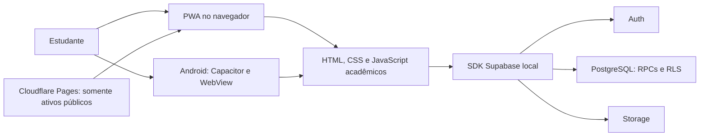

# MatchUp — conexões acadêmicas que funcionam

**Encontre quem pode ajudar em uma disciplina. Compartilhe o que você sabe. Organize o estudo em grupo.**

Aplicativo de monitoria entre estudantes, desenvolvido como projeto para a disciplina **UPX da FACENS**. Uma mesma pessoa pode ensinar algumas matérias e buscar apoio em outras, sem contas ou modos separados. O uso é destinado a adultos (18+). O projeto é independente: não representa um serviço oficial da FACENS nem verifica matrícula institucional.

**Versão atual: 3.3.3 · Android versionCode 13 · abertura opcional em vídeo.**

| Quero… | Acesso |
|---|---|
| Usar no navegador ou instalar no iPhone | [Abrir MatchUp](https://matchup-87k.pages.dev/) |
| Instalar o piloto no Android 7+ | [Baixar MatchUp-3.3.3.apk](MatchUp-3.3.3.apk) |
| Consultar o pacote web desta entrega | [MatchUp-PWA-3.3.3.zip](MatchUp-PWA-3.3.3.zip) |
| Entender ou manter o projeto | [Documentação completa](docs/README.md) |
| Conhecer testes, limites e pendências | [Qualidade e evidências](docs/07-testes-e-validacao.md) |

> **Transparência:** o APK é uma compilação debug para distribuição direta do piloto, não uma versão publicada na Play Store. Testes Chrome/WebKit não substituem testes em Android/iPhone físicos. Entrega de e-mails Auth, homologação física e designação de um moderador real continuam pendências operacionais. Não há promessa de ausência absoluta de defeitos.

## 1. O problema que o produto procura resolver

Um estudante pode precisar de ajuda com uma dúvida específica, mas não saber quem domina o assunto, quando está disponível ou como organizar o encontro. Grupos informais ajudam, porém misturam mensagens, horários e materiais.

O MatchUp reúne esse percurso: **disciplina → pessoa compatível → pedido com objetivo → aceite → conversa → encontro → acompanhamento**. A hipótese é diminuir o esforço para organizar ajuda entre colegas. Melhoria de notas, aprendizagem ou retenção **não foi demonstrada por pesquisa com participantes**; são resultados a investigar, não números de marketing.

## 2. O que já existe

- **Perfil acadêmico:** curso/modalidade, semestre, matérias, interesses, metodologia, experiência, disponibilidade e foto opcional com prévia.
- **Catálogo FACENS:** seleção de cursos e disciplinas a partir de fontes públicas, com lacunas documentadas em vez de matérias inventadas.
- **Descoberta:** cards compactos com foto, detalhes acessíveis, filtros, favoritos privados e motivos de compatibilidade baseados em dados declarados.
- **Pedido guiado:** dúvida, objetivo e sugestão opcional de data; a conversa individual depende do aceite.
- **Chat e materiais:** comunicação vinculada ao contexto acadêmico e compartilhamento autorizado de materiais.
- **Agenda:** encontros individuais e de grupos, estados de participação e exportação `.ics` para calendários externos.
- **Grupos:** criação/configuração, entrada por código, controle de vagas, membros, encontros e arquivamento.
- **Proteção e acompanhamento:** notificações internas, bloqueios, denúncias e ferramentas de moderação para operadores autorizados.
- **Distribuição:** PWA instalável e Android com a mesma base web, sem manter duas interfaces independentes.
- **Abertura opcional:** vídeo fornecido, integral e sem som, com botão para pular. O app carrega por trás; movimento reduzido, economia de dados, offline e retornos de autenticação dispensam o vídeo. No Android, aparece depois da splash do sistema, não a substitui.
- **Acabamento responsivo:** Início adaptado a tablet/desktop, descoberta compacta, textos de apoio mais legíveis, skeletons acessíveis e formulários de grupo com opções avançadas expansíveis.
- **Laboratório:** reset de matches em **Perfil → Configurações → Laboratório**, exigindo digitar `RESETAR`. Remove pedidos e dados individuais vinculados para ambos os participantes; preserva perfil, conta, grupos e registros de segurança. Não é exclusão completa de dados pessoais.

A navegação principal possui cinco destinos: **Início · Descobrir · Chat · Agenda · Perfil**. A inspiração visual dos cards no Tinder não transforma o produto em aplicativo de relacionamentos: disciplina, objetivo e consentimento para a monitoria orientam o fluxo.

### O que não está incluído

Não há pagamentos, IA de recomendação, vínculo oficial com a FACENS, push com o aplicativo fechado, edição de dados acadêmicos offline, fila offline de envios, sincronização bidirecional de calendários ou publicação em lojas. As propostas de evolução ficam separadas da entrega no [capítulo 10](docs/10-manutencao-e-evolucao.md).

## 3. Começar a usar

1. Acesse a [PWA](https://matchup-87k.pages.dev/) com internet ou instale o APK do piloto em um Android autorizado.
2. Cadastre-se/entre e conclua o perfil acadêmico em duas etapas. A confirmação por e-mail depende da configuração operacional do Supabase.
3. Selecione seu curso e matérias; indique o que pode ensinar e o que quer aprender. A foto é opcional.
4. Abra **Descobrir**, confira os detalhes e envie um pedido com uma dúvida concreta.
5. Depois do aceite, combine a monitoria no chat e consulte a agenda. Para estudo coletivo, use o fluxo de grupos e convites.

**iPhone/iPad:** abra no Safari, use **Compartilhar → Adicionar à Tela de Início**. Os nomes e a disposição do menu variam com o iOS. O botão do app explica o procedimento; não instala automaticamente. Consulte o [manual completo](docs/02-funcionalidades-e-uso.md) para erros, privacidade, fotos, grupos e atualização.

**Internet e atualização:** o worker guarda somente a estrutura pública da PWA. Perfil, mensagens, materiais e operações do banco dependem de internet. Aguarde o salvamento antes de aceitar uma atualização ou recarregar. Uma prévia de foto não significa que a imagem já foi salva.

## 4. Como a aplicação funciona



Não existe um servidor Express entre o cliente atual e o Supabase. A pasta `server` contém uma implementação histórica independente. Não a execute para corrigir o MatchUp atual. Regras de permissão, capacidade e participação são verificadas no backend; esconder um botão não autoriza nem protege uma operação.

**Fontes principais:** `index.html`, `startup.js`/`startup.css`, `mentorship.js`, `mentorship-academic.js`, `mentorship-catalog.js`, `mentorship-product.js`, `mentorship-calendar.js`, estilos correspondentes, `pwa.js` e `sw.js`. A intro é independente de sessão/navegação; seu vídeo não integra o cache obrigatório nem é interceptado pelo worker. A [arquitetura comentada](docs/01-visao-geral-e-arquitetura.md) explica componentes, limites de confiança e decisões.

## 5. Início rápido para desenvolvimento

Pré-requisitos: Node.js 22+ e npm; a versão usada na entrega foi Node 24.14.1. Na raiz, em PowerShell:

```powershell
npm ci
npm run build:web
node .\tools\serve.cjs
```

Abra `http://127.0.0.1:8089`. Encerre o servidor com `Ctrl+C` quando terminar. Não há `npm start` ou `npm run dev` na raiz. O servidor permite apenas os ativos públicos; ele não publica o diretório inteiro.

> **Atenção ao ambiente:** abrir a interface real e autenticar utiliza o Supabase configurado nos fontes. Não existe troca automática para um banco de testes. Para testes isolados de interface, use as fixtures documentadas no capítulo 07. Não execute migrations, seeds ou `setup-supabase.js` para simplesmente iniciar o frontend.

Com dependências e navegadores preparados:

```powershell
npm test
npm run test:ui -- --list
```

O primeiro executa os testes Node; o segundo **somente lista** os testes de interface. Para execução Chrome/WebKit, Android, publicação e troubleshooting, siga [Desenvolvimento](docs/06-desenvolvimento-e-android.md) e [Testes](docs/07-testes-e-validacao.md).

### Organização e limpeza local

O `.gitignore` da raiz exclui dependências instaladas, resultados temporários de testes, caches/builds Android, `www`, logs, configurações privadas, chaves de assinatura, bancos locais e uploads. Ignorar não apaga arquivos nem protege um arquivo que já tenha sido versionado; revise o conteúdo antes de publicar. Os APKs/ZIPs nomeados e relatórios acadêmicos permanecem disponíveis intencionalmente.

Na limpeza local foram removidos resultados temporários `test-results*`/`material-*-results`, logs de falhas da JVM, caches `.gradle`/`.kotlin`, saídas `build` do Android, o estado vazio `.wrangler` e `server\node_modules`. Foram preservados fontes, testes, migrações, catálogo, evidências em `docs`, relatórios acadêmicos, releases documentadas e dados/configurações locais. O legado permanece como referência; não é necessário instalá-lo para usar o MatchUp.

- `npm ci` restaura as dependências da raiz; a instalação atual foi mantida para desenvolvimento e testes.
- `npm run build:web` recria `www`; `npm run sync:android` atualiza os ativos nativos. As cópias web atuais foram mantidas e conferidas.
- O próximo build Gradle recria caches e saídas Android removidos; pode demorar mais.
- Apenas para manutenção autorizada do legado, `npm --prefix .\server ci` restaura suas dependências, sem executar servidor, migração ou seed.

Nunca exclua bancos, uploads, arquivos `.env` ou chaves como se fossem cache. Eles não devem acompanhar um envio da pasta inteira ao GitHub.

## 6. Qualidade e estado da entrega

A entrega 3.3 registrou **55 testes Node, 156 Chrome e 156 WebKit aprovados**, além de **241 assertions SQL com rollback** e **127 assertions autenticadas de grupos**. O fluxo publicado de foto foi exercitado com conta descartável e limpeza. Foram comparados os 21 ativos públicos entre fonte/build/artefatos/publicação.

Esses resultados são **históricos da 3.3**. A entrega anterior **3.3.1** adicionou o reset de laboratório e aprovou 57 testes Node, 74 Chrome, 74 WebKit e 49 assertions SQL com rollback, sem resetar contas reais.

A campanha anterior **3.3.2** aprovou **57/57 testes Node**. A suíte UI tinha **179 cenários em 14 arquivos**: as execuções completas iniciais passaram 178 em Chrome e 173 em WebKit; após corrigir o teste do catálogo e o comportamento de cliques/foco nos grupos, os **32 testes de catálogo e grupos passaram integralmente em cada navegador**. Assim, todos os cenários tiveram aprovação ao longo da campanha, sem alegar uma passagem única final de 179/179. APK, ZIP e os **21 ativos públicos** foram conferidos byte a byte; startup/cache em ambos os motores e recarga offline Chrome passaram. O patch não executou SQL nem alterou dados de participantes. Consulte a [campanha e seus limites](docs/07-testes-e-validacao.md) e os [hashes/deployment](docs/13-historico-de-releases.md).

A campanha **3.3.3** aprovou **57/57 Node**; o inventário UI passou a **201 cenários em 15 arquivos**. Os recortes finais de abertura + entrada principal passaram **23/23 em Chrome e 23/23 em WebKit**. Ao longo das execuções e correções, **78 cenários direcionados distintos tiveram aprovação por motor**, não uma passagem final única de 78 nem execução completa dos 201. Os **24 arquivos públicos** foram conferidos byte a byte entre fontes/worker gerado, `www`, assets Android, APK e ZIP. Chrome confirmou decodificação do vídeo real; WebKit valida reprodução quando disponível ou liberação segura, não o codec em iPhone. Sem SQL, alterações de contratos backend ou dados de participantes. A publicação estável foi verificada: **24 arquivos em bytes/MIME**, vídeo real silencioso/inline no Chrome, worker e **22 arquivos de shell em cache sem MP4** nos dois motores; recarga offline Chrome e controlada online WebKit aprovadas. O pedido Range público devolveu o vídeo completo com 200 validado, não 206. Implantação e limites no [histórico da 3.3.3](docs/13-historico-de-releases.md).

Na campanha anterior, a recarga offline da publicação foi validada no Chrome. No WebKit Windows, a navegação offline apresentou uma limitação do runner reproduzível com worker mínimo; a verificação publicada cobre cache e recarga controlada online. O Safari físico permanece pendente. Leia os limites de cada teste antes de interpretar os números como garantia de qualidade.

## 7. Onde continuar

| Tema | Documento |
|---|---|
| Produto, requisitos e diagramas de arquitetura | [01 — Visão geral e arquitetura](docs/01-visao-geral-e-arquitetura.md) |
| Manual de estudantes e responsáveis por grupos | [02 — Funcionalidades e uso](docs/02-funcionalidades-e-uso.md) |
| Código e componentes de interface | [03 — Frontend](docs/03-frontend.md) |
| Modelo de dados e permissões | [04 — Banco de dados](docs/04-banco-de-dados.md) |
| Configuração e migrações seguras | [05 — Supabase](docs/05-supabase-e-configuracao.md) |
| Ambiente, APK e publicação | [06 — Desenvolvimento e Android](docs/06-desenvolvimento-e-android.md) |
| Testes e critérios de aceite | [07 — Testes e validação](docs/07-testes-e-validacao.md) |
| Operação do piloto, privacidade e suporte | [08 — Operação](docs/08-operacao-privacidade-e-suporte.md) |
| Por que os arquivos antigos continuam aqui | [09 — Backend legado](docs/09-backend-legado.md) |
| Manutenção, decisões e evolução | [10 — Manutenção](docs/10-manutencao-e-evolucao.md) |
| Material Design 3, usabilidade e acessibilidade | [11 — UI/UX](docs/11-ui-ux-e-acessibilidade.md) |
| Livros, referências técnicas e vocabulário | [12 — Referências e glossário](docs/12-referencias-e-glossario.md) |
| Releases, hashes e evidências preservadas | [13 — Histórico](docs/13-historico-de-releases.md) |

**Regra de manutenção:** código atual define o comportamento; documentação explica o contrato; testes produzem evidências limitadas; propostas não devem ser apresentadas como funções existentes. Nunca publique credenciais, dados de participantes ou a pasta inteira do projeto.
