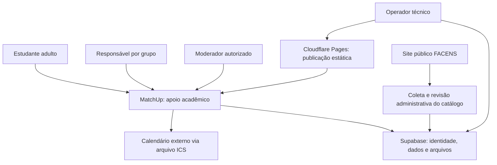
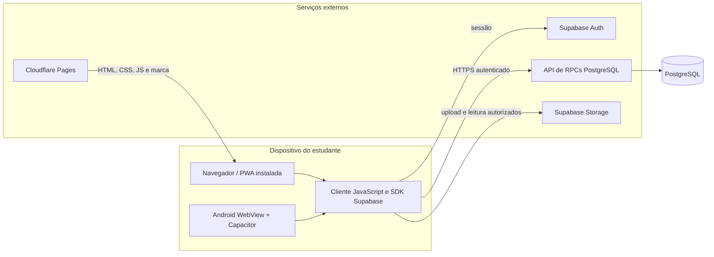
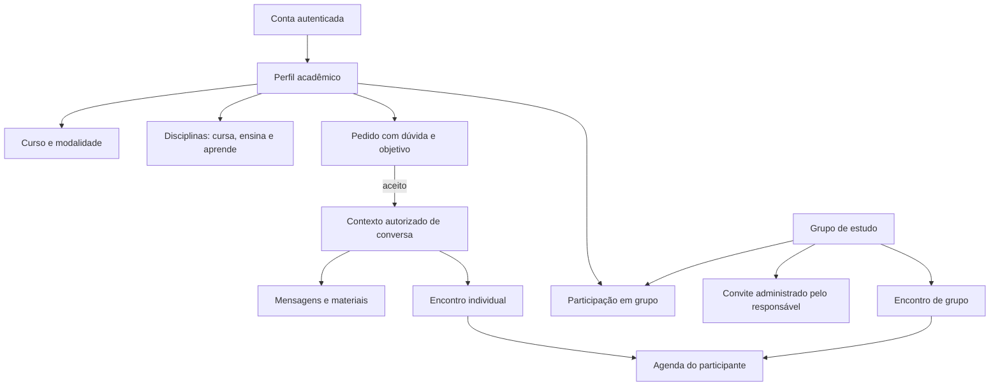
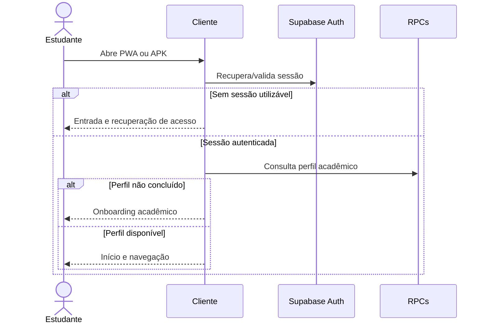
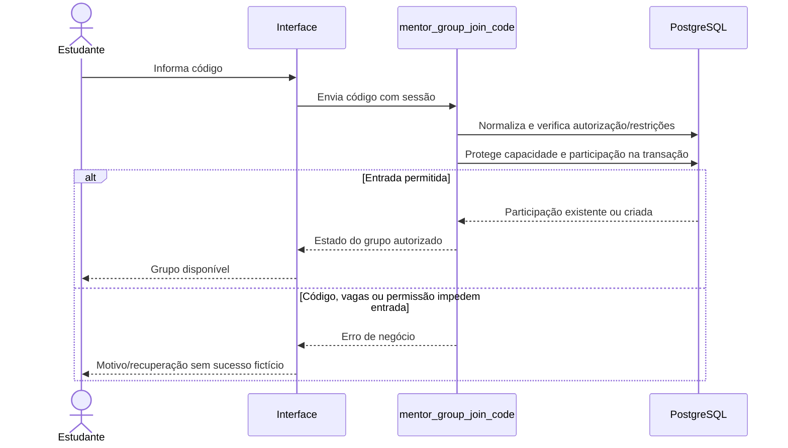

# 01 — Visão geral, requisitos e arquitetura

[Índice](README.md) · [Próximo: funcionalidades e uso](02-funcionalidades-e-uso.md)

**Referência: MatchUp 3.3.3, com abertura opcional em vídeo sobre o refinamento de interface da 3.3.2 e a arquitetura/reset de laboratório da 3.3.1.** Este capítulo descreve o sistema acadêmico atual. Diagramas são modelos explicativos dos fontes, não exportações da infraestrutura remota. Os motivos e trade-offs abaixo são uma leitura técnica das escolhas existentes, não atas retroativas de decisões da equipe.

## 1. Problema, público e proposta de valor

### 1.1 Problema de produto

Pedir ajuda acadêmica envolve mais do que localizar alguém: é preciso explicitar a dúvida, identificar uma pessoa que possa ajudar, obter concordância, combinar horário/local, conversar e acompanhar o encontro. Quando cada etapa ocorre em uma ferramenta diferente, o contexto se perde.

O MatchUp concentra esse percurso em uma experiência pequena e especializada. **O objeto central não é uma curtida: é uma oportunidade de aprendizagem entre pessoas.** A foto facilita reconhecimento, mas disciplina, objetivo e disponibilidade devem sustentar a decisão.

### 1.2 Quem usa

| Papel | Necessidade | Limite de autoridade |
|---|---|---|
| Estudante que busca apoio | Encontrar ajuda para uma matéria/dúvida | Não abre conversa individual sem aceite |
| Estudante que oferece monitoria | Informar o que sabe e negociar encontros | Não recebe autoridade administrativa por ensinar |
| Responsável por grupo | Organizar membros e encontros | Administra somente o grupo de que é responsável |
| Participante de grupo | Entrar, conversar e acompanhar encontros | Não administra convites/configurações do responsável |
| Moderador autorizado | Analisar denúncias e aplicar decisões disponíveis | Papel concedido pelo backend, não pelo cliente |
| Operador técnico | Configurar implantação e responder a incidentes | Credenciais administrativas fora do aplicativo |

Esses são **papéis funcionais**, não seis tipos obrigatórios de conta. Uma pessoa pode aprender e ensinar em matérias diferentes. O responsável por um grupo não é automaticamente moderador da plataforma.

### 1.3 Contexto acadêmico e ética

O projeto foi desenvolvido para UPX/FACENS. Não consulta o sistema acadêmico da instituição, não confirma matrícula, não certifica competência de um monitor e não atribui notas oficiais. O escopo 18+ é uma regra de uso/validação, não verificação documental de identidade.

A hipótese de valor é facilitar a organização do apoio entre colegas. Sua confirmação exige avaliação com participantes consentidos. Não há evidência registrada de redução de reprovação, melhoria de notas ou aumento de aprendizagem atribuível ao produto.

## 2. Escopo atual e não objetivos

### Implementado

Perfil acadêmico, catálogo de disciplinas, descoberta e compatibilidade explicável, filtros/favoritos, pedidos de monitoria, chat contextual, materiais, grupos e convites, agenda, exportação de calendário, avaliações ligadas ao fluxo acadêmico, notificações internas, bloqueios, denúncias e moderação autorizada.

A versão 3.3 acrescenta o editor de foto e a central ampliada de grupos, além de consolidar cards compactos. A [história das entregas](13-historico-de-releases.md) separa essas mudanças das versões anteriores.

### Fora do escopo entregue

- Rede de relacionamentos ou caronas, embora existam fontes antigos dessas experiências.
- Ensino a distância completo, aulas por vídeo próprias, provas, notas oficiais ou LMS.
- Pagamento por monitoria, assinatura premium ou marketplace financeiro.
- Recomendação por aprendizado de máquina ou porcentagem de compatibilidade sem fundamento.
- Sincronização completa com calendários externos ou séries recorrentes automáticas.
- Operação acadêmica offline, fila de mutações offline ou push com o app fechado.
- Certificação de acessibilidade, auditoria de segurança independente ou homologação física concluída.

**MVP completo** significa uma jornada essencial utilizável e sustentada por regras, recuperação e operação — não ausência de limitações nem equivalência a um produto comercial homologado.

## 3. Requisitos funcionais e critérios de aceite

Os identificadores abaixo são uma organização documental desta revisão. Não indicam um sistema de requisitos anterior nem substituem os testes executáveis.

| ID | Requisito | Critério observável | Evidência principal |
|---|---|---|---|
| RF01 | Autenticar e completar perfil acadêmico | Usuário autenticado sem perfil recebe onboarding, não dados inventados | `mentorship.spec.cjs` |
| RF02 | Permitir ensinar e aprender | Listas de matérias para oferecer/buscar apoio coexistem | `mentorship.spec.cjs`, catálogo |
| RF03 | Selecionar cursos/disciplinas publicados | Títulos longos permanecem íntegros e matrizes ausentes são reconhecidas | `mentorship-catalog.spec.cjs` |
| RF04 | Encontrar pessoas com critérios explicáveis | Filtros e motivos usam dados declarados, sem pontuação fictícia | `mentorship-product.spec.cjs` |
| RF05 | Gerir favoritos privados | A marcação persiste e respeita visibilidade/bloqueios | Produto: testes UI/backend |
| RF06 | Solicitar apoio com contexto | Pedido registra dúvida/objetivo e valida data opcional | Produto: testes UI/unitários |
| RF07 | Conversar após aceite | Participante autorizado acessa a conexão; estranho é recusado | Núcleo e integração backend |
| RF08 | Compartilhar materiais autorizados | Arquivo é validado; acesso exige autorização vigente | `mentorship-material.spec.cjs` |
| RF09 | Gerir encontros e exportar calendário | Estados reais alimentam agenda; exportação não expõe link privado | Acadêmico/calendário |
| RF10 | Criar e configurar grupos | Responsável define visibilidade, inscrições, vagas e contexto | `mentorship-groups.spec.cjs` |
| RF11 | Entrar por convite respeitando restrições | Código normalizado não contorna capacidade, remoção ou bloqueio | Grupos: testes UI/backend/live |
| RF12 | Editar foto sem perder rascunho | Prévia antes do envio; alteração só persiste ao salvar | `mentorship-photo.spec.cjs` |
| RF13 | Notificar e proteger participantes | Destinos contextuais; denúncia privada e moderação autorizada | Notificações/produto/backend |
| RF14 | Distribuir uma base web em duas plataformas | Allowlist compõe PWA e APK; nenhum servidor de notebook é exigido | PWA, build e release |
| RF15 | Reiniciar conexões em laboratório | Confirmação explícita; somente pedidos próprios e cascatas bilaterais; grupos, perfil e segurança preservados | `mentorship-lab.spec.cjs`, `mentorship-lab-backend.cjs` |

Os arquivos citados estão em `tests`. O [capítulo 07](07-testes-e-validacao.md) discrimina mocks, testes reais, resultados históricos e lacunas.

## 4. Atributos de qualidade

| Atributo | Decisão/contrato atual | Como avaliar | O que não concluir |
|---|---|---|---|
| Usabilidade | Cinco destinos, pedido guiado, estados vazios/erros explícitos | Tarefas reais com estudantes e revisão heurística | Interface bonita prova facilidade de uso |
| Responsividade | Conteúdo pode crescer, navegação reserva espaço, controles acessíveis | Larguras curtas, paisagem, texto ampliado, teclado | Toda combinação de dispositivo está homologada |
| Confiabilidade | Invalidação de leituras antigas e preservação de rascunhos em falhas cobertas | Atraso, erro, troca de tela/conta e nova tentativa | Toda mutação é offline ou automaticamente repetida |
| Privacidade | Regras no servidor, fotos públicas tratadas explicitamente, materiais autorizados | RLS/RPC/Storage e procedimentos operacionais | RLS torna qualquer arquivo privado |
| Integridade | Transações, constraints e verificação de capacidade no banco | Concorrência e testes de autorização | Checagem de vagas no navegador é suficiente |
| Manutenibilidade | Arquivos por responsabilidade, allowlist única e testes | Alteração localizada com regressão relevante | Ausência de framework elimina acoplamento |
| Portabilidade | Mesmos ativos no navegador e WebView | Chrome/WebKit e ensaio físico separado | WebKit no Windows equivale a Safari no iPhone |
| Desempenho | Foto reduzida, consultas controladas e cancelamento de leituras | Medição de tempo, bytes e consultas em ambiente definido | Há SLA ou capacidade máxima demonstrada |

Ainda não há orçamento formal de latência, teste de carga com população realista ou garantia de disponibilidade end-to-end. Qualquer meta numérica futura deve ser marcada como **meta**, acompanhada de método de medição e ambiente.

## 5. Visão de contexto — quem se comunica com quem

O catálogo é uma importação revisada de fontes públicas: cada tela não raspa o site FACENS durante o uso. A importação de `.ics` transfere um arquivo; não cria uma integração bidirecional permanente com Google/Apple Calendar.

O diagrama usa a ideia de níveis de abstração do **C4 de Simon Brown**: começar por pessoas e sistemas antes de explicar detalhes internos. A [bibliografia](12-referencias-e-glossario.md) fornece a referência; estes desenhos são uma adaptação didática, não um modelo C4 formal completo.

## 6. Visão de execução e distribuição

### 6.1 Cliente

A interface é uma aplicação web sem framework de componentes. O HTML inicial carrega estilos e scripts locais com `defer`. JavaScript renderiza as telas e trata navegação/estado. Não há backend de renderização de páginas, bundle React, servidor de SSR ou API Express intermediária no fluxo atual.

No APK, os ativos acompanham o aplicativo. No navegador, são entregues pelo host estático. Em ambos, dados acadêmicos são buscados na nuvem.

### 6.2 Backend como serviço

A aplicação usa Supabase Auth, API sobre PostgreSQL e Storage. Embora a plataforma também ofereça Realtime, o frontend acadêmico atual **não abre canais Realtime**: solicitações e chat são atualizados por consulta periódica a cada 12 segundos, pausada nas condições documentadas no [capítulo 03](03-frontend.md). Usar BaaS reduz o trabalho de infraestrutura, mas **não elimina o backend**: as funções SQL, permissões e políticas são parte essencial da aplicação e precisam de revisão/testes/versionamento.

As RPCs representam operações do domínio. O cliente não deve reproduzir a decisão final de autorização. Os detalhes de `SECURITY DEFINER`, `auth.uid()`, RLS, grants e transações estão no [capítulo 04](04-banco-de-dados.md).

### 6.3 Admin e ferramentas

Node.js executa ferramentas locais de empacotamento, testes e administração. Isso não significa que um processo Node precise ficar online para servir o produto publicado. O servidor de desenvolvimento restringe a entrega à allowlist; os scripts administrativos não são parte do aplicativo.

## 7. Visão modular do frontend

| Arquivo | Responsabilidade arquitetural | Evitar misturar com |
|---|---|---|
| `index.html` | Documento, metadados, ordem dos scripts e pontos de montagem | Segredos, scripts administrativos ou dados de participantes |
| `mentorship.js` | Coordenação principal: sessão, perfil, descoberta, pedidos, chat e navegação | Backend legado em `script.js` |
| `mentorship-academic.js` | Grupos, encontros, agenda, materiais e integrações acadêmicas | Um segundo aplicativo independente |
| `mentorship-catalog.js` | Catálogo e componentes de escolha de curso/disciplinas | Coleta/importação administrativa das fontes FACENS |
| `mentorship-product.js` | Regras/helpers de produto e experiência, como compatibilidade e pedido guiado | Um motor de IA |
| `mentorship-calendar.js` | Geração/exportação de calendários e ponte de compartilhamento | Sincronização de calendários ou push |
| `mentorship*.css` | Estilos do domínio, módulos e seletores | Arquivos antigos `styles.css`/`campus.css` |
| `pwa.js`, `pwa.css` | Orientação de instalação, atualização e conectividade | Fluxos de banco offline |
| `sw.js` | Template de cache público, gerado com versão por conteúdo | Armazenamento de mensagens/fotos privadas |
| `vendor\supabase.js` | SDK local copiado da dependência fixada | Código de negócio próprio |

`window.MentorApp` funciona como ponte entre o coordenador e módulos acadêmicos. Esses contratos devem ser pequenos e estáveis: expor mais estado global facilita o primeiro desenvolvimento, mas aumenta o acoplamento. O [capítulo 03](03-frontend.md) detalha os símbolos e mecanismos realmente usados.

### 7.1 Por que não chamar isto de microsserviços ou Clean Architecture completa

Há separação de responsabilidades, mas não uma decomposição em serviços independentes de domínio, nem fronteiras formais de portas/adaptadores em todas as camadas. Há módulos JavaScript que compartilham uma ponte global e funções SQL em um backend comum.

Livros de arquitetura ajudam a analisar dependências, mudanças e atributos de qualidade. Não é necessário aplicar todos os padrões de um livro para justificar um MVP. Acrescentar uma camada sem um problema concreto pode aumentar o custo de entendimento sem melhorar o produto.

## 8. Modelo de domínio — leitura antes do SQL

Este é um **modelo lógico**, não um ER físico: “contexto autorizado de conversa”, por exemplo, não declara a existência de uma tabela com esse nome. Campos, chaves, cardinalidades e funções exatas estão no [dicionário de dados](04-banco-de-dados.md).

Invariantes úteis para raciocinar:

1. Uma conta autenticada não implica perfil acadêmico concluído.
2. Uma pessoa pode oferecer e procurar apoio em assuntos diferentes.
3. Favoritar alguém não envia um pedido nem autoriza conversa.
4. Um pedido pendente não equivale a uma conexão aceita.
5. Visibilidade pública do grupo não autoriza qualquer alteração nele.
6. Um código válido não supera falta de vagas ou restrições do participante.
7. A lotação inclui o responsável pelo grupo.
8. Um encontro exportado não permanece automaticamente sincronizado com o app externo.
9. Ocultar um perfil para oferecer monitoria não significa excluir a conta.
10. Remover a referência de foto não significa apagar todo objeto histórico do Storage.

## 9. Fluxos ponta a ponta

### 9.1 Abrir o aplicativo

Uma falha de rede precisa ser apresentada como falha recuperável. Tratar erro como “não existem encontros” produz informação incorreta e pode levar o usuário a repetir ações desnecessárias.

### 9.2 Salvar uma foto

1. A pessoa seleciona JPEG, PNG ou WebP dentro do limite de 5 MB.
2. O cliente valida arquivo/conteúdo e mostra prévia local; não houve persistência ainda.
3. Ao salvar, a imagem é otimizada para JPEG de até 640 px e enviada ao caminho do próprio usuário no Storage.
4. A atualização do perfil referencia a URL permitida. A autorização final continua no backend.
5. O cliente confirma o salvamento; somente então a pessoa deve considerar a alteração persistida.

Se o upload terminar mas a atualização de perfil falhar, o cliente pode reutilizar a URL já enviada na nova tentativa, evitando upload duplicado. Isso **não é uma transação única entre Storage e banco**: objetos sem vínculo podem exigir tratamento operacional. O rascunho em memória também não é backup contra fechamento/recarregamento.

### 9.3 Entrar em grupo por código

O bloqueio transacional de capacidade é importante: duas pessoas podem observar a última vaga na mesma hora. Somente a decisão no banco impede exceder o limite. Renovar o convite invalida o anterior; não libera automaticamente quem foi removido do grupo.

### 9.4 Ler, navegar e receber respostas atrasadas

Uma consulta pode começar na tela A e terminar depois da navegação para B. Atualizar B com dados de A seria um erro mesmo que a resposta HTTP fosse válida. O cliente usa controle de ciclo de leitura/navegação para descartar respostas obsoletas e cancela leituras quando possível.

Troca de conta é uma fronteira ainda mais importante: respostas da conta anterior não podem reaparecer na interface da próxima. Cancelar uma requisição no navegador, entretanto, **não desfaz uma gravação já processada no servidor**. A aplicação deve reconciliar o estado real depois da falha.

## 10. Estado, persistência e atualização

| Local | Exemplos | Duração/limite |
|---|---|---|
| Memória JavaScript | Tela, rascunhos, prévia `blob:`, requisições em curso | Pode se perder ao fechar/recarregar |
| Persistência local do cliente | Sessão do SDK e preferências específicas | Não substitui o banco nem equivale a cofre seguro |
| PostgreSQL | Perfis, pedidos, participação, encontros e estado acadêmico | Fonte de verdade do domínio |
| Storage | Fotos e arquivos conforme bucket/política | Visibilidade depende da política, não da existência de login |
| Cache Storage do worker | HTML, CSS, JS, manifesto e marca públicos | Cache do shell; sujeito a remoção pelo navegador |
| Cache nativo de exportação | Arquivos `.ics` preparados para compartilhamento | Não é agenda persistida do servidor |

A atualização de atividade combina mecanismos implementados de consulta e eventos em primeiro plano; não representa execução ilimitada em background. Sistemas móveis podem suspender o app. Ao retornar, consultas atualizadas devem confirmar o estado.

## 11. Fronteiras de confiança

### Dispositivo → backend

Tudo recebido do cliente é entrada não confiável, mesmo quando veio de um formulário com select. Validar no cliente melhora a UX; validar no banco/API preserva as regras. Não aceite um ID de usuário enviado pelo formulário como prova de identidade quando o servidor dispõe da sessão autenticada.

### Código publicável → operação administrativa

O SDK utiliza configuração publicável para acessar serviços, sujeita às políticas do servidor. Credenciais privilegiadas, senhas de banco e tokens de gestão nunca devem ser colocados em HTML/JS, PWA, APK, screenshots ou documentos. A allowlist controla o que é empacotado, mas não corrige um segredo escrito em um arquivo permitido.

### Arquivos públicos → materiais restritos

A foto usa URL pública do bucket permitido. Quem possui a URL pode ter acesso sem login. Materiais restritos seguem outro fluxo e autorização. Não use o comportamento de um bucket para explicar a privacidade de todos os arquivos.

### Participante → responsável → moderador

A permissão depende do contexto e do servidor. Entrar em grupo não permite renovar convites; criar grupo não concede moderação; estar autenticado não permite consultar denúncias de terceiros.

## 12. Catálogo: procedência também é arquitetura

Na entrega de referência foram importados **21 nomes de cursos, 24 combinações curso/modalidade, 718 títulos de disciplinas e 1.087 vínculos curriculares**. A auditoria registra 18 matrizes completas em relação ao conteúdo publicado, 4 parciais e 2 indisponíveis.

“Completa” não significa confirmada como matriz vigente pela instituição. Jogos Digitais presencial e Gestão de T.I. presencial não tiveram matriz pública adequada localizada. Não copiar a matriz de outra modalidade nem inventar nomes é uma decisão de integridade de dados.

Os arquivos `data\facens-catalog.json` e `data\facens-source-audit.json` apoiam a importação administrativa. Não entram na allowlist web. A [configuração](05-supabase-e-configuracao.md) explica revisão e manutenção; o [manual](02-funcionalidades-e-uso.md) explica o efeito no seletor.

## 13. Decisões e trade-offs

| Escolha observada | Benefício | Custo/risco | Quando reavaliar |
|---|---|---|---|
| HTML/CSS/JS sem framework | Poucas camadas e implantação simples | Coordenação manual de DOM/estado | Mudanças recorrentes gerarem acoplamento difícil de testar |
| Supabase e funções SQL | Auth/dados/arquivos sem API própria adicional | Regras distribuídas entre cliente e migrações | Domínio/integradores exigirem outra fronteira de aplicação |
| Capacitor com os mesmos ativos | Uma experiência visual mantida | Dependência de WebView/plugins | Necessidades nativas justificarem manutenção adicional |
| Catálogo controlado | Consistência e menos digitação | Fontes externas incompletas/desatualizadas | Mudanças curriculares exigirem revisão institucional |
| Cards compactos com detalhes | Decisão inicial rápida sem tela enorme | Foto pode ganhar peso indevido | Pesquisa indicar foco insuficiente em critérios acadêmicos |
| Cache apenas público | Menor exposição e complexidade offline | Negócio depende de rede | Pesquisa comprovar necessidade offline com estratégia de conflitos |
| Grupos privados por padrão | Menor exposição acidental de novos grupos | Descoberta exige convite deliberado | Dados de uso indicarem necessidade de opção pública mais clara |
| Histórico mantido fora do runtime | Rastreabilidade de evolução | Confusão se fontes forem confundidos | Arquivamento controlado reduzir custo sem perder evidência |

A discussão de atributos de qualidade pode ser aprofundada em **Software Architecture in Practice**; refatorações pequenas e preservação de comportamento, em **Refactoring**; dados, consistência e limites de transações, em **Designing Data-Intensive Applications**. Essas leituras orientam análise, não comprovam aplicação integral de todos os padrões. Veja [referências](12-referencias-e-glossario.md).

## 14. Fontes de verdade e próximos capítulos

- **Entrada e distribuição:** `index.html`, `package.json`, `tools\web-assets.cjs`, `tools\build-web.cjs`, `capacitor.config.json`.
- **Interface/contratos de módulos:** [Frontend](03-frontend.md).
- **Permissões e integridade:** [Banco](04-banco-de-dados.md), com definições SQL mais recentes prevalecendo.
- **Estado remoto:** só pode ser confirmado por inspeção/teste autorizado; um arquivo SQL local não prova implantação.
- **Artefato distribuído:** hash, metadados, assinatura e conteúdo do APK/ZIP; o nome do arquivo não basta.
- **Usabilidade:** [UI/UX](11-ui-ux-e-acessibilidade.md), distinguindo heurística de pesquisa empírica.
- **Evolução:** [Manutenção](10-manutencao-e-evolucao.md), sem transformar backlog em promessa de recurso existente.

**Perguntas para fixação:** por que a última vaga precisa ser protegida no banco? Por que a prévia da foto não prova persistência? Por que atualizar o frontend não configura SMTP? Por que um teste WebKit não homologa um iPhone? Responder a essas perguntas demonstra compreensão da arquitetura, além de memorizar nomes de tecnologias.
