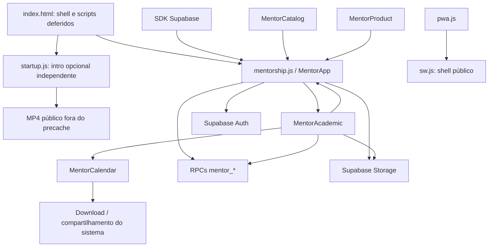
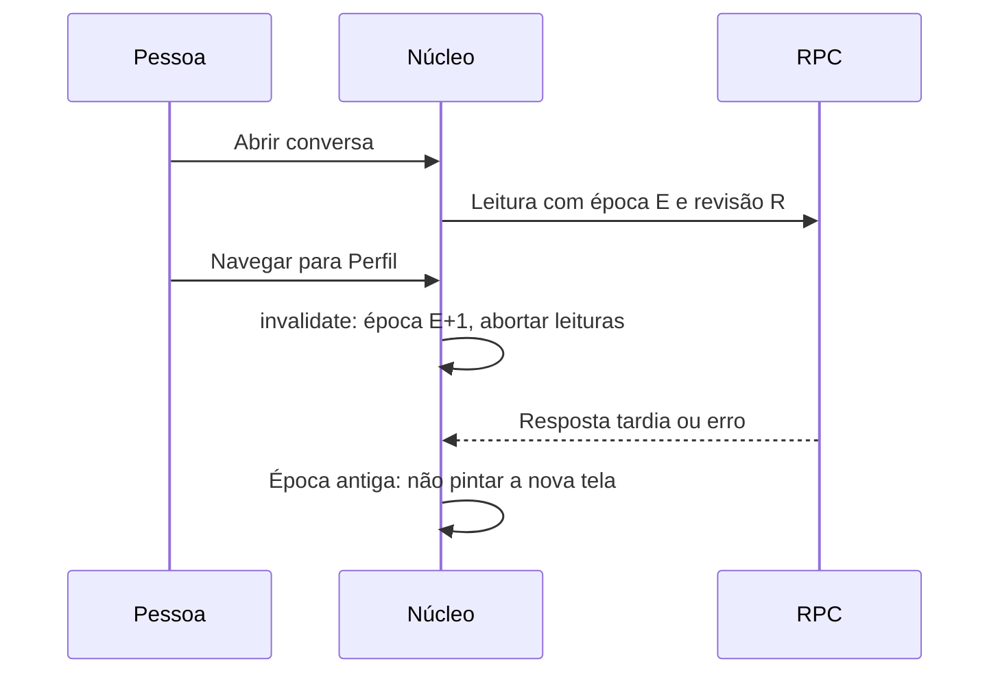
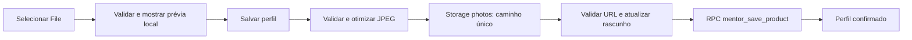

# 03 — Arquitetura e implementação do frontend

> **Base de código:** MatchUp 3.3.3, aplicativo acadêmico; Android `versionCode` 13. O patch adiciona abertura opcional em vídeo, preservando o refinamento responsivo da 3.3.2 e o contrato de backend da 3.3.1. A seção 9.4 descreve o laboratório introduzido anteriormente. Evidências e status de publicação estão nos capítulos [07](07-testes-e-validacao.md) e [13](13-historico-de-releases.md). Nenhuma conta real foi resetada; não houve uso de emuladores nem homologação física.

[Índice](README.md) · [Arquitetura geral](01-visao-geral-e-arquitetura.md) · [Manual](02-funcionalidades-e-uso.md) · [UI/UX](11-ui-ux-e-acessibilidade.md) · [Referências](12-referencias-e-glossario.md)

## 1. O que este frontend é

O frontend é uma aplicação web de página única, escrita em HTML, CSS e JavaScript, com navegação e renderização controladas pelo próprio projeto. Ele atende monitorias, descoberta de apoio por disciplina, solicitações, conversas, grupos, encontros e materiais. A interface tem cinco abas: **Início, Descobrir, Chat, Agenda e Perfil**.

Não há React, roteador de framework ou módulos ES na entrada atual. Os arquivos usam funções imediatamente executadas — IIFEs — e publicam contratos em `window`. Há helpers com exportação CommonJS para uso fora do navegador, mas isso não transforma a entrada web em um sistema de `import`/`export`.

Também não há algoritmo romântico, inferência de competência ou IA. “Deu match!” é uma celebração de aceite acadêmico. Descrições antigas de Spark, Campus e modos de relacionamento devem ser interpretadas apenas com o [histórico](13-historico-de-releases.md), nunca como contrato atual.

### 1.1 Mapa de arquivos

| Arquivo | Responsabilidade atual |
|---|---|
| `index.html` | Shell, metadados, acessibilidade inicial e ordem de carregamento. |
| `startup.js`, `startup.css` | IIFE e apresentação da intro opcional; ciclo de vida independente do núcleo. |
| `assets\brand\matchup-intro.mp4` | Vídeo público fornecido, preservado integralmente; não obrigatório no cache. |
| `vendor\supabase.js` | SDK utilizado por autenticação, RPCs e Storage. |
| `mentorship.js` | Núcleo: sessão, navegação, perfil, descoberta, pedidos, chat, estado e helpers compartilhados. |
| `mentorship-academic.js` | Agenda, grupos, notificações, avaliações, materiais e ferramentas acadêmicas do chat. |
| `mentorship-catalog.js` | Seletores de curso/disciplinas, pesquisa, chips, limites e preservação de dados legados. |
| `mentorship-product.js` | Preferências, razões de compatibilidade, favoritos, pedidos guiados, segurança e otimização de foto. |
| `mentorship-calendar.js` | Serialização iCalendar e compartilhamento nativo do arquivo. |
| `mentorship.css` | Tokens visuais, layout, cartões, formulários, foco, navegação e responsividade. |
| `mentorship-academic.css` | Componentes acadêmicos que herdam papéis visuais do núcleo. |
| `mentorship-catalog.css` | Seletores e chips do catálogo. |
| `pwa.js`, `pwa.css` | Instalação web, avisos e atualização da PWA. |
| `sw.js` | Cache restrito do shell público e ciclo de atualização do service worker. |

A separação facilita localizar responsabilidades, mas os módulos compartilham APIs globais e dependem de ordem de carregamento. Não confundir divisão em arquivos com isolamento completo. [AR01]

## 2. Entrada e inicialização

### 2.1 Shell HTML

`index.html` declara `lang="pt-BR"`, viewport com `viewport-fit=cover` e folhas de estilo nesta ordem: `mentorship.css`, `mentorship-academic.css`, `mentorship-catalog.css`, `pwa.css`, **`startup.css` por último**.

O HTML inicial é pequeno: link para pular ao conteúdo, `#app`, cabeçalho, `<main id="main" tabindex="-1">`, carregamento com papel de status, toast com anúncio educado e alternativa `noscript`. O diálogo da intro começa **fechado**, com vídeo **sem `src`**; as condições de elegibilidade são verificadas antes de atribuir a mídia. As telas são construídas depois pelo JavaScript.

Os scripts usam `defer`, nesta ordem: **`startup.js` primeiro** → SDK Supabase local → catálogo → produto → núcleo → calendário → acadêmico → PWA. A ordem relativa dos scripts existentes foi preservada. `MentorApp` é publicado pelo núcleo antes da inicialização associada a `DOMContentLoaded`; quando ela ocorre, os scripts deferidos seguintes já tiveram oportunidade de publicar suas APIs.

**Regra de manutenção:** não trocar esses scripts por `async` ou alterar sua ordem sem revisar dependências. Não carregar duas cópias do núcleo, pois isso pode duplicar eventos, estado e intervalos.



As setas representam chamadas/dependências, não processos separados. A fronteira de autorização é o servidor, com funções, privilégios e políticas adequadas; esconder um controle no DOM não protege dados. [DOC06] [DOC09]

### 2.2 Sessão e primeiro conteúdo

O cliente Supabase é criado com persistência de sessão, renovação automática de token e detecção de sessão na URL. Não se devem copiar URLs/chaves do ambiente para exemplos; a chave publicável do cliente não equivale a uma credencial administrativa.

O núcleo consulta `getSession` e processa mudanças de autenticação. Eventos relevantes incluem `SIGNED_IN`, `SIGNED_OUT` e `PASSWORD_RECOVERY`, com encaminhamento por `queueMicrotask`. Não existe um fluxo específico de rerender para todo `TOKEN_REFRESHED`; a renovação é tratada pelo SDK.

`sessionChanged` diferencia:

- ausência de sessão: limpar estado privado e apresentar autenticação;
- mesma identidade já tratada: evitar hidratação repetida, ressalvado o fluxo de recuperação;
- identidade diferente: limpar os dados da conta anterior antes de carregar a nova.

`mentor_me` obtém o perfil. Sem perfil, a pessoa é conduzida ao cadastro; com perfil, segue para o Início. O onboarding apresenta duas etapas e não cria identidades mutuamente exclusivas de aluno e monitor. Nome, curso e semestre compõem a base; disponibilizar-se para ajudar exige disciplinas de ajuda.

Na saída, `logout` chama `signOut({ scope: 'local' })`. Uma falha permite tentar novamente. **Saída local não é promessa de revogação de todas as sessões em outros dispositivos.** Recuperação de senha e configuração do provedor estão no [capítulo 05](05-supabase-e-configuracao.md).

### 2.3 Abertura opcional e independente — 3.3.3

A IIFE de `startup.js` não depende de `MentorApp`, da sessão Supabase ou da navegação. A aplicação inicializa **por trás** da intro; o vídeo não é uma etapa obrigatória de login nem uma tela que substitui o app enquanto ele carrega. No Android, é a mesma intro web após a splash nativa do sistema operacional.

- **Mídia:** `assets\brand\matchup-intro.mp4`, 2.648.263 bytes, duração integral de **10,006 s**, 1280 × 720, H.264/AAC. O original foi mantido byte a byte, sem corte/transcodificação. Reprodução automática silenciosa e inline, com logo local MatchUp como poster e `object-fit: contain`, sem recortar o vídeo em retrato.
- **Frequência:** marcador `sessionStorage` **`matchup:intro-shown:v1`**, uma vez por sessão da aba, sem repetição na navegação interna. Se o armazenamento estiver bloqueado, a degradação é uma vez por documento. Restauração de abas/sessões varia por navegador; não é “uma vez para sempre”.
- **Dispensa antes do download:** movimento reduzido, `saveData`, conexão `2g`/`slow-2g`, offline, documento inicialmente oculto, marcador já presente ou ausência de suporte ao diálogo. Nesses casos, não atribui `src` à mídia nem inicia seu download.
- **Autenticação tem prioridade:** parâmetros em query/hash `code`, `type`, `token`, `token_hash`, `access_token`, `refresh_token`, `error`, `error_code` ou `error_description` dispensam a intro sem baixar o vídeo. Retornos Auth e recuperação de senha não devem ser atrasados pela apresentação.
- **Prazos e interrupções:** até **2 s para o primeiro evento `playing`** e **12 s no total**. Pular, Escape, fim, erro/autoplay negado ou prazo excedido encerram a intro. Ocultar o documento, perder conexão ou ativar movimento reduzido/economia de dados também a encerram.
- **Liberação:** pausa e libera a mídia ao sair, fecha o modal e mantém o app utilizável, sem tela vazia. Restaura foco em `#main` quando o documento estiver visível e não houver outro modal aberto.

O `<dialog>` nativo recebe foco no botão de pular, com alvo mínimo de **48 px**. Enquanto estiver modal, o conteúdo por trás não deve receber foco. Tab pode alcançar a interface do navegador, o que não autoriza focar controles subjacentes nem exige um ciclo artificial preso ao único botão. Critérios de UX e limites de validação estão nos [capítulos 11](11-ui-ux-e-acessibilidade.md) e [07](07-testes-e-validacao.md).

O MP4 integra o pacote público e o hash de versão, mas **não o precache obrigatório nem a interceptação do worker**, inclusive em requisições Range. Veja o contrato de empacotamento e HTTP no [capítulo 06](06-desenvolvimento-e-android.md).

## 3. Contratos públicos entre módulos

Os nomes abaixo são efetivamente publicados. Funções internas não devem ser chamadas por outro arquivo apenas porque são localizáveis no código.

### 3.1 `window.MentorApp`

| Parte pública | Contrato e uso |
|---|---|
| Getters `client`, `user`, `profile`, `epoch`, `view`, `container` | Valores atuais do núcleo; `container` é o conteúdo principal. Objetos retornados não são cópias imutáveis. |
| `isCurrent(epoch)` | Alias de `active`: compara a geração capturada com a atual. Não verifica sozinho autorização no servidor. |
| `loadCatalog` | Carrega o catálogo. Consumidores devem tratar falha e validade da tela. |
| `navigate(view, focus = true, context = {})` | Invalida trabalho anterior e seleciona a tela; aceita contexto de grupo. |
| `refreshHome()` | Executa `navigate('home', false)`. Não é apenas atualização de um texto isolado. |
| `openChat`, `openRequestChat` | Dois nomes para a mesma abertura de conversa de uma solicitação. |
| `openGroup(id)` | Navega para grupos com `{ groupId: id }`. |
| `updateHomeMetrics`, `updateFavorite` | Atualizam estado/apresentação correspondentes sob as condições implementadas pelo núcleo. |
| `helpers` | `esc`, `icon`, `toast`, `notice`, `rpc`, `dialog`, `closeDialog`, `friendly`, `safePhoto`, `loading`, `empty`. |

`state`, `invalidate`, `sendMessage`, `validatePhoto`, `uploadPhoto` e `saveProfile`, por exemplo, são internos. Não documentá-los como métodos de `MentorApp`.

`navigate` reconhece aliases `discover → explore`, `chat → chats`, `inicio → home`, `perfil → profile`. Sem usuário ou durante logout, não navega; sem perfil, força perfil. Destinos específicos incluem `home`, `explore`, `profile`, `favorites`, `agenda`, `groups` e `notifications`; pedidos/conversas são encaminhados à apresentação correspondente. Não existe correspondência geral entre esses nomes e URLs de um roteador externo.

### 3.2 `window.MentorAcademic`

| Exportação | Finalidade |
|---|---|
| `renderAgenda(root, month, selectedDay, reuse)` | Agenda, seleção mensal/diária e ações de encontro/exportação, com padrões para argumentos opcionais. |
| `renderGroups(root)`, `renderGroup(root, id)` | Lista/criação/entrada e centro de atividades de grupo. |
| `renderNotifications` | Lista com filtros, leitura e navegação por destino. |
| `mountChatTools(root, context)` | Agenda e materiais de conversa/contexto autorizado. |
| `renderReviews(root, userId)` | Avaliações disponíveis do usuário indicado. |
| `nextSession()` | Próximo encontro e, quando o núcleo oferece suporte, atualização de indicadores do Início. |
| `scheduleForm(root, context, done)` | Formulário reutilizável para agendamento, com contexto e callback. |
| `renderFiles(root, context)`, `validateFile` | Materiais e validação local de arquivos. |
| `cleanup()` | Invalida contextos, aborta leituras e descarta snapshot; preserva rascunhos. |
| `reset()` | Executa limpeza e remove rascunhos/identidade acadêmica local. Não apaga solicitações, conexões ou mensagens persistidas no servidor; não é uma ação de laboratório em Configurações. |

Depende de `MentorApp` para cliente, identidade, época e navegação. Sua função `rpc` é privada e **não tem exatamente a mesma semântica** de timeout do helper público do núcleo.

### 3.3 `window.MentorCatalog`

- `validate(catalog)`: validação estrutural superficial de catálogo, cursos e listas; não confirma autenticidade acadêmica de cada item.
- `markup()`: marcação dos três seletores de disciplinas.
- `mount(form, catalog, draft, persisted)`: conecta controles ao formulário e guarda o leitor de valores em `WeakMap`.
- `values(form)`: lê `course`, `catalog_course_id`, `current_subjects`, `subjects` e `learning_subjects`; retorna `{}` se o formulário não estiver montado.
- `single(root, catalog, selected = '')`: monta seleção única e retorna **uma função leitora**, não a disciplina diretamente.

O `WeakMap` associa estado ao objeto formulário sem criar uma lista global permanente de formulários descartados. Se o DOM for reconstruído, montar o novo formulário; não reutilizar leitor de um nó antigo.

### 3.4 `MentorProduct`

Exporta `slots`, `normalize`, `reasons`, `reasonMarkup`, `profileMarkup`, `fields`, `detailMarkup`, `filtersMarkup`, `favoriteButton`, `renderFavorites`, `requestFields`, `guided`, `requestSummary`, `reportDialog`, `safetyDialog` e `optimizePhoto`.

No navegador, publica `window.MentorProduct` e instala tratamento delegado de favorito. Em CommonJS, usa `module.exports`. `toggleFavorite` e `moderationDialog` são privados.

Nem tudo é função pura: há helpers de strings/normalização e funções que manipulam DOM, chamam RPC ou processam imagem. `reasons` é determinística sobre os dados fornecidos, não IA. `slots` representa sete dias × três turnos, totalizando 21 possibilidades.

### 3.5 `MentorCalendar`

Exporta `calendar`, `escapeText`, `foldLine`, `safeText`, `isNative` e `shareNative`, para navegador e CommonJS.

`calendar(sessions, now)` produz iCalendar e valida entradas; `shareNative` integra arquivos e compartilhamento nativo. A geração é separada da obtenção/autorização dos encontros, responsabilidade de `MentorAcademic`. Essa fronteira permite verificar serialização sem chamar serviços reais. [AR02] [DOC11]

## 4. Estado, navegação e trabalho assíncrono

### 4.1 Estado do núcleo

| Conjunto | Exemplos | Persistência/observação |
|---|---|---|
| Identidade | `user`, `profile`, `catalog`, `recovery` | Interface em memória; sessão Auth tem persistência própria do SDK. |
| Navegação | `view`, `epoch`, `chat`, `onboardingStep` | Controla a apresentação atual. |
| Dados visíveis | `profiles`, `requests`, `messages`, `homeMetrics` | Resultados locais sujeitos a atualização/invalidação. |
| Preferências de tela | `filter`, `filters`, `direction` | Não equivalem a políticas de acesso. |
| Edição | `profileDraft`, `photoFile`, `drafts`, `outbox` | Rascunhos em memória, não fila offline persistente. |
| Concorrência | `pending`, `controllers`, `revision`, `loading` | Prevenção de ações repetidas e respostas antigas. |
| Recursos de UI | `poll`, `toastTimer`, preview e observador do cartão | Precisam ser encerrados/revogados no ciclo de vida. |

`invalidate` incrementa `epoch`, aborta leituras rastreadas, encerra polling, desconecta observação do cartão, revoga prévia da foto, fecha diálogo e chama `MentorAcademic.cleanup`. Navegar não é apenas substituir `innerHTML`.

`clearPrivate` faz limpeza mais ampla: identidade, perfil, catálogo, rascunhos, mensagens, filtros e estado acadêmico são reiniciados. Preservar rascunho numa falha não autoriza mantê-lo ao trocar de conta.

### 4.2 Por que usar `epoch` e `revision`

A pessoa abre uma conversa, uma leitura demora e ela navega para o perfil. A leitura antiga não deve substituir o perfil por mensagens. A época identifica a geração da tela.

Outra corrida ocorre na mesma conversa: um polling começa, a pessoa envia uma mensagem e o polling termina depois. A revisão local é incrementada após mutações relevantes, permitindo ignorar essa resposta anterior ao envio.



Abortar reduz trabalho, mas a guarda continua importante: uma resposta pode já estar a caminho. **A época protege a apresentação; não concede acesso nem desfaz escrita no servidor.** [AR03]

### 4.3 Dois wrappers de RPC, duas semânticas

| Aspecto | Núcleo: `MentorApp.helpers.rpc` | Acadêmico: `rpc` privado |
|---|---|---|
| Prazo de espera | 20 segundos por chamada | 20 segundos, com `Promise.race` |
| Leituras | Rastreia `AbortController`; usa `.abortSignal` | Allowlist de RPCs de leitura; rastreia e usa sinal de aborto |
| Navegação/cleanup | Cancela leituras rastreadas | Cancela leituras e altera revisão local |
| Mutação durante navegação | Não entra no conjunto cancelado pela navegação | Não é tratada como leitura cancelável |
| Timeout de mutação | Seu próprio controlador sinaliza aborto da requisição | A espera termina, mas a mutação não recebe sinal de aborto |
| Resultado no servidor | Aborto não comprova rollback | Pode ter sido salvo; mensagem orienta atualizar antes de repetir |
| Validade da resposta | Consumidores verificam época/estado conforme o fluxo | Wrapper verifica identidade, revisão e época depois da espera |

A classificação acadêmica é explícita: inclui `mentor_sessions`, `mentor_notifications`, `mentor_reviews`, `mentor_requests`, `mentor_groups`, `mentor_group_detail`, `mentor_files` e `mentor_group_suggestions`. `mentor_group_code` é leitura somente com ação `get`; `rotate` e `disable` são mutações.

Ao adicionar RPC, decidir sua natureza. Tratar escrita como leitura pode cancelar a espera de forma enganosa; tratar leitura como mutação pode impedir cleanup esperado. Toda mutação acadêmica invalida o snapshot da agenda.

### 4.4 Contextos acadêmicos e limites

`start(root, title)` cria token `Symbol` associado ao root. `ctx.live()` combina nó conectado, token atual, identidade, revisão e época. Subáreas de grupo têm tokens próprios contra respostas de uma seção substituída.

`action` desabilita o botão e restringe feedback ao contexto válido. `cleanup` preserva rascunhos; `reset` e sincronização de conta os limpam quando apropriado.

Não generalizar isso para garantia transacional universal: algumas rotinas auxiliares e esperas diretas por Storage usam checagens mais simples de nó conectado e identidade. Revisar cada `await`, inclusive caminhos de erro e `finally`, ao alterá-las.

## 5. DOM, eventos e apresentação segura

O padrão comum é construir marcação, atribuir `innerHTML`, localizar novos elementos e ligar handlers. Há eventos locais (`onclick`, `onsubmit`, `onchange`, `oninput`) e delegação em pontos específicos, como favoritos e ações com atributos `data-*`.

1. **Texto externo passa por `esc` ao entrar em HTML.** Para texto simples, preferir `textContent`. Nome, biografia, disciplina e mensagem não são HTML confiável.
2. **Validar URLs separadamente.** Escapar aspas não torna um endereço adequado; `safePhoto` limita fotos, e materiais têm validação de URLs assinadas.
3. **Não reutilizar nós mortos.** Após `innerHTML`, referências e listeners antigos podem não corresponder à tela.
4. **Restaurar contexto de uso.** Verificar foco, seleção, rolagem e rascunhos ao reconstruir.
5. **Desligar recursos.** Intervalos, observers, previews e leituras pertencem a um ciclo de vida.
6. **Separar falha de vazio.** Acesso negado/offline não significa ausência de mensagens.

`dialog` usa `<dialog>` nativo com `showModal`, título associado, fechamento e cancelamento. Aproveita semântica do navegador, mas não demonstra implementação própria completa de gerenciamento de foco nem compatibilidade universal.

`notice` distingue alerta de erro e status; `toast` usa texto e se oculta após aproximadamente 4,8 segundos. Informação indispensável à recuperação não deve depender apenas de aviso efêmero. Ver [acessibilidade](11-ui-ux-e-acessibilidade.md).

## 6. Perfil, catálogo e preferências

### 6.1 Curso e disciplinas

`MentorCatalog` separa `current_subjects` (até 12 disciplinas atuais), `subjects` (até 8 em que oferece ajuda) e `learning_subjects` (até 8 em que deseja aprender).

A pesquisa remove marcas de acento por NFD e compara em minúsculas. Todos os termos precisam corresponder; não é busca semântica. Apresenta 30 opções iniciais e amplia em lotes de 30. Seleções aparecem em chips removíveis, com contador anunciado; opções adicionais são desabilitadas ao atingir o limite.

Disciplinas atuais dependem do curso; ajuda/aprendizagem podem vir de outros cursos. Ao trocar curso, o componente ajusta escolhas atuais não salvas e preserva valores persistidos conforme a lógica de legado. Curso não catalogado pode ser representado por `__legacy`; não há conversão silenciosa obrigatória.

Grade completa, parcial ou indisponível é explicitada. Links de fonte são restritos a HTTPS em `facens.br` ou subdomínios. O seletor não comprova matrícula, não inventa disciplinas para preencher lacunas e não substitui a fonte institucional.

### 6.2 Preferências e razões

`MentorProduct.normalize` organiza campos. `reasons(peer, own)` compara disciplinas de ajuda/aprendizagem, curso/catálogo, formatos, turnos e preferência individual/grupo. “Híbrido” e “ambos” são considerados nas compatibilidades correspondentes.

O resultado é uma lista de razões legíveis, não nota geral, ranking pedagógico ou promessa de aprendizagem. São declarações dos perfis, não qualificações verificadas. Ver [UI/UX](11-ui-ux-e-acessibilidade.md). [UX01] [UX04]

## 7. Foto de perfil: pipeline e falhas

### 7.1 Seleção e prévia

Foto é opcional. O input aceita JPEG, PNG e WebP, com botões de escolha/remoção, status e iniciais como alternativa. O arquivo fica em memória; uma Object URL mostra a prévia válida sem upload imediato, sendo revogada quando reconstruída ou invalidada.

Remover limpa o arquivo escolhido e define `photo_url` vazio no rascunho. **A remoção só é publicada ao salvar o perfil.** Alterações alimentam o rascunho local; recarregar a página não recupera esse rascunho.

### 7.2 Validação e otimização

`validatePhoto` verifica MIME JPEG/PNG/WebP, tamanho maior que zero e no máximo `5 * 1024 * 1024` bytes (5 MiB), além de assinatura JPEG (`FF D8 FF`), PNG (oito bytes iniciais) ou WebP (`RIFF`/`WEBP` nas posições esperadas).

O upload valida novamente. `MentorProduct.optimizePhoto` decodifica a imagem, limita o maior lado a 640 px sem ampliar imagens menores, desenha em canvas com fundo branco e gera JPEG com qualidade 0,82. Sua Object URL é revogada em `finally`.

**Não existe editor manual de recorte/zoom/reposicionamento.** O enquadramento exibido é por CSS, com `object-fit:cover` e posicionamento fixo. Assinatura e decodificação são verificações limitadas de formato, não antivírus nem prova de procedência.

### 7.3 Upload e salvamento não são atômicos



`saveProfile` captura época, usuário e rascunho, desabilita controles relevantes e envia primeiro a foto quando houver. O caminho usa ID do usuário e UUID aleatório terminado em `.jpg`, com MIME JPEG e `upsert:false`.

Após upload bem-sucedido, a URL validada entra no rascunho e o `File` é limpo antes de `mentor_save_product`, que recebe `p_profile` e `p_course_id`. Uma nova tentativa após falha da RPC pode reutilizar o upload em vez de reenviar desnecessariamente.

Storage e atualização do perfil não são transação única: pode existir objeto enviado sem associação confirmada. Substituir/remover foto nessa UI não exclui automaticamente o objeto antigo. Retenção e limpeza exigem política própria em [operação e privacidade](08-operacao-privacidade-e-suporte.md). [AR03]

### 7.4 O que `safePhoto` valida

Aceita URL absoluta somente quando a origem é exatamente a Supabase configurada; o caminho tem formato `/storage/v1/object/public/photos/<identificador>/<identificador>.<extensão>`; cada identificador corresponde a 36 caracteres hexadecimais/hífens pela expressão implementada; extensão é `jpg`, `jpeg`, `png` ou `webp`; e não há query nem fragmento.

Retorna URL normalizada ou string vazia. A expressão não valida toda a estrutura de UUID, não analisa bytes e não confirma propriedade da foto pela conta exibida. Não deve ser usada para materiais privados, cujo fluxo é outro.

## 8. Descoberta, favoritos e solicitações

`exploreView` busca `mentor_discover_product` e catálogo, usando filtros de disciplina, curso, semestre, formato e disponibilidade. Descoberta não é a lista exclusiva de favoritos; há também exclusões locais, como a própria conta e perfis inativos.

`renderCard` mostra o primeiro perfil, identidade, curso/semestre, até duas disciplinas e acesso aos demais detalhes. Compatibilidade pode ser expandida. **Pular** retira o item apenas da lista local; atualizar pode trazê-lo novamente. Não é voto persistido de rejeição.

Favorito usa `mentor_favorite` com estado desejado. A interface confere a confirmação retornada antes de atualizar botões. Não é interesse recíproco, aceite nem mensagem automática.

### 8.1 Gesto opcional

- Ignora início em botões e botão de mouse não principal.
- Reconhece movimento horizontal após mais de 12 px e predominância superior a 1,3 vezes o deslocamento vertical.
- Mostra deslocamento limitado a ±70 px, rotação e selo de intenção.
- Ao soltar, exige pelo menos 65 px e a mesma predominância horizontal.
- Direita abre formulário de solicitação; esquerda pula; `pointercancel` não age.
- Suprime clique posterior por cerca de 300 ms contra ação duplicada.

Pular/Favorito/Solicitar continuam como botões explícitos. Clicar no corpo do cartão abre detalhes, ressalvadas as condições do gesto. Não remover botões porque “o swipe já funciona”. [DOC05]

### 8.2 Pedido guiado e segurança

`requestFields`, `guided` e `requestSummary` sustentam o contexto do pedido. Pergunta aceita 10–1000 pontos de código Unicode; objetivo, 5–500. Data opcional deve ser futura e dentro de 365 dias; valor local é convertido para ISO.

Validação no frontend melhora feedback, mas precisa ser repetida no servidor. Horário sugerido não é encontro confirmado. Aceite/recusa é mutação própria; após sucesso, o núcleo altera a revisão contra polling antigo.

Denúncia, bloqueio e moderação são distintos. `reportDialog` e `safetyDialog` expõem ações; acesso administrativo depende da RPC, não de papel apenas no navegador. A UI informa limites de desfazer bloqueio. Ver [dados](04-banco-de-dados.md) e [privacidade](08-operacao-privacidade-e-suporte.md).

## 9. Chat: atualização, rascunho e envio

### 9.1 Polling, não Realtime

**O frontend atual não cria canais/subscrições Supabase Realtime.** `startPolling` usa intervalo de 12 segundos para pedidos e conversas, quando há conta/perfil e a página está visível.

`pollCurrent` evita trabalho se a página está oculta, carregando ou há operação pendente. Captura época/revisão e descarta respostas se esses marcadores mudam, a página se oculta ou uma mutação fica pendente.

Ocultar a página limpa o intervalo; voltar o retoma e consulta imediatamente pedidos/conversas. `online`/`offline` atualizam aviso de conexão: não enviam uma fila offline genérica.

Agenda, notificações e chat de grupo **não herdam esse polling de 12 segundos**: usam carregamento, atualização explícita e rerender após ações. Supabase oferecer Realtime não significa que esteja usado aqui.

### 9.2 Mensagens e idempotência

`sendMessage` usa pendência por solicitação, normaliza o corpo e guarda UUID em `outbox`. Nova tentativa do mesmo corpo reutiliza `p_client_id` em `mentor_send`. Alterar texto invalida a identificação do payload anterior.

Só sucesso confirmado limpa rascunho/outbox; mensagem retornada é deduplicada por ID. Isso depende da garantia correspondente no servidor, não significa entrega exatamente uma vez sob qualquer falha. Mapas ficam em memória, sem sobrevivência a reload. [AR03]

`renderMessages` evita substituir DOM se a marcação não mudou. A rolagem acompanha o fim somente quando a pessoa estava perto dele, em margem aproximada de 120 px, para não interromper leitura anterior.

### 9.3 Falha transitória versus acesso negado

Falha transitória permite recuperação e preserva rascunho. Acesso negado reconhecido por `chatError` remove mensagens, composer e ferramentas e interrompe atualização. Não continuar mostrando conversa privada cuja indisponibilidade foi reconhecida.

O cliente pode estar temporariamente desatualizado entre consultas. Polling não revoga instantaneamente tudo que já foi recebido; o servidor deve negar novas leituras/escritas independentemente da tela. [DOC06]

### 9.4 Laboratório em Configurações — adição posterior à base 3.3

> **Situação:** entregue na 3.3.1, com RPC instalada preservando dados existentes. Os dez cenários de laboratório passaram em Chrome/WebKit; o backend passou 49 assertions com fixtures e rollback. Nenhuma conta real foi resetada. Consulte a [evidência delimitada](07-testes-e-validacao.md). Não é o reset romântico do sistema legado.

`mentorship.js` acrescenta **Laboratório** às Configurações do perfil concluído. A função privada `laboratoryDialog` abre “Laboratório · Resetar matches” e explica que matches são conexões acadêmicas. Não é método novo exportado por `MentorApp`, nem o `MentorAcademic.reset()` de limpeza local.

O formulário exige digitar exatamente `RESETAR`; o botão começa desabilitado. Pendência por conta (`lab-reset:<id>`) impede novo envio local enquanto aguarda. A interface verifica a identidade capturada, oferece cancelamento antes de enviar e avisa que **fechar o diálogo depois do envio não cancela a operação**. A confirmação textual reduz acionamentos acidentais; não substitui autorização no servidor. [UX01] [UX05]

A chamada é `mentor_reset_connections`, com `{ p_confirmation: 'RESETAR' }` e `{ mutation: true }`. Na SQL inspecionada, `p_confirmation text` é obrigatório, **sem `DEFAULT`**; `RESETAR` é o valor exigido, não um argumento que possa ser omitido.

#### Alcance e preservação

| Efeito | Contrato adicionado |
|---|---|
| Pedidos | Elimina todos os enviados/recebidos pela conta atual, de qualquer status, não apenas os aceitos. |
| Dependências | Cascatas removem mensagens, encontros individuais, participantes, avaliações e metadados de materiais dessas conexões. Também são removidas leituras das notificações correspondentes. |
| Outra pessoa da conexão | A exclusão afeta os dois lados; não é apenas ocultar a conversa de quem solicitou o reset. |
| Preservação | Conta, perfil/foto/disciplinas, favoritos, bloqueios, denúncias, todos os grupos e relações exclusivamente entre terceiros. |
| Limite de exclusão | Não apaga objetos físicos do Storage, cópias baixadas ou ICS exportados; links temporários já emitidos podem continuar válidos até expirar. |

`supabase\mentorship-lab.sql` obtém a conta por `mentor_ac__actor`, aplica `mentor__lock` à conta e seleciona pedidos em que ela é aluno ou monitor. Não recebe ID de outra conta para reset arbitrário. A função é `SECURITY DEFINER`, usa `search_path` vazio e restringe execução ao papel autenticado; a segurança depende também dos helpers, políticas e cascatas instalados. O nome “Laboratório” não é, por si, uma restrição a contas de teste: a UI orienta usar contas de laboratório com ciência dos envolvidos.

#### Resposta, invalidação e erro

O núcleo exige retorno com `reset === true` e contagem inteira não negativa em `requests`. Se a conta ainda é a mesma, incrementa `revision`, limpa pedidos/perfis carregados/mensagens/chat, rascunhos e outbox de conversas, reinicia métricas e navega novamente para a tela atual. Essa navegação executa a invalidação normal e a limpeza acadêmica correspondente. Se houve troca de conta, não aplica esse resultado ao estado da nova conta.

Código de função ausente (`PGRST202`/`42883`) informa que a atualização ainda precisa ser habilitada no servidor. Outros erros orientam atualizar conexões antes de repetir. O wrapper é o do núcleo: timeout ou aborto da requisição **não comprova que a exclusão não aconteceu**. Não mostrar sucesso antecipado nem prometer desfazer. [AR03]

A contraparte e outras sessões não recebem invalidação instantânea por esse código. Precisam atualizar/consultar novamente; não foi acrescentado Realtime. Dados persistidos e cópias já entregues continuam sendo conceitos distintos.

#### Instalação não é execução do reset

`supabase\mentorship-lab.sql` é a migração incremental posterior às prévias; exige a base acadêmica/produto e não deve ser usada como motivo para reaplicar migrações anteriores.

`tools\deploy-lab.cjs` valida estruturalmente **offline por padrão**. Com `--apply`, instala a função em transação e compara snapshots de dados e funções preexistentes; **não invoca o reset de nenhuma conta**. A presença dessas verificações no script não equivale a resultado de teste observado nesta revisão. Procedimento e evidência de execução/publicação devem ser registrados nos capítulos [05](05-supabase-e-configuracao.md), [06](06-desenvolvimento-e-android.md), [07](07-testes-e-validacao.md) e [13](13-historico-de-releases.md).

## 10. Grupos: centro de atividades e acesso

### 10.1 Criação e edição

Grupo começa **privado**, capacidade **12**, mínimo **2**, máximo **100**, **incluindo o proprietário**. Criação considera disciplina, nome, tópico, objetivo, formato, local, preferência de horário, inscrições e necessidade de monitor.

A UI limita nome a 100 caracteres, tópico a 160, objetivo a 1000 e local a 200. Isso não substitui validação no banco. Local é informação no contexto de membros, não justificativa para publicação irrestrita.

**Horário preferido não é encontro.** Salvar configurações não cria compromisso nem reagenda encontros existentes; o centro de atividades tem fluxo próprio para isso.

### 10.2 Convites por código

`normalizeCode` converte para maiúsculas e remove espaços/hífens. A entrada deve corresponder a 32 dígitos hexadecimais (`^[0-9A-F]{32}$`) antes de `mentor_group_join_code`.

O proprietário usa `mentor_group_code` com `get` (consultar), `rotate` (gerar outro e invalidar anterior) ou `disable` (desativar/revogar ingresso pelo código atual). **Não existe ação `revoke` nesse contrato.**

Exibição em blocos de quatro ajuda leitura. Copiar usa clipboard ou seleção manual. Rotação/desativação pedem confirmação. Convite não garante vaga; admissão depende do servidor. A UI informa que membro removido não volta nem com novo código; essa regra precisa existir nas funções/políticas, não apenas em aviso. Privacidade do grupo não torna o código adequado para divulgação irrestrita.

### 10.3 Hub de grupo

`renderGroup` organiza resumo, membros, encontros, chat e arquivos. Para o proprietário: configurações, código/convites, sugestões de estudantes e administração. Configurações, código e encontros carregam sob demanda na primeira abertura; tokens locais evitam repintura por trabalho antigo.

Remover usa `mentor_group_remove`; sair e arquivar são operações diferentes, com arquivamento por `mentor_group_cancel`. Confirmações descrevem efeitos em atividades futuras e convites. Grupo arquivado pode mostrar histórico sem oferecer novo chat/material como se estivesse ativo.

Chat do grupo mantém `{ text, clientId }`. ID é reutilizado enquanto texto não muda; após `mentor_group_send`, rascunho só é apagado se não foi alterado durante a espera. Não há Realtime nem polling de 12 segundos nesse fluxo.

Sugestões apoiam composição acadêmica, não classificam valor pessoal nem reservam capacidade. Encontros usam `mentor_sessions` no contexto do grupo, agendamento e resposta/cancelamento; exportar remete à agenda.

## 11. Materiais: preparar, enviar, confirmar e baixar

`validateFile` aceita arquivos maiores que zero e até `10 * 1024 * 1024` bytes (10 MiB): PDF, DOC, DOCX, PPT, PPTX, JPG/JPEG, PNG e WebP.

Combina extensão, MIME quando informado e assinatura: PDF, ZIP para DOCX/PPTX, OLE para DOC/PPT e imagens. ZIP com cabeçalho adequado não prova documento Office íntegro/seguro; não há análise antimalware completa no cliente.

Fluxo:

1. `mentor_file_prepare` autoriza/prepara metadados e destino.
2. Upload ao Storage com `upsert:false`.
3. `mentor_file_commit` confirma o material no contexto.
4. Em falha, `finally` tenta remover objeto e abortar por `mentor_file_abort`.
5. Sem confirmação de limpeza, preserva metadados necessários à reconciliação, em vez de afirmar que tudo foi apagado.

Download lista com `mentor_files`, solicita `createSignedUrl(path, 60, { download: name })`, valida HTTPS/origem Supabase e abre link com `noopener noreferrer`.

A URL assinada dura 60 segundos conforme solicitado; não é revogação instantânea de link emitido ou cópia baixada. Foto pública e material autorizado têm modelos diferentes: **não substituir este fluxo por `getPublicUrl` ou `safePhoto`.**

## 12. Agenda, avaliações e notificações

### 12.1 Snapshot e indicadores

`renderAgenda` mantém snapshot vinculado ao root, conta, revisão e época. Navegar mês/dia pode reutilizá-lo. Mutação, cleanup ou troca de conta invalidam a base.

Exportação **consulta novamente `mentor_sessions`** para dados autorizados atuais e verifica se um encontro selecionado ainda pertence ao resultado. Isso não apaga arquivos já compartilhados.

`nextSession` busca sessões e, quando suportado pelo núcleo, avaliações/notificações para indicadores. Contador de encontros concluídos usa confirmados cujo fim já passou; não comprova presença, aprendizagem ou atendimento efetivo. Próximo encontro considera data futura, não cancelamento e resposta individual não recusada.

`renderReviews` mostra contagem, média e comentários autorizados; ausência de avaliação é explicitada, não convertida em nota zero de qualidade.

### 12.2 iCalendar e integração nativa

`calendar` valida lista não vazia, IDs únicos, datas válidas e duração inteira de 15–240 minutos. Produz VCALENDAR 2.0, `METHOD:PUBLISH`, timestamps UTC e UID estável derivado do ID.

Estado vira `CANCELLED`, `CONFIRMED` ou `TENTATIVE`. Sequência deriva do tempo de atualização, limitada ao intervalo implementado. `escapeText` trata caracteres reservados; `foldLine` dobra linhas considerando 75 octetos UTF-8 e continuação CRLF. [DOC11]

`safeText` remove URLs HTTP/HTTPS/www, atribuições parecidas com tokens e caracteres de controle. A exportação evita links privados de encontro, mas **não anonimiza tudo**: títulos, nomes e outros textos podem continuar identificáveis.

Na web, usa compartilhamento de arquivo quando suportado ou download por Object URL, revogada posteriormente. Cancelamento do seletor não é sucesso de importação.

No nativo, `isNative` detecta Capacitor; `shareNative` usa Filesystem/Share, escreve `.ics` em subdiretório próprio de cache, valida URI e contexto antes da entrega. Retorno de compartilhamento não confirma inserção no calendário. [DOC07] [DOC08]

Arquivos são retidos para leitura pelo destinatário e podem ser limpos após 24 horas **numa exportação posterior**, por nomes/idade. Não há timer garantindo exclusão exatamente em 24 horas. Não há sincronização bidirecional, CalDAV ou atualização automática de cópia importada.

### 12.3 Notificações internas

`renderNotifications` oferece leitura/categoria, seções Novas/Anteriores e atualização explícita. “Marcar visíveis como lidas” percorre somente não lidas do conjunto visível. Ler não aceita solicitação, ingresso ou encontro.

Navegação usa o destino disponível: sessão → Agenda; grupo → grupo; pedido → solicitações/conversa. Sem destino válido, informa limitação e permite atualizar.

São notificações **dentro do app**; não há push implementado para recebimento com aplicativo fechado.

## 13. CSS, adaptação e acessibilidade

Há CSS próprio com tokens inspirados em MD3, não biblioteca Material certificada: cor, tipografia, forma, elevação e estados, além de aliases antigos usados pelas extensões. [DOC01]

O shell de celular/acesso à conta tem largura máxima de 500 px. `nav()` aplica `.signed-in` somente à sessão com perfil, fora da recuperação de senha. Acima de 700 px, esse shell autenticado usa a largura disponível com margens de 24 px e máximo de 1120 px; o conteúdo comum tem máximo de 800 px, e Descobrir permanece limitado a 516 px incluindo padding (card até 452 px). Acima de 1000 px, Início organiza próximo encontro/indicadores e seções de matérias em duas colunas. A ordem DOM continua a ordem de leitura, e o documento continua sendo o contêiner de rolagem, inclusive no chat.

A navegação inferior mantém cinco colunas, safe areas e largura máxima de 640 px nas telas maiores. `--navigation-clearance` reserva navegação, folga e área segura. `scroll-padding-bottom` auxilia a revelação dos controles; não se repete essa reserva inteira em `scroll-margin`, pois duplicá-la pode deslocar o foco para fora da área útil em telas horizontais curtas. Textos quebram linha, grids são flexíveis e há media queries para largura/altura reduzidas.

`loading(text, layout)` aceita layouts opcionais `list`, `card` e `messages`. Os skeletons são decorativos (`aria-hidden="true"`), não contêm ações nem simulam dados; o status textual permanece visível e anunciado por `role="status"`. O wrapper `.loading` foi preservado porque detalhe de perfil e tratamento de erro do chat dependem dele. A substituição pelo resultado/erro continua submetida às mesmas verificações de época e conta. Animações respeitam `prefers-reduced-motion`; o skeleton reduz o vazio visual, mas não garante CLS zero para conteúdos de tamanho desconhecido.

Retrato usa `clamp(280px, calc(100svh - var(--card-clearance, 440px)), 420px)`. `ResizeObserver` recalcula folga por posição do cartão, navegação e ações. Não promete ausência de rolagem em qualquer tela/zoom. Legenda com camada escura, iniciais e fallback sustentam leitura quando a imagem varia/falha.

Há foco visível, link de salto, HTML semântico, status, movimento reduzido e cores forçadas. Muitos botões têm altura mínima de 44 px ou mais; ações do cartão, 56 × 56 px. Calendário de sete colunas pode ter largura menor que 44 px por dia.

**Distinção normativa:** WCAG 2.2 AA 2.5.8: 24 × 24 px CSS, com exceções. Critério aprimorado 2.5.5 AAA: 44 × 44 px, também com exceções. Altura isolada não demonstra conformidade. [DOC02] [DOC03] [DOC04]

Consultar [UI/UX e acessibilidade](11-ui-ux-e-acessibilidade.md) para critérios, riscos e protocolo. Não há garantia de acessibilidade total por inspeção de CSS.

## 14. PWA, cache e atualização

`pwa.js` não executa instalação web ao detectar Capacitor nativo. Na web, trata `beforeinstallprompt`, instruções quando apropriadas e ocultação de controles em modo instalado. Registro do service worker depende do contexto adequado.

Com worker em espera, a UI oferece atualização e avisa sobre rascunhos antes de recarregar. Confirmação envia `MATCHUP_ACTIVATE_UPDATE`; reload ocorre em `controllerchange` quando solicitado. Não prometer preservação de mapas em memória após reload.

### Política de `sw.js`

- Fonte contém `__MATCHUP_VERSION__` e `__MATCHUP_ASSETS__`, substituídos no empacotamento. O arquivo cru não é release pronta isoladamente.
- Cache de shell público por lista explícita.
- Requisições não GET, de outra origem ou com autorização ficam fora da estratégia; assets com query também são excluídos.
- Navegação raiz/index usa rede primeiro e fallback de shell, sem gravar resposta de navegação com parâmetros/tokens como nova página cacheada.
- Assets da lista de shell usam cache primeiro/rede como alternativa; a lista pública é maior. O MP4 opcional fica fora do precache e de toda interceptação do worker, inclusive Range.
- Ativação remove caches antigos `matchup-static-*`, não todos indiscriminadamente.
- Ativação antecipada depende da mensagem prevista, sem `skipWaiting` incondicional a cada instalação.

O service worker não cacheia API, mensagens ou materiais privados. Isso não significa ausência de qualquer persistência: Auth mantém sessão própria e cache HTTP tem suas regras.

**Offline:** shell pode abrir se já disponível em cache; dados autenticados e novas operações exigem conexão. Não há sincronização offline persistente, push nem envio automático de rascunhos ao reconectar.

## 15. Receitas de manutenção

Exemplos são explicações para desenvolvimento/testes; não foram executados aqui e não devem ser usados para experimentar mutações em produção.

### 15.1 Conteúdo derivado sem nova leitura

Se a informação já está no perfil, preferir apresentação derivada, escapando e tratando ausência:

```js
const { esc } = window.MentorApp.helpers;
const profile = window.MentorApp.profile;
const text = profile?.course || 'Curso ainda não informado';
root.innerHTML = `<p>${esc(text)}</p>`;
```

Caller fornece root da tela atual. Ao acrescentar `await`, capturar época/identidade e verificar antes de pintar. Para nova leitura acadêmica, integrar wrapper/contexto existente, não criar terceira política de cancelamento.

### 15.2 Seletor simples

```js
const readSubject = window.MentorCatalog.single(root, catalog, initialSubject);
// No tratamento do formulário, depois da escolha:
const selectedSubject = readSubject();
```

`single` retorna leitor. Ao reconstruir root, montar novamente. Para perfil: manter `markup → mount → values` e dados persistidos usados na compatibilidade com legado.

### 15.3 Nova preferência de perfil

1. Definir significado acadêmico e limites.
2. Localizar normalização/campos/apresentação em `MentorProduct`, rascunho/salvamento no núcleo.
3. Confirmar contrato `mentor_save_product`, validação e retorno; UI sozinha não cria persistência.
4. Definir padrão para perfis anteriores sem transformar ausência em declaração falsa.
5. Preservar labels, feedback, escaping e rascunho.
6. Atualizar testes adequados e manual; verificar reload, erro de gravação e troca de conta.

### 15.4 Ajustar cartão

Trabalhar em `renderCard`, observação de layout e `.mentor-card`, `.portrait`, `.card-info`, `.card-actions`. Não apenas reduzir altura fixa. Conferir nomes longos, foto ausente, lista vazia, detalhe expandido, ampliação, tela baixa, rolagem vertical e botões internos. Preservar distinção entre abrir solicitação e enviar.

### 15.5 Nova ação de grupo

Usar responsabilidade de `renderGroup`, guardas de root e `action`. Classificar leitura/mutação; revisar allowlist somente se leitura. Manter confirmação sensível, feedback de timeout incerto e atualização após sucesso. Servidor aplica permissão mesmo quando RPC é chamada sem UI.

### 15.6 Refatorar sem mudar comportamento

Extrair helpers não deve mudar exportações, inicialização, escaping, IDs de mensagem, rascunhos ou cleanup. Alterar isso exige mudança de contrato explícita, não apenas “organização de código”. [AR02]

Sequência recomendada: localizar consumidores → definir comportamento observável → alterar uma responsabilidade → executar testes próximos → verificar jornadas → atualizar documentação. Comandos e ferramentas em [testes](07-testes-e-validacao.md).

## 16. Diagnóstico sem operar produção

| Sintoma | Onde inspecionar | Distinção importante |
|---|---|---|
| Tela antiga reaparece | `epoch`, `invalidate`, `isCurrent`, `ctx.live` | Resposta atrasada versus navegação incorreta. |
| Mensagem duplicada | `sendMessage`, `outbox`, `p_client_id`, `mentor_send` | Nova tentativa versus novo envio. |
| Chat não atualiza instantaneamente | `startPolling`, `pollCurrent`, visibilidade, `pending` | Polling versus falha; não presumir WebSocket. |
| Foto escolhida não publicada | validação, otimização, upload, rascunho, `mentor_save_product` | Prévia versus upload versus salvamento. |
| Material enviado não listado | prepare/upload/commit e cleanup | Objeto versus metadado confirmado. |
| Grupo parece ter uma vaga a menos | capacidade/proprietário | Proprietário conta na capacidade. |
| Preferência não mudou encontro | configurações versus `scheduleForm` | Preferência não reagenda. |
| Exportação não entrou no calendário | `calendar`, suporte, `shareNative` | Compartilhamento versus importação. |
| Atualização perdeu texto | mapas em memória e PWA | Reload não persiste rascunho. |
| Dia da agenda parece pequeno | sete colunas e dimensões | Altura não garante largura. |

## 17. Limites e capítulos complementares

A implementação não cria novas garantias: continuam relevantes validação no servidor, escrita incerta após timeout, ausência de dados offline/Realtime/push, upload e perfil não atômicos, retenção de cópias compartilhadas e avaliação de acessibilidade dependente de testes.

- [01 — Visão geral e arquitetura](01-visao-geral-e-arquitetura.md): fronteiras/componentes.
- [02 — Funcionalidades e uso](02-funcionalidades-e-uso.md): jornadas.
- [04 — Banco](04-banco-de-dados.md) e [05 — Supabase](05-supabase-e-configuracao.md): contratos/autorização.
- [06 — Desenvolvimento e Android](06-desenvolvimento-e-android.md): execução/empacotamento.
- [07 — Testes](07-testes-e-validacao.md): alcance das evidências reais.
- [08 — Operação, privacidade e suporte](08-operacao-privacidade-e-suporte.md): retenção/incidentes.
- [09 — Backend legado](09-backend-legado.md): contexto histórico, não runtime presumido.
- [10 — Manutenção](10-manutencao-e-evolucao.md): processo de alteração.
- [11 — UI, UX e acessibilidade](11-ui-ux-e-acessibilidade.md) e [12 — Referências e glossário](12-referencias-e-glossario.md): fundamentos/termos.
- [13 — Histórico](13-historico-de-releases.md): distinguir registro anterior e comprovação atual.

