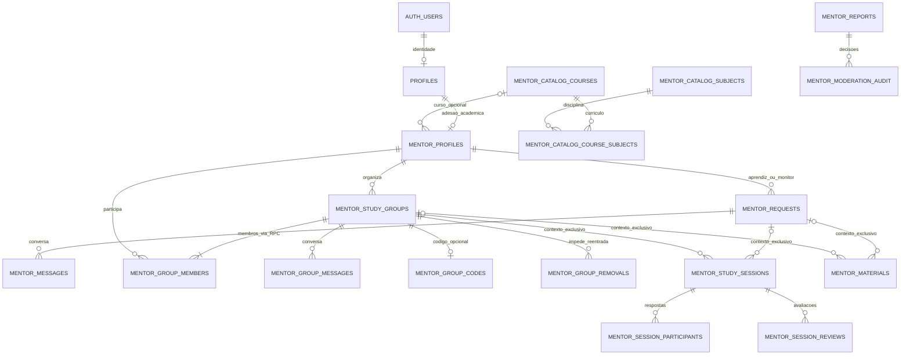

# 04 — Banco de dados, contratos e autorização

[Índice](README.md) · [Arquitetura](01-visao-geral-e-arquitetura.md) · [Configuração e mudanças](05-supabase-e-configuracao.md)

## 1. Qual banco e qual produto este capítulo descreve?

O MatchUp 3.3.3 conserva o banco da 3.3.1 e é uma aplicação de colaboração acadêmica para adultos de **18 anos ou mais**: descoberta de colegas/monitores, solicitações, conversas, grupos de estudo, encontros, materiais, avaliações e moderação. O produto atual não é o antigo aplicativo de relacionamento nem o antigo Campus; também não é um serviço oficial da FACENS.

O backend em uso é Supabase: PostgreSQL, Auth, API de RPC e Storage. O banco SQLite/servidor Node preservado na pasta é [legado](09-backend-legado.md), não a fonte dos dados atuais. O esquema PostgreSQL preserva tabelas antigas e compartilha alguns pontos de integração com elas; removê-las porque não aparecem na interface seria perigoso.

**Escopo da evidência:** leitura dos arquivos SQL e ferramentas locais, sem conexão ao banco. A definição efetiva deve ser reconstruída na ordem **`mentorship.sql` → `mentorship-academic.sql` → `mentorship-catalog.sql` → `mentorship-product.sql` → `mentorship-groups.sql`**, sobre uma base de contas previamente auditada. Isso é precedência de definições, **não uma instrução para reaplicar a cadeia sobre um banco atual**. Veja o procedimento de mudança no [capítulo 05](05-supabase-e-configuracao.md).

Os cinco arquivos introduzem **24 tabelas acadêmicas `mentor_*`**: 4 de núcleo, 9 acadêmicas, 4 de catálogo, 5 de produto/moderação e 2 de grupos. Não são “as únicas 15 tabelas do sistema”. Além delas existem Auth, Storage, tabelas preservadas e uma view privada de permissões. A contagem descreve os fontes, não uma inspeção do ambiente remoto.

**Incremento 3.3.1:** `supabase\mentorship-lab.sql` vem depois dessas camadas e instala somente a RPC de reset das próprias conexões; não cria tabela nem executa um reset. Foi instalado com preservação verificada; o contrato está na seção 7.1 e as 49 assertions específicas com rollback estão registradas no capítulo 07. Não reutilizar as evidências históricas da release 3.3 como prova desse recurso.

## 2. Vocabulário mínimo de PostgreSQL

| Conceito | Significado no MatchUp |
|---|---|
| PK — chave primária | Identifica uma linha. Um grupo tem `id`; uma associação tem a dupla `(group_id,user_id)` |
| FK — chave estrangeira | Impede referência inexistente: membro aponta para grupo e perfil |
| `NOT NULL` / `CHECK` | Campo obrigatório / regra que o PostgreSQL exige mesmo fora da interface |
| `UNIQUE` | Impede duplicidade; também é implementado por índice. Algumas unicidades são parciais, só para estados ativos |
| Índice | Caminho de busca; não é permissão. Índices de histórico ordenam conversas; GIN atende listas de horários |
| `jsonb` / `text[]` | JSON validado pelas RPCs / lista PostgreSQL. Não substituem validação de tipo, tamanho e conteúdo |
| `uuid` / `timestamptz` | Identificador / instante com tratamento de fuso. A interface pode exibir horário local; não gravar texto formatado como se fosse UTC |
| Transação | Conjunto que confirma inteiro ou desfaz inteiro no PostgreSQL. Não inclui automaticamente o envio de bytes ao Storage |
| Trigger | Regra executada pelo banco em resposta a evento; não confundir com JavaScript do navegador |

O limite `length(text)` do SQL conta caracteres; tamanhos de arquivos são bytes. Uma validação do formulário é conveniência; a RPC e as constraints continuam sendo a autoridade.

## 3. Diagrama lógico — parcial, não inventário completo

Abaixo estão os vínculos centrais. Não representa todas as FKs (por exemplo, autores, denúncias, bloqueios e auditoria) nem detalhes das tabelas legadas. A ligação material–objeto é **lógica pelo caminho**, não FK para os bytes de arquivos.

A cardinalidade “grupo tem membro” é garantida pela criação via RPC, que insere o organizador na mesma transação; a FK isoladamente não exige ao menos um membro. Em encontros e materiais, `request_id` e `group_id` obedecem a um `CHECK`: **exatamente um** deve ser não nulo. A referência de catálogo do perfil pode ser nula; o nome textual do curso permanece obrigatório.

## 4. Dicionário acadêmico consolidado

Salvo indicação contrária, tabelas ficam em `public`, IDs são UUID e datas são `timestamptz`. As FKs operacionais de perfil/pedido/grupo usam amplamente `ON DELETE CASCADE`; **as referências de catálogo não têm cascata**, denúncias usam `SET NULL` para pessoas e a auditoria preserva identificadores históricos. O efeito de exclusão deve ser analisado em conjunto, nunca usado como receita de remoção de conta.

### 4.1 Perfil e relacionamento de estudo

| Tabela | Campos e regras significativas |
|---|---|
| `mentor_profiles` | PK/FK `id → profiles.id`; `name` e `course` de 1–80 caracteres após trim; `semester` 1–20; `bio` até 1000; `availability` até 160; `format` = `presencial`, `online`, `hibrido`; `photo_url` até 512, vazia ou URL pública de foto própria no projeto autorizado; `active` boolean, só verdadeiro com ao menos uma matéria em `subjects` |
| `mentor_requests` | `id`, `learner_id`, `mentor_id`, `subject` 1–256 após catálogo; pessoas diferentes; `status` = `pending`, `accepted`, `declined`; `created_at`, `updated_at`; produto acrescenta `question`, `objective`, `proposed_at` |
| `mentor_messages` | `id`, `request_id`, `sender_id`, `body` não vazio até 2000 após trim; `client_id` obrigatório; unicidade `(sender_id,client_id)`; `created_at` |
| `mentor_blocks` | PK `(blocker_id,blocked_id)`, pessoas diferentes; `reason` até 1000; `created_at`. Bloqueio é unilateral no registro, bilateral no efeito de acesso |

Campos adicionais de `mentor_profiles`:

| Campo | Regra consolidada |
|---|---|
| `subjects` / `learning_subjects` | Até 8 itens cada; respectivamente ensino e aprendizagem |
| `current_subjects` | Até 12 itens; disciplinas atuais |
| `topics` | Até 20 itens; cada tópico 1–80 caracteres |
| Itens de disciplinas | Cada item 1–256 caracteres nas RPCs após catálogo; strings aparadas, sem duplicatas ignorando maiúsculas/minúsculas |
| `institution` / `city` | Até 120 / 100 caracteres. Produto permite vazios no onboarding; não perpetuar a regra antiga de obrigatoriedade |
| `study_preference` | `individual`, `grupo`, `ambos`; padrão `ambos` |
| `catalog_course_id` | FK opcional para `mentor_catalog_courses.id`; preserva integração com perfis anteriores ao catálogo |
| `methodology` / `experience` | Texto até 1000 cada, padrão vazio |
| `availability_slots` | Até 21 valores únicos, sem nulos; dia `seg`, `ter`, `qua`, `qui`, `sex`, `sab`, `dom` + hífen + turno `manha`, `tarde`, `noite`; exemplo `seg-noite`; lista vazia permitida |

**Pedido atual versus compatibilidade:** `mentor_request_product` exige dúvida de 10–1000 e objetivo de 5–500 caracteres, ambos após trim. Data proposta é opcional, finita, futura e até um ano à frente. As constraints aceitam textos vazios para preservar pedidos antigos; a antiga RPC `mentor_request` ainda existe. Logo, não afirmar que toda linha histórica contém dúvida/objetivo. A data da constraint apenas precisa ser finita; a janela futura é validação da RPC de produto.

`mentor_requests_open_unique` torna único `(learner_id,mentor_id,lower(btrim(subject)))` enquanto `pending` ou `accepted`. Um reenvio da mesma solicitação ativa retorna a existente; não sobrescreve sua dúvida/objetivo/data. Uma solicitação recusada não ocupa essa unicidade.

### 4.2 Grupos, agenda, materiais e leitura

| Tabela | Campos e regras significativas |
|---|---|
| `mentor_study_groups` | `id`, `owner_id`, `name` 1–100, `subject` 1–256, `topic` até 160, `objective` até 1000; `capacity` **2–100**; `starts_at` opcional e finito; `needs_mentor`; `status` = `open`/`cancelled`; `created_at`; `visibility` = `public`/`private`; `enrollment_open`; `format`; `location` até 200 |
| `mentor_group_members` | PK `(group_id,user_id)`, `joined_at`. Organizador já conta como membro e ocupa uma vaga |
| `mentor_group_messages` | `id`, `group_id`, `sender_id`, `body` 1–2000, `client_id`, `created_at`; unicidade `(sender_id,client_id)` |
| `mentor_group_invitations` | PK `(group_id,user_id)`, `created_at`; convite direcionado dá visibilidade, não cria participação nem reserva vaga |
| `mentor_group_codes` | PK/FK `group_id`; `code` único, nulo ou exatamente 32 dígitos hexadecimais maiúsculos; `updated_at`; acesso ao código só pelo organizador |
| `mentor_group_removals` | PK `(group_id,user_id)`, `removed_at`; registra impedimento duradouro de reentrada; não existe RPC de “desfazer remoção” |
| `mentor_study_sessions` | Contexto exclusivo pedido/grupo; `created_by`; `title` 1–100, `subject` 1–256, `topic` até 160; `starts_at` obrigatório/finito; `duration_minutes` 15–240; `location` até 200; `format`; `status` = `pending`/`confirmed`/`cancelled`; `created_at`, `updated_at` |
| `mentor_session_participants` | PK `(session_id,user_id)`; `response` = `pending`/`confirmed`/`declined` |
| `mentor_materials` | Contexto exclusivo pedido/grupo; `id`, `owner_id`, `name` 1–180, `mime`, `size` 1–10.485.760 bytes, `path` único, `committed` inicialmente falso, `created_at` |
| `mentor_session_reviews` | PK `(session_id,reviewer_id)`; `recipient_id` diferente do avaliador; `rating` 1–5; `comment` até 1000; `created_at` |
| `mentor_notification_reads` | PK `(user_id,notification_id)`; identificador textual 1–200; `read_at`. Guarda leitura, não a notificação completa |

**Defaults 3.3:** grupos novos privados, 12 vagas, inscrições abertas, formato presencial, sem necessidade de monitor por padrão. A migração mantém visibilidade pública das linhas anteriores e suas capacidades; só muda defaults futuros. `cancelled` corresponde a “arquivado” no hub: não é exclusão física.

O limite antigo de 30 vagas em `mentorship-academic.sql` foi substituído por 100 em `mentorship-groups.sql`. Editar capacidade abaixo do número atual de membros é recusado. `starts_at` novo deve ser futuro; atualização preserva uma data histórica se não foi efetivamente alterada.

### 4.3 Catálogo: nomes referenciados, não comprovação de matrícula

| Tabela | Campos e regras |
|---|---|
| `mentor_catalog_metadata` | Uma linha, PK `singleton` que deve ser verdadeira; `institution`, `checked_at` (date), `source_url` |
| `mentor_catalog_courses` | `id` slug `[a-z0-9]+(-[a-z0-9]+)*`; `name`, `degree`, `modality`, `source_url`, `curriculum_source_url`, `curriculum_version`, `curriculum_status` = `complete`/`partial`/`unavailable`, `active` |
| `mentor_catalog_subjects` | PK textual `name`, não vazia |
| `mentor_catalog_course_subjects` | PK `(course_id,subject_name,semester)`; FKs para cursos/matérias; `semester` 0–20, sendo **0 = não informado**, exposto como `null` pela RPC; `active` |

`mentor_catalog()` expõe apenas cursos e vínculos ativos, com origem, data e cobertura. “Oficial” no seletor significa nome proveniente do catálogo de fontes institucionais, não matrícula verificada nem endosso da FACENS. Lacunas de currículo não devem ser preenchidas por suposição.

`mentor_save_catalog` valida curso pelo ID e nome exato. Novas matérias de ensino/aprendizagem podem vir de qualquer curso ativo; matérias atuais novas devem pertencer ao curso selecionado. Valores antigos só podem ser mantidos quando forem **exatamente os já salvos na mesma lista da própria pessoa**; podem ser removidos, não copiados de outro perfil ou de outra lista como atalho. Curso livre sem ID só é preservado para perfil pré-existente que já não tinha ID e não muda o nome. `mentor_save_product` envolve esse contrato e acrescenta metodologia, experiência e horários.

O deploy de catálogo aposenta cursos/vínculos (`active=false`) em vez de apagá-los, preservando FKs e histórico. Há limite de compatibilidade de 80 caracteres para nome de curso e 256 para disciplina verificado pela ferramenta; ela bloqueia em vez de truncar nomes. As tabelas de catálogo não impõem sozinhas esses dois máximos.

### 4.4 Favoritos, denúncias e moderação

| Tabela | Campos e regras |
|---|---|
| `mentor_favorites` | PK `(owner_id,user_id)`; pessoas diferentes; `created_at`; favorito privado de quem salva |
| `mentor_moderators` | PK/FK `user_id → profiles.id`; `created_at`; habilitação administrativa explícita, sem conta padrão |
| `mentor_restrictions` | PK/FK `user_id → profiles.id`; `restricted` padrão verdadeiro; `updated_at`; restrição acadêmica, não banimento de Auth |
| `mentor_reports` | `id`; `reporter_id`, `target_id` com `ON DELETE SET NULL`; `reason` = `harassment`, `spam`, `impersonation`, `inappropriate`, `other`; `details` 10–2000; `status` = `pending`, `reviewed`, `dismissed`; datas e `resolution_note` |
| `mentor_moderation_audit` | `id`, FK `report_id` sem cascata; `moderator_id` e `target_id` históricos **sem FK de cascata**; `previous_status`, `status` final, `action` = `none`/`restrict`/`restore`; `note` até 2000; `created_at` |

Há no máximo uma denúncia pendente por par denunciante/alvo (`mentor_reports_pending`). Repetição retorna seu ID antes da checagem de limite. São permitidas no máximo **10 novas denúncias por denunciante na janela móvel de um dia**; não é reset à meia-noite.

O trigger `mentor_audit_immutable` rejeita `UPDATE`, `DELETE` e `TRUNCATE` da auditoria. Não significa inviolabilidade contra administradores capazes de alterar o próprio schema. A retenção e os identificadores históricos exigem tratamento explícito em pedidos de exclusão.

### 4.5 Integrações e legado preservado

| Objeto | Relação com o produto atual |
|---|---|
| `auth.users` | Identidade, conta apagada/banida, sessão validada pelo Auth; não acessível pelo app como tabela comum |
| `public.profiles` | Perfil-base e `birth_date` para elegibilidade; `mentor_profiles.id` depende dele. Gênero, preferências de namoro e outros campos antigos não definem a descoberta acadêmica |
| `public.user_filters` | Ainda é criado pelo trigger histórico de cadastro; isso não torna o filtro de namoro uma funcionalidade acadêmica |
| `public.blocks` | Bloqueios legados entram, nos dois sentidos, em `mentor__blocked`, junto a `mentor_blocks` |
| `storage.buckets` / `storage.objects` | Configuração/metadados do Storage; os bytes dos arquivos não são um simples campo destas tabelas |
| `mentor_private.mentor_material_permissions` | **View**, não tabela; projeta permissões de material usadas pelas políticas do Storage |
| Outras tabelas preservadas | `user_interests`, `user_photos`, `swipes`, `matches`, `messages`, `reports`, `notifications`, `premium_plans`, `premium_subscriptions`, `pickup_lines`, `stickers`, `favorite_lines`; além de `campus_posts`, `campus_members`, `campus_messages` quando implantadas |

Não confundir `reports` com `mentor_reports`, `messages` com `mentor_messages`, nem `notifications` com eventos acadêmicos derivados. A presença do schema antigo não autoriza distribuí-lo como parte da PWA atual ou limpar seus dados.

## 5. RLS, grants, JWT e SECURITY DEFINER

O acesso tem camadas distintas:

1. **Auth/JWT:** Supabase valida o token da sessão. `auth.uid()` extrai a identidade autenticada desse contexto; não vem de um `user_id` livre no formulário. Chave publicável/anon identifica acesso ao projeto, não concede administração nem representa a identidade da pessoa.
2. **Grants:** permissões de tabela e `EXECUTE` determinam se o papel PostgreSQL pode tentar a operação.
3. **RLS:** políticas decidem quais linhas uma operação permitida pode ler/escrever. Um grant não substitui RLS; RLS não concede um grant ausente.
4. **RPC:** valida ator, relação, estado, campos e bloqueios. Para as tabelas acadêmicas há RLS habilitada e `REVOKE ALL` de `PUBLIC`, `anon`, `authenticated`; a API normal é **RPC-only**, não CRUD direto.
5. **Funções privilegiadas:** RPCs `SECURITY DEFINER` executam com privilégios do proprietário da função; por isso devem validar o chamador explicitamente. Helpers internos têm `EXECUTE` revogado inclusive de `authenticated`.

`SET search_path=''` e referências qualificadas (`public.*`, `auth.*`) evitam resolução involuntária de objetos controlados por outro usuário. Isso reduz uma classe de riscos; não corrige por si só uma função com regra de autorização errada. `STABLE` descreve semântica de execução/otimização, não é permissão.

`public` é nome de schema; **não significa “acessível sem login”**. `PUBLIC` é o conjunto de papéis PostgreSQL; `anon` é o papel usual sem sessão. As RPCs acadêmicas publicadas abaixo concedem execução a `authenticated`, não a `anon` — inclusive `mentor_catalog()`. Uma cópia estática dos dados de catálogo distribuída como conteúdo seria outro mecanismo, não abertura da RPC.

`mentor_actor()` exige `birth_date` finita e idade atual de pelo menos 18, conta Auth não apagada, sem ban vigente e sem restrição acadêmica. A idade é calculada pela data, não pelo campo legado `age` nem por uma declaração de idade na tela. Isso **não equivale a verificação documental**. `mentor_ac__actor()` exige ainda perfil acadêmico. Flags editáveis de perfil/JWT não tornam ninguém moderador.

## 6. Catálogo das interfaces RPC e autorização

Os nomes abaixo são símbolos reais dos SQLs. “Autenticado elegível” inclui as regras da seção anterior. Funções helpers (`mentor__*`, `mentor_ac__*`, `mentor_product__*`, `mentor_groups__*`, `mentor_actor`, `mentor_can_contact`) não são endpoints para o cliente.

| Família / RPCs publicadas | Contrato de autorização e resultado |
|---|---|
| `mentor_me()`, `mentor_save(jsonb)` | Próprio perfil; `mentor_me` pode retornar nulo antes da adesão. `mentor_save` é interface de compatibilidade; não usar como substituta da validação atual de catálogo/produto |
| `mentor_catalog()`, `mentor_save_catalog(jsonb,text)`, `mentor_save_product(jsonb,text)` | Catálogo para autenticado elegível; salvar sempre no próprio UID, curso e listas validados; produto é o caminho atual de gravação completa |
| `mentor_discover(text)`, `mentor_discover_product(text,text,integer,text,text,boolean)` | Excluem própria pessoa, inelegíveis e bloqueados; lista até 100. Produto filtra matéria, curso, semestre, formato, horário e favoritos |
| `mentor_profile(uuid)` | Próprio perfil ou alvo ativo, compatível por aprendizagem mútua, ou com pedido entre os dois; elegibilidade/bloqueio continuam obrigatórios. O ramo de pedido desta RPC não limita a `accepted` |
| `mentor_favorites()`, `mentor_favorite(uuid,boolean)` | Lista/manipula favoritos próprios. Visibilidade do favorito requer alvo ativo, aprendizagem mútua ou relação **aceita**; desmarcar é permitido sem continuar visível |
| `mentor_request(uuid,text)`, `mentor_request_product(uuid,text,text,text,timestamptz)` | Perfil do solicitante e alvo elegível sem bloqueio; disciplina oferecida por monitor ativo ou compatibilidade de aprendizagem mútua. Produto exige dúvida/objetivo |
| `mentor_requests()`, `mentor_respond(uuid,boolean)` | Somente pedidos envolvendo o ator; apenas destinatário (`mentor_id`) responde; resposta final conflitante é recusada, repetição da mesma decisão é aceita |
| `mentor_messages(uuid)`, `mentor_send(uuid,text,uuid)` | Dupla participante de pedido **aceito**, ambos elegíveis e sem bloqueio. Leitura das últimas 200 mensagens, devolvidas em ordem cronológica |
| `mentor_block(uuid,text)` | Próprio bloqueio contra outro perfil acadêmico existente, nunca contra si; inserção repetida não duplica registro |
| `mentor_reset_connections(text)` — incremento 3.3.1 instalado | Somente conexões da própria conta acadêmica elegível; exige `RESETAR`; remoção definitiva afeta os dois lados. Ver seção 7.1 |
| `mentor_groups()`, `mentor_group_detail(uuid)` | Visibilidade detalhada na matriz abaixo; até 100 grupos na listagem e 200 mensagens no detalhe permitido |
| `mentor_group_create(jsonb)`, `mentor_group_update(uuid,jsonb)` | Criador elegível com perfil torna-se organizador/membro; só organizador atualiza grupo aberto |
| `mentor_group_join(uuid)`, `mentor_group_join_code(text)` | Participante elegível, sem impedimento; grupo aberto, inscrições abertas e vaga. Código não substitui autorização |
| `mentor_group_code(uuid,text)`, `mentor_group_remove(uuid,uuid)` | Só organizador; ações de código `get`, `rotate`, `disable`. Remoção não pode atingir o próprio organizador |
| `mentor_group_leave(uuid)`, `mentor_group_cancel(uuid)` | Não organizador sai; organizador arquiva. Não transfere propriedade |
| `mentor_group_send(uuid,text,uuid)` | Membro com acesso a grupo aberto; reenvio idempotente com mesmo `client_id`, conteúdo e contexto |
| `mentor_group_suggestions(uuid)`, `mentor_group_invite(uuid,uuid)` | Só organizador com acesso; sugestão até 20 perfis compatíveis por disciplina/tópico; convite exige alvo elegível/contactável e inscrições abertas |
| `mentor_sessions()`, `mentor_session_save(jsonb)` | Agenda de participantes autorizados; pedido aceito permite criar a um dos dois; em grupo só organizador cria; só criador remarca, mantendo contexto |
| `mentor_session_respond(uuid,boolean)`, `mentor_session_cancel(uuid)` | Participante responde a encontro futuro não cancelado; só criador cancela |
| `mentor_file_prepare(uuid,uuid,text,text,bigint)`, `mentor_file_commit(uuid)`, `mentor_file_abort(uuid)`, `mentor_files(uuid,uuid)` | Contexto aceito ou grupo aberto com participação; preparar reserva; commit/abort só proprietário; listagem exige também que o autor do arquivo ainda tenha acesso ao contexto |
| `mentor_review(uuid,integer,text)`, `mentor_reviews(uuid)` | Avaliar exige encontro confirmado e terminado, presença confirmada e acesso atual; sem autoavaliação; leitura agregada passa pela visibilidade do perfil e exclui avaliações de autores bloqueados/inelegíveis |
| `mentor_notifications()`, `mentor_notification_read(text)` | Eventos calculados do contexto atual do próprio usuário, até 100; marcar leitura exige ID presente nessa lista; não é e-mail/push |
| `mentor_report(uuid,text,text)`, `mentor_my_reports()` | Denúncia de pessoa conhecida por visibilidade, bloqueio, pedido ou grupo autorizado; leitura só das próprias denúncias, sem nota interna |
| `mentor_moderation_access()`, `mentor_moderation_queue(text)`, `mentor_moderate(uuid,text,text,text)` | Acesso depende de elegibilidade **e** linha em `mentor_moderators`; fila até 200 por estado; decisão impede moderador envolvido como denunciante ou alvo |

Aprendizagem mútua não é “mesmo curso”: exige ao menos uma matéria comum em `learning_subjects`, ambos com preferência `individual`/`ambos` e formatos compatíveis (igual ou um híbrido). Estar com `active=false` desativa oferta de monitoria, mas não necessariamente aprendizagem mútua nem contatos existentes. Na descoberta normal, um pedido de saída pendente/aceito com o alvo já o retira da lista; favoritos têm ramo separado. O filtro aceita matéria até 256, slug de curso até 100, semestre 1–20 e horário válido; híbrido também satisfaz filtros presencial/online.

Notificações são **derivadas**, não uma fila de entrega persistente: pedido, aceite, mensagens, convite, material, atualização/cancelamento de encontro e proximidade nas próximas 24 horas. IDs de encontro incorporam `updated_at`; uma remarcação pode gerar evento ainda não lido. Apenas os 100 eventos atuais mais recentes entram no feed, e marcar leitura exige que o ID ainda esteja nele. Não há promessa de e-mail, push ou lembrete entregue com o app fechado.

### Matriz de visibilidade de grupos

| Situação do ator elegível | Cartão/detalhe resumido | Membros e local/link | Chat/materiais | Código |
|---|---|---|---|---|
| Não membro de grupo público aberto | Sim | Não | Não | Não |
| Não membro de privado sem convite | Não | Não | Não | Não |
| Convidado direcionado, ainda não membro | Sim, se aberto | Não | Não | Não |
| Portador de código, ainda não membro | Código serve para tentar entrada, não listar dados privados | Não | Não | Não pode consultar pela RPC de gestão |
| Membro de grupo aberto | Sim | Sim | Sim, conforme contexto | Só se organizador |
| Membro de arquivado | Sim | Sim no detalhe | Não; agenda histórica conforme acesso | Só organizador consulta/desabilita; não rotaciona |
| Removido, restrito ou bloqueado no contexto | Não | Não | Não | Código não restabelece acesso |

Elegibilidade de grupo considera bloqueio entre ator e organizador **ou qualquer membro**, nos dois sentidos e nas duas tabelas de bloqueio. Conteúdo não é apenas escondido no HTML: os helpers de contexto são reutilizados por RPCs, agenda e materiais. As ações administrativas do próprio organizador, como editar/código/remover, verificam identidade elegível e propriedade; não são uma leitura pública do contexto.

## 7. Concorrência, idempotência e revogação

- `mentor__lock` usa advisory locks transacionais por conta em ordem UUID, cobrindo até a criação do primeiro perfil. A mesma disciplina serializa mensagens, bloqueios e restrições relevantes.
- `mentor_ac__group_lock` trava o grupo primeiro e depois participantes/organizador/ator/alvo extra em ordem. Entrada usa também `FOR UPDATE` na linha do grupo; contar vagas e inserir membro ocorre sob a mesma proteção.
- `mentor_groups__join` revalida o código **depois** do lock. Rotacionar/desabilitar concorrentemente não deixa um código antigo passar apenas porque foi lido antes do lock.
- Entrada repetida de membro existente em grupo aberto retorna a associação sem contar duas vagas, mesmo com inscrições depois fechadas; código fornecido ainda precisa ser válido. Grupo arquivado rejeita entrada.
- Rotação gera UUID aleatório sem hífens em hexadecimal maiúsculo (122 bits aleatórios do UUID), substitui o código anterior e não remove membros. `get` não gera código; `disable` o anula. Não existe prazo automático de expiração nem código individual de uso único. Entrada aceita até 120 caracteres brutos, remove espaços/hífens, converte para maiúsculas e exige 32 hexadecimais.
- Remover grava `mentor_group_removals`, apaga participação/convite e recusa reentrada até com código novo. Repetir a mesma remoção retorna sucesso. Saída voluntária não grava impedimento duradouro, mas remove convite direcionado.
- Entrar inclui a pessoa como `pending` nos encontros futuros não cancelados e recoloca o encontro como `pending`. Sair/remover declina sua resposta futura; arquivar cancela encontros futuros e revoga código/inscrições. Histórico concluído não é reescrito por essas ações.
- `mentor_session_save` ao remarcar reinicia respostas, confirmando o criador e deixando os demais pendentes. Todos precisam confirmar para estado `confirmed`. Não remarca encontro encerrado/cancelado ou com avaliação. Avaliação é única por encontro/avaliador; repetir conteúdo igual retorna sucesso, alteração é recusada. O destinatário é o monitor do pedido ou organizador do grupo, nunca o próprio avaliador.
- Mensagens têm chave idempotente por remetente. Reusar `client_id` com outro texto/contexto é erro, não edição. Não gerar novo ID automaticamente depois de resposta de rede incerta.
- `mentor_moderate` trava conta/alvo, linha da autorização do moderador (`FOR SHARE`) e denúncia (`FOR UPDATE`); revogação administrativa de papel se serializa com decisões. Cada decisão registra auditoria — não prometer idempotência de decisão repetida.

SQLSTATE `42501` indica autorização/contexto indisponível; `22023`, dados/estado inválidos; `54000`, limite de denúncias. Um erro genérico de grupo/convite evita revelar se existe um grupo privado. Não contornar isso com consultas privilegiadas para o participante.

### 7.1 Reset das próprias conexões — adição pós-3.3

**Estado:** contrato de `supabase\mentorship-lab.sql` instalado e publicado com a 3.3.1. Validação SQL: 49 assertions, fixtures com rollback, negações/escopo/cascatas e contenção da trava. Nenhuma conta real foi resetada. Não confundir com reset legado nem com reset administrativo do banco.

- Assinatura efetiva: `mentor_reset_connections(p_confirmation text)`. O parâmetro **não tem default SQL**: precisa ser exatamente `RESETAR`; nulo/outro valor gera `22023`. A função retorna JSON com `reset`, `requests`, `messages`, `sessions`, `materials` e `reviews`.
- `mentor_ac__actor()` obtém e valida o ator a partir de Auth; não há UUID de alvo recebido do cliente. A função usa `SECURITY DEFINER`, `search_path=''`, `lock_timeout='5s'` e EXECUTE somente para `authenticated`. Exige perfil/elegibilidade acadêmicos, não papel de moderador nem cadastro especial de laboratório.
- Adquire `mentor__lock(u)` **somente para a própria conta** e revalida o ator após o lock. Coleta todos os pedidos em que o ator é aprendiz **ou** monitor, sem filtro de status, mais IDs dos filhos. A remoção e suas cascatas pertencem à mesma transação; falha desfaz o conjunto.
- Apaga `mentor_requests` selecionados. As FKs removem mensagens, encontros individuais, participantes, avaliações desses encontros e metadados de materiais. Remove também `mentor_notification_reads` correspondentes a `request`, `accepted`, `message`, `file`, `session` e `upcoming`, inclusive versões por data e registros do outro participante. Não filtra essa limpeza por usuário porque os eventos de ambas as pontas deixam de existir.
- Preserva conta, perfil/foto, favoritos, bloqueios, denúncias, todos os grupos e relações entre terceiros. Como avaliações individuais são eliminadas, agregados derivados podem mudar. A autorização de leitura dos materiais daquele contexto deixa de existir, mas **nenhum objeto Storage é fisicamente apagado**; URLs já emitidas, downloads e ICS exportados não são recolhidos.
- Não há chave idempotente de requisição. Sem novas conexões, repetir encontra zero pedidos; se houver novos pedidos entre chamadas, uma repetição poderá apagá-los. Após resposta de rede incerta, reler o estado antes de confirmar novamente. Não há operação de desfazer após commit.

A implantação instala essa capacidade, mas **não a executa**. O teste `mentorship-lab-backend.cjs --run` validou negações, limites de escopo, cascatas, concorrência, ausência de relações e preservação de terceiros/grupos, usando apenas fixtures transacionais com rollback. O registro completo de alcance e limitações está no [capítulo 07](07-testes-e-validacao.md). Isso não representa execução autenticada do reset por HTTP nem ensaio com participantes reais.

## 8. Storage: fotos públicas e materiais privados

| Aspecto | Fotos | Materiais |
|---|---|---|
| Bucket | `photos`, público | `mentor-materials`, privado |
| Referência | `mentor_profiles.photo_url` | `mentor_materials.path`, metadados e estado `committed` |
| Envio | Foto própria em pasta do UID; cliente aceita JPG/PNG/WebP até 5 MiB e envia JPEG otimizado com `upsert:false` | Reserva via RPC, upload sem sobrescrita, commit; até 10 MiB e 50 registros por contexto, incluindo reservas |
| Leitura | URL pública conhecida não depende de pertencer ao grupo/ser aceito | Permissões dependem de identidade, contexto, autor elegível, bloqueios/restrições e participação |
| Exclusão no cliente | Desvincular URL do perfil não prova remoção do objeto | Cliente só remove objeto **não committed**; não pode editar/sobrescrever/remover material confirmado |

O limite de 5 MiB é verificado no código cliente da foto; não o apresentar como quota do bucket remoto não consultado. `mvp-fixes.sql` limita inserção/exclusão de objetos de fotos à pasta `auth.uid()`. O SQL acadêmico valida URL da foto contra o host do projeto e caminho do próprio UID; migrar de projeto exige revisão explícita dessas referências, não apenas trocar a chave do SDK.

### Fluxo de material e suas falhas intermediárias

1. `mentor_file_prepare` valida contexto, nome e tipo; cria reserva `committed=false`, caminho `UID/UUID.ext` e retorna bucket/caminho.
2. Storage recebe os bytes. São aceitos PDF, DOC/DOCX, PPT/PPTX, JPG/JPEG, PNG e WebP com MIME correspondente; nome não aceita separadores, controle, início com ponto ou caracteres proibidos de caminho. Não há promessa de antivírus no servidor.
3. `mentor_file_commit` confere no objeto proprietário, caminho, MIME e tamanho final exatos; só então torna o material compartilhado. Repetição do commit retorna o arquivo já confirmado se o contexto continua autorizado.
4. Se o envio falhar, o cliente tenta remover objeto incompleto e depois `mentor_file_abort`. Abort só apaga reserva própria não confirmada **sem objeto existente**. Falha de cleanup preserva metadados para investigação; não ocultar como sucesso.

O trigger `mentor_material_write_guard` trava o contexto e revalida escritas em `storage.objects`, inclusive a passagem preliminar `version='1'` do serviço Storage, que ocorre antes de conhecer o tamanho final. Isso não dispensa a conferência de metadados no commit. Updates de materiais são negados.

A view `mentor_private.mentor_material_permissions` é `security_barrier`, com direitos do proprietário, e replica predicados de elegibilidade/bloqueios. O patch de produto acrescenta restrições à view. `anon` recebe SELECT na view, mas, sem identidade elegível, não obtém caminhos; isso não libera o bucket. Políticas **restritivas** de SELECT/INSERT/UPDATE/DELETE impedem políticas permissivas legadas de ampliar acesso ao bucket de materiais.

No cliente acadêmico, download cria URL assinada por **60 segundos**. Revogar participação/bloquear/restringir impede novas autorizações, mas não apaga bytes já baixados nem deve ser descrito como revogação instantânea de toda URL já assinada. Fotos públicas têm limitação ainda maior: bloquear alguém não invalida a URL pública.

## 9. Índices e triggers que merecem atenção

| Símbolo | Por que existe |
|---|---|
| `mentor_requests_open_unique`, `mentor_requests_incoming`, `mentor_requests_outgoing` | Idempotência de pedido ativo e listagens dos dois lados |
| `mentor_messages_history`, `mentor_group_messages_history` | Últimas mensagens por contexto, data e ID |
| `mentor_blocks_target` | Busca do bloqueio no sentido inverso |
| `mentor_session_participants_user` | Agenda por participante |
| `mentor_materials_request`, `mentor_materials_group` | Materiais por contexto |
| `mentor_product_course_semester`, `mentor_product_slots` (GIN) | Filtros estruturados de descoberta e contenção de horário |
| `mentor_favorites_target` | Relação inversa de favoritos |
| `mentor_reports_pending`, `mentor_reports_owner_date`, `mentor_reports_queue`, `mentor_audit_report` | Unicidade pendente, histórico próprio, fila e auditoria |
| PKs/UNIQUE de grupos e códigos | Não duplicar associação; localizar código único |
| `on_auth_user_created → handle_new_user` | Integra cadastro de Auth com perfil-base/filtros; corpo histórico corrigido em `mvp-fixes.sql`; não cria automaticamente perfil acadêmico |
| `mentor_material_write_guard → mentor_ac__storage_write` | Protege escrita e consistência do material |
| `mentor_audit_immutable → mentor_product__immutable_audit` | Bloqueia alteração/apagamento da trilha de decisão |

Existem triggers antigos de relacionamento e entitlement; não foram convertidos em regras de monitoria. Não desabilitá-los globalmente como forma de “consertar cadastro”.

## 10. Como investigar sem confundir modelo com ambiente

| Pergunta | Evidência local a consultar | O que ela não comprova |
|---|---|---|
| Quem pode entrar num privado? | `mentorship-groups.sql`: `mentor_groups__eligible`, `mentor_groups__join`, `mentor_ac__group_visible` | Que a versão remota é exatamente a mesma |
| Código antigo deveria funcionar? | `mentor_group_code`, rechecagem pós-lock e teste `mentorship-groups-backend.cjs` | Que houve rotação no grupo de um participante |
| Por que uma matéria é recusada? | `mentor_save_catalog`, `catalog-data.cjs`, dados do catálogo | Que o aluno está matriculado ou que todos os currículos estão completos |
| Restrição vale para arquivo? | `mentor__eligible`, patch da view de permissões no SQL de produto | Que uma cópia já baixada foi apagada |
| Resultado de moderação pode ser alterado? | `mentor_moderate`, `mentor_audit_immutable` | Que existe operador escalado para atender |

Os testes backend de catálogo/produto/grupos exercitam papéis, claims simulados, limites, preservação e rollback; o live de grupos exercita Auth/PostgREST reais com contas descartáveis. Aqui eles foram **lidos, não executados**. Não usar testes antigos que reaplicam migrações-base como diagnóstico rotineiro de um banco atualizado.

## 11. Continuação e referências

- [01 — Arquitetura](01-visao-geral-e-arquitetura.md), [02 — Uso](02-funcionalidades-e-uso.md), [03 — Frontend](03-frontend.md).
- [05 — Supabase](05-supabase-e-configuracao.md), [06 — Desenvolvimento](06-desenvolvimento-e-android.md), [07 — Validação](07-testes-e-validacao.md).
- [08 — Operação/privacidade](08-operacao-privacidade-e-suporte.md), [09 — Legado](09-backend-legado.md), [10 — Manutenção](10-manutencao-e-evolucao.md).
- [11 — UI/UX e acessibilidade](11-ui-ux-e-acessibilidade.md), [12 — Referências/glossário](12-referencias-e-glossario.md), [13 — Histórico](13-historico-de-releases.md).
- Referências oficiais: [constraints PostgreSQL](https://www.postgresql.org/docs/current/ddl-constraints.html), [RLS PostgreSQL](https://www.postgresql.org/docs/current/ddl-rowsecurity.html), [segurança de funções](https://www.postgresql.org/docs/current/sql-createfunction.html), [locks](https://www.postgresql.org/docs/current/explicit-locking.html), [RLS Supabase](https://supabase.com/docs/guides/database/postgres/row-level-security), [Storage e acesso](https://supabase.com/docs/guides/storage/security/access-control).
