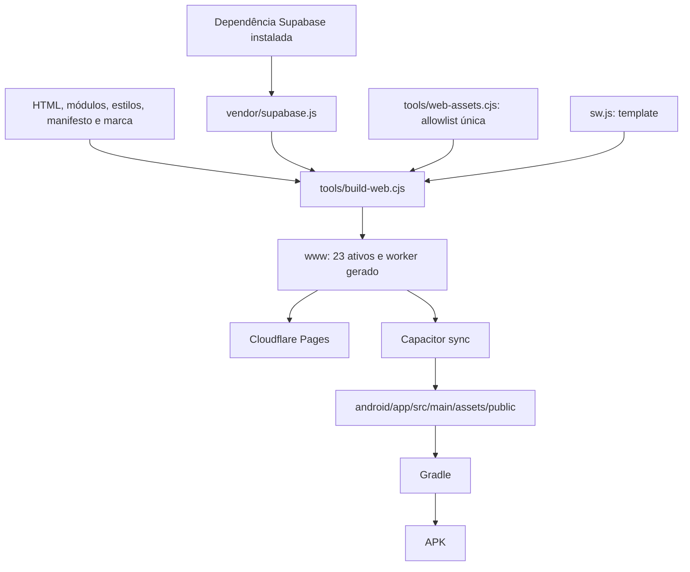

# 06 — Desenvolvimento, build, PWA e Android

[Índice](README.md) · [Anterior: Supabase](05-supabase-e-configuracao.md) · [Próximo: testes](07-testes-e-validacao.md)

Este guia parte de uma pasta local já contendo os fontes. Os comandos usam **PowerShell no Windows** e devem ser executados na raiz, salvo indicação. O checkout desta entrega é uma pasta sem Git; não pressuponha branches, commits ou pull requests disponíveis.

> **Não execute tudo de uma vez.** Iniciar o frontend não exige migration; compilar não publica; publicar não configura Auth; instalar um APK não homologa um dispositivo. Cada seção possui efeito e pré-condições próprios.

## 1. Mapa das atividades e riscos

| Atividade | Efeito | Precisa de nuvem? |
|---|---|---|
| `npm ci` | Instala as versões do lockfile; recria dependências locais | Registro de pacotes, normalmente |
| `npm run build:web` | Atualiza SDK local e recria `www` | Não, com dependências presentes |
| `node .\tools\serve.cjs` | Serve a allowlist dos fontes no loopback | Não para HTML; a aplicação real usa Supabase |
| `npm test` | Executa suíte Node local | Testes previstos como locais |
| `npm run test:ui` | Inicia servidor de teste e navegador | Fixtures dos cenários atuais interceptam serviços |
| `npm run sync:android` | Faz build web e sincroniza Capacitor Android | Pode necessitar dependências |
| Gradle `assembleDebug` | Gera APK de depuração | Primeiro build pode baixar dependências |
| Wrangler Pages deploy | Publica o conteúdo de `www` | **Sim; altera publicação** |
| Ferramenta SQL com `--apply` | Modifica backend | **Sim; fora do início rápido** |

A aplicação atual **não** usa `server\src\index.js`. Scripts antigos, seeds e ferramentas administrativas não são atalhos de instalação.

## 2. Requisitos e versões de referência

### 2.1 Desenvolvimento web

- Node.js 22 ou superior compatível com as dependências. Entrega executada com **24.14.1**.
- npm; entrega executada com **11.4.2**.
- Google Chrome para a configuração padrão Playwright, que usa `channel: 'chrome'`.
- WebKit distribuído pelo Playwright para a suíte desse motor; não é Safari físico.
- Acesso de rede para baixar dependências e, ao usar o app real, acessar o Supabase configurado.

Verifique o ambiente, sem alterar o projeto:

```powershell
node --version
npm --version
```

### 2.2 Dependências resolvidas no lockfile da entrega

| Pacote | Versão resolvida | Papel |
|---|---:|---|
| `@supabase/supabase-js` | 2.117.2 | SDK usado no cliente e ferramentas |
| `@capacitor/core`, `@capacitor/android`, `@capacitor/cli` | 8.5.2 | Runtime/empacotamento Android |
| `@capacitor/filesystem` | 8.1.3 | Arquivo temporário de exportação nativa |
| `@capacitor/share` | 8.0.2 | Compartilhamento nativo |
| `@playwright/test` | 1.63.0 | Testes de navegador |
| `pg` | 8.23.1 | Ferramentas administrativas PostgreSQL, não frontend |

A faixa declarada no `package.json` pode diferir da versão resolvida. Por exemplo, Playwright está declarado como `^1.58.2`, mas o lockfile resolve 1.63.0. Use o lockfile como referência de reprodução; não afirme que a faixa do manifest é a versão instalada.

### 2.3 Android

- JDK **21**.
- Android SDK com plataforma **36**, platform-tools e build-tools compatíveis.
- Licenças do SDK aceitas.
- Gradle Wrapper do projeto: **8.14.3**; Android Gradle Plugin: **8.13.0**.
- Espaço para SDK, dependências, caches e saídas; memória suficiente para Java e processos de build.

Não é necessário iniciar emulador. **Nesta campanha não foram utilizados emuladores/simuladores, conforme a restrição vigente do projeto**; testes do comportamento nativo devem ser feitos em dispositivo físico autorizado. Essa restrição atual não reescreve os registros históricos de campanhas anteriores.

## 3. Preparar dependências

```powershell
Set-Location 'P:\app\tirnitintinder'
npm ci
```

Substitua a pasta se estiver em outra máquina. `npm ci` instala conforme o lockfile e remove/recria `node_modules`; não é uma operação a repetir a cada execução. Se falhar, confira a versão do Node, acesso ao registro e compatibilidade do manifest/lockfile. Não apague o lockfile para esconder divergências.

Não há arquivo `.env` de frontend automaticamente carregado por este build. O cliente contém a configuração publicável do Supabase. Consulte o [capítulo 05](05-supabase-e-configuracao.md) antes de apontar para outro ambiente. Nunca substitua a chave publicável por uma credencial privilegiada.

## 4. Executar localmente

```powershell
npm run build:web
node .\tools\serve.cjs
```

Abra **http://127.0.0.1:8089**. O segundo comando permanece em execução; encerre pelo terminal que o iniciou com `Ctrl+C`.

### O que o servidor entrega

`tools\serve.cjs` lê a allowlist central e serve **os fontes permitidos da raiz**, com `sw.js` gerado a partir do template. Ele não serve toda a pasta e não é um servidor Express de negócio. Essa diferença importa: editar um fonte pode mudar o preview local, enquanto um `www` antigo continua desatualizado até novo build.

O servidor define MIME por extensão, `X-Content-Type-Options: nosniff` e `Cache-Control: no-cache`. Para o MP4 público, entrega `video/mp4`, suporta `HEAD`, anuncia `Accept-Ranges` e responde a intervalos simples válidos com **206** e inválidos com **416**. Isso é contrato do servidor local: a publicação Cloudflare observada respondeu a Range com **200 e o vídeo completo**, um fallback HTTP válido para reprodução progressiva, não prova de 206 público. O vídeo não autoriza ampliar a allowlist; arquivos administrativos e legados fora da lista retornam 404. O bind é **127.0.0.1**, portanto não está acessível diretamente a um celular na rede local. Para teste físico da PWA, use uma publicação HTTPS autorizada; não exponha a raiz inteira como atalho.

### Porta e subdiretório

```powershell
$env:SPARK_TEST_PORT = '8093'
node .\tools\serve.cjs
```

`SPARK_TEST_PORT` mantém um nome histórico, mas é usado pelo servidor e pelos testes atuais. A variável vale para o processo/terminal; não reconfigura Supabase. `MATCHUP_BASE_PATH` permite testar um prefixo de URL; por exemplo, `matchup` serve o app em `/matchup/`. Não defina esse prefixo no comando padrão de teste sem ajustar a URL esperada pelo runner.

Para limpar escolhas feitas no terminal:

```powershell
Remove-Item Env:SPARK_TEST_PORT -ErrorAction SilentlyContinue
Remove-Item Env:MATCHUP_BASE_PATH -ErrorAction SilentlyContinue
```

### O risco mais comum no desenvolvimento

O servidor local não cria um Supabase de testes. Login, upload e pedidos feitos manualmente podem acessar o ambiente real configurado. Use contas autorizadas e fixtures para regressão; não use participantes reais como dados descartáveis.

## 5. Scripts existentes — sem comandos inventados

| Script | Comando interno | Observação |
|---|---|---|
| `build:web` | `node tools/build-web.cjs` | Gera ativos públicos |
| `test` | `node --test tests/*.test.cjs` | Executa todos os unitários dessa seleção |
| `test:ui` | `playwright test` | Seleciona `mentorship*.spec.cjs` |
| `sync:android` | `npm run build:web && cap sync android` | Build antes da sincronização |

Não existem scripts de raiz `start`, `dev`, `lint`, `typecheck` ou `build` genérico. Não há transpilação TypeScript ou bundler de framework nesse pipeline. Um `package.json` dentro de `server` pertence ao legado, não ao app atual.

## 6. Fontes canônicas e saídas geradas



### Passos reais do build

1. Copia o SDK UMD instalado para `vendor\supabase.js`.
2. Remove e recria **somente `www`**, que é saída gerada.
3. Copia os **23 ativos** de `assets` em `tools\web-assets.cjs`: inclui `startup.js`, `startup.css` e `assets\brand\matchup-intro.mp4`, além dos 20 ativos anteriores.
4. Calcula hash do template e de **todos os ativos públicos de origem, inclusive o vídeo**.
5. Gera `www\sw.js`, preenchendo versão e lista do cache a partir de `shellAssets`, que exclui o MP4.

Resultado atual 3.3.3: **24 arquivos públicos**, contando o worker, mas apenas **22 arquivos de precache obrigatório**. O MP4 e o próprio worker não integram esse precache. Na referência histórica 3.3/3.3.2 eram 21 arquivos públicos e 20 pré-armazenados. Não confundir quantidade publicada com quantidade no cache; adicionar um arquivo exige revisar a allowlist, referências no HTML, testes e política de cache.

Não edite `www`, assets nativos gerados ou o SDK copiado como fonte de uma correção. Edite a entrada canônica e gere novamente. O build não minifica código, injeta variáveis por ambiente, valida credenciais, aplica migrations ou publica automaticamente.

## 7. Service worker e ciclo da PWA

### Instalação

A PWA usa manifesto e ícones locais. No iOS, a instalação é conduzida pelo Safari: **Compartilhar → Adicionar à Tela de Início**. A interface explica o procedimento quando não existe um evento de instalação utilizável. Não há pacote `.ipa` nem App Store como parte da entrega.

### Cache

A versão do cache é derivada do conteúdo, no padrão `matchup-static-…`. O código evita armazenar requisições autenticadas, APIs, material privado, envios e URLs com credenciais. A navegação usa rede e fallback do shell conforme o worker. O cache não é uma réplica offline do banco.

O MP4 opcional **não é interceptado pelo service worker, inclusive em requisições Range**, nem obrigatório para instalar ou atualizar o shell. Offline dispensa o vídeo antes de atribuir `src`; não se promete vídeo offline. `matchup-static-e4a396563d6dc6efa254` é o cache gerado para a 3.3.3. A política e o hash não significam que todos os dispositivos já atualizaram.

A disponibilidade do shell também depende de visita anterior, instalação do worker e retenção do cache pelo navegador. Limpeza de dados ou gestão de armazenamento pelo sistema pode removê-lo; não prometa abertura offline em um dispositivo que nunca carregou o app.

### Atualização

O app apresenta a atualização e solicita confirmação. Recomende salvar rascunhos primeiro. A nova versão web não substitui os assets já embarcados em um APK: Android exige novo pacote/sincronização/build e distribuição quando o conteúdo nativo muda.

### Limite de evidência

O release 3.3 verificou cache atual e recarga controlada online em Chrome/WebKit, além de recarga offline no Chrome. O runner WebKit Windows falha em navegação offline mesmo com um worker mínimo independente; isso não prova defeito do Safari físico nem o homologa. O teste local de host desconectado é uma evidência distinta, explicada no [capítulo 07](07-testes-e-validacao.md).

## 8. Configuração e identidade Android

`capacitor.config.json` define:

| Campo | Valor atual |
|---|---|
| `appId` | `com.spark.upx` |
| `appName` | `MatchUp` |
| `webDir` | `www` |
| `server.androidScheme` | `https` |

Não há `server.url` para notebook. Manter o identificador histórico `com.spark.upx` permite continuidade da instalação; o nome apresentado ao usuário é MatchUp. Alterar o applicationId criaria outra identidade de aplicativo, não uma simples troca de marca.

`android\app\build.gradle` declara **versionName 3.3.3 / versionCode 13**. `android\variables.gradle` declara API mínima **24 (Android 7)** e compile/target **36**. O versionCode deve crescer em uma nova distribuição; nunca deduza a versão interna apenas pelo nome do APK.

`MainActivity` estende `BridgeActivity`; a experiência acadêmica permanece na base web. A intro 3.3.3 também é web e aparece **depois da splash nativa do sistema operacional**, não como vídeo da splash do Android. Filesystem e Share atendem a exportação nativa de `.ics`. A presença de bibliotecas/Google Services no build não significa que push foi implementado.

## 9. Compilar um APK de piloto no Windows

### Antes de executar

- Confirme o ambiente e o conteúdo de `www` que será incluído.
- Encerre cargas de build concorrentes desnecessárias.
- Não altere o backend para resolver erro de compilação.
- Use a mesma sessão de terminal para definir Java/SDK e executar Gradle.

```powershell
Set-Location 'P:\app\tirnitintinder'
$env:JAVA_HOME = 'C:\caminho\real\para\jdk-21'
$env:ANDROID_HOME = "$env:LOCALAPPDATA\Android\Sdk"
$env:ANDROID_SDK_ROOT = $env:ANDROID_HOME
& "$env:JAVA_HOME\bin\java.exe" -version
npm run sync:android
```

O caminho de Java é um **placeholder**: substitua por um JDK 21 instalado. Prossiga somente se a sincronização concluir sem erros:

```powershell
Set-Location .\android
.\gradlew.bat assembleDebug --no-daemon --max-workers=1 '-Dorg.gradle.jvmargs=-Xmx512m -XX:MaxMetaspaceSize=384m'
```

Esse perfil de memória foi suficiente na entrega 3.3, mas não é garantia em qualquer máquina. Falha de alocação exige diagnóstico de recursos; não justifica retirar testes ou alterar regras do produto.

Saída relativa à raiz:

```text
android\app\build\outputs\apk\debug\app-debug.apk
```

Os arquivos `capacitor.build.gradle`/`capacitor.settings.gradle` gerados pelo sync não devem receber correções manuais que precisam persistir. Revise as entradas de configuração apropriadas.

### Debug não é release de loja

O APK atual usa assinatura de desenvolvimento para distribuição direta. Não há configuração de assinatura de produção pronta no `build.gradle` inspecionado. Rodar `assembleRelease` não cria uma política de proteção de chave, termos, suporte ou aprovação Play Store.

## 10. Inspecionar e instalar em aparelho físico

Volte à raiz antes dos comandos de caminho relativo. As ferramentas abaixo usam a versão de build-tools **35.0.0**, disponível na verificação registrada; ajuste se seu SDK possuir outra versão compatível.

```powershell
Set-Location 'P:\app\tirnitintinder'
$apk = '.\android\app\build\outputs\apk\debug\app-debug.apk'
$buildTools = Join-Path $env:ANDROID_HOME 'build-tools\35.0.0'
& "$buildTools\aapt.exe" dump badging $apk
& "$buildTools\apksigner.bat" verify --verbose --print-certs $apk
Get-FileHash $apk -Algorithm SHA256
```

Verifique pacote, nome, versão, minSdk/targetSdk e assinatura; compare os ativos embarcados com `www`. Uma assinatura válida não comprova que o conteúdo é a versão pretendida. Um hash igual comprova identidade dos bytes, não ausência de defeitos.

Para um **dispositivo físico de teste autorizado**:

```powershell
$adb = Join-Path $env:ANDROID_HOME 'platform-tools\adb.exe'
& $adb devices
& $adb -s '<SERIAL_DO_APARELHO_DE_TESTE>' install -r $apk
```

Substitua o serial explicitamente. A atualização preservando dados depende de pacote, assinatura e versão compatíveis. Não desinstale automaticamente para resolver erro de certificado: isso pode apagar sessão/preferências. Não use dispositivo compartilhado de um participante para teste destrutivo.

`Spark.apk` foi um alias histórico de distribuição, mas não está presente na inspeção final desta pasta. Não dependa dele nem presuma que versões antigas continuem disponíveis. Utilize o APK nomeado da entrega atual indicado no [histórico de releases](13-historico-de-releases.md) e preserve os artefatos existentes ao produzir uma nova versão.

## 11. Publicar a PWA com segurança

**Efeito: publicação remota.** Execute apenas para uma entrega aprovada, com autenticação Cloudflare adequada, build conferido e compatibilidade de backend estabelecida. A campanha 3.3.1 publicou o incremento de laboratório e verificou os ativos públicos; o registro está no capítulo 13. Isso não autoriza repetir o deploy sem conferir o estado do build e do backend.

```powershell
npm run build:web
npx wrangler@4 pages deploy .\www --project-name matchup --branch main
```

- Projeto Pages: `matchup`.
- Endereço conhecido: **https://matchup-87k.pages.dev/**.
- `--branch main` seleciona o canal de publicação usado no Pages; não cria uma branch Git nesta pasta.
- Publique **somente `www`**, nunca `.` ou a pasta raiz.
- Não inclua `supabase`, `tests`, `tools`, `.env`, documentação administrativa, dados, manifests de fixtures ou credenciais.
- Um deployment bem-sucedido não comprova funcionalidade nem configuração de e-mail.

Para verificar a publicação conhecida, após conferir que o build local é o esperado:

```powershell
node .\tests\mentorship-release-live.cjs --run
```

Esse verificador é opt-in, não grava dados de negócio e restringe o destino aos domínios aprovados. Confere **24 arquivos públicos**, bytes, MIME e os cenários de worker suportados, distinguindo os **22 arquivos do shell** da mídia opcional. A publicação pode responder ao pedido Range com 206 correto ou 200 com o arquivo completo validado; não confundir esse fallback com um intervalo parcial. Não contorne a restrição de host apenas para testar outra implantação; uma mudança de ambiente exige revisão consciente da ferramenta.

Configuração/checagem de redirects Auth e envio de e-mails estão no [capítulo 05](05-supabase-e-configuracao.md). O build não lê automaticamente `config.toml` para configurar a nuvem.

## 12. Pacote ZIP e rastreabilidade de artefatos

Um ZIP PWA é uma forma de transportar ativos para um host HTTPS, **não um instalador para o iPhone**. A pessoa instala a PWA pelo endereço publicado.

A entrega 3.3.3 gerou `MatchUp-3.3.3.apk` e `MatchUp-PWA-3.3.3.zip`, com build web/Android concluídos, assinatura conferida e **24 arquivos públicos idênticos** entre fontes/worker gerado, `www`, assets nativos, APK e ZIP. Pacote `com.spark.upx`, rótulo MatchUp, minSdk 24/target 36 e ausência de URL de servidor de desenvolvimento foram verificados; isso não é homologação em aparelho físico. Tamanhos, hashes e resultado da publicação estão no [capítulo 13](13-historico-de-releases.md).

Ao preparar nova entrega, escolha nomes inéditos, empacote somente o conteúdo de `www`, confira os arquivos extraídos e registre SHA-256. Não sobrescreva os ZIP/APK históricos para trocar uma versão silenciosamente. O [histórico](13-historico-de-releases.md) reúne os tamanhos e hashes conhecidos.

Checklist mínimo:

- [ ] Fontes e dependências identificados.
- [ ] `www` reconstruído e allowlist conferida.
- [ ] Backend compatível; migrations aplicadas somente se necessárias e autorizadas.
- [ ] Testes proporcionais à mudança aprovados, sem esconder falhas.
- [ ] APK inspecionado: versão, certificado, ausência de URL de desenvolvimento e ativos.
- [ ] Publicação verificada contra o build aprovado.
- [ ] Hash/tamanho/versionCode/deployment registrados.
- [ ] Limitações comunicadas; testes físicos e e-mails não marcados como concluídos sem evidência.
- [ ] Caminho de recuperação planejado, sem replay de SQL antigo.

## 13. Diagnóstico por sintoma

| Sintoma | Causa a investigar | Próximo passo seguro |
|---|---|---|
| `npm start` não existe | Comando não definido | Usar o servidor estático deste guia |
| SDK local ausente | Dependências/build não preparados | Instalar conforme lockfile e executar build |
| `EADDRINUSE` | Outra execução usa a porta | Encerrar somente o processo conhecido ou usar outra porta |
| Playwright rejeita servidor existente | `reuseExistingServer: false` | Parar o servidor manual; deixar runner criar o seu |
| Chrome não localizado | Configuração usa Chrome, não só Chromium | Preparar Chrome ou revisar conscientemente a configuração |
| Celular não acessa localhost do notebook | Bind em loopback | Usar publicação HTTPS de teste autorizada |
| Java incompatível | JDK diferente no shell | Conferir `JAVA_HOME` e Java 21 na mesma sessão |
| Android SDK ausente | Caminho, plataforma ou licenças | Corrigir instalação SDK, sem alterar código de negócio |
| Build sem memória | Pressão da máquina/processos concorrentes | Conferir logs e recursos, limitar workers |
| App local muda, APK não | Assets nativos antigos | Repetir sync/build; não editar cópia gerada |
| PWA mostra versão anterior | Worker anterior/build publicado divergente | Salvar rascunhos, confirmar atualização e inspecionar deployment/cache |
| Login entra, e-mail não chega | Configuração Auth/SMTP/redirecionamento | Seguir diagnóstico do capítulo 05; não é resolvido por Gradle |
| APK não atualiza anterior | Assinatura/pacote/versionCode | Comparar metadados; não apagar dados para forçar |
| Falha WebKit ao navegar offline | Limitação conhecida do runner Windows | Separar teste de cache de ensaio Safari físico |

Evite encerrar processos por nome em uma máquina compartilhada. Identifique o terminal/PID da própria execução; não mate todos os processos Node/Java.

## 14. Referências e manutenção deste guia

Fontes verificáveis: `package.json`, `package-lock.json`, `tools\web-assets.cjs`, `tools\build-web.cjs`, `tools\serve.cjs`, `capacitor.config.json`, `android\app\build.gradle`, `android\variables.gradle`, configuração Playwright e verificador de release. Referências externas: [Capacitor Android](https://capacitorjs.com/docs/android), [Cloudflare Pages Direct Upload](https://developers.cloudflare.com/pages/get-started/direct-upload/) e a [bibliografia técnica](12-referencias-e-glossario.md).

Revise este capítulo quando mudar dependência, allowlist, host, plugin, assinatura, versão mínima Android ou estratégia de configuração. Não copie versões dos exemplos para uma entrega nova sem verificar os fontes e o artefato resultante.
