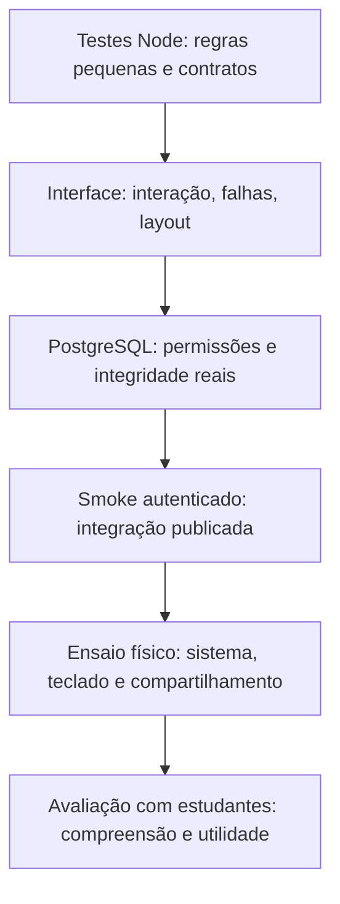

# 07 — Estratégia de testes, validação e evidências

[Índice](README.md) · [Anterior: desenvolvimento](06-desenvolvimento-e-android.md) · [Próximo: operação](08-operacao-privacidade-e-suporte.md)

**Regra de leitura:** resultado de teste é uma evidência delimitada pelo cenário, ambiente, dados e versão. Não significa “aplicativo sem bugs”, “segurança garantida” ou “UX homologada”. Este capítulo separa o que existe nos fontes, a campanha de abertura opcional 3.3.3, a campanha anterior de UI/UX 3.3.2, os resultados históricos da 3.3.1/3.3 e as verificações exclusivamente documentais.

## 1. Estado da evidência

| Nível | Significado | Exemplo |
|---|---|---|
| Implementado | Comportamento identificado nos fontes | Validação da foto antes do upload |
| Coberto por teste | Há um cenário executável para verificar uma propriedade | Erro de upload preserva a prévia |
| Validado na entrega | Há relato de execução com resultado da versão | 156 casos Chrome aprovados na 3.3 |
| Conferido na documentação | Inspeção/listagem, separada de execução | Inventário informado de 201 testes em 15 arquivos após a intro |
| Pendente/proposto | Ainda requer evidência ou desenvolvimento | Homologação Safari físico e teste de usabilidade com estudantes |

A tarefa começou como reescrita documental e recebeu um requisito adicional: restaurar o reset de matches para laboratório. Por isso, além da revisão dos documentos, houve implementação e validação funcional da 3.3.1. A nova migração aditiva foi instalada preservando dados e funções existentes; nenhum participante real teve suas conexões resetadas. O teste SQL usa exclusivamente fixtures e rollback. Os resultados dessa campanha anterior estão na seção seguinte. O patch de UI/UX 3.3.2 não executa SQL, não altera contratos de backend e não reutiliza assertions históricas como se tivessem sido executadas novamente.

## 2. Resultados atuais e históricos

### Campanha atual 3.3.3 — abertura opcional em vídeo

| Verificação | Resultado | Escopo e limite |
|---|---:|---|
| Node completo | **57/57 aprovados** | Inclui política PWA: vídeo fora do precache obrigatório e da interceptação do worker |
| Chrome direcionado inicial | **74/76 aprovados; 2 falhas** | Startup, PWA, responsivo e núcleo; expectativas antigas de ordem de scripts/estilos e de foco com Tab |
| WebKit direcionado inicial | **74/76 aprovados; 2 falhas** | Mesmo recorte e mesmas duas expectativas corrigidas |
| WebKit intermediário | **22/23 aprovados; 1 falha** | Rota mock de 404 de mídia não aplicada pelo motor; corrigido o teste, não o produto |
| Chrome final: startup + entrada principal | **23/23 aprovados** | 22 cenários de startup e um de entrada do núcleo, após as correções |
| WebKit final: startup + entrada principal | **23/23 aprovados** | Mesmo recorte; 404 real e saída segura confirmados |
| Inventário UI atual | **201 cenários em 15 arquivos** | 179 anteriores + 22 de startup; não houve execução completa dos 201 neste patch |
| HTTP local da mídia | Aprovado | Arquivo completo, `HEAD`, `video/mp4`, intervalos simples 206 e inválidos 416 |
| Build/artefatos | **24 arquivos públicos idênticos** | Fontes/worker gerado, `www`, assets Android, APK e ZIP; 22 arquivos obrigatórios no precache |
| HTTPS final no endereço estável | **Aprovado** | 24 arquivos em bytes/MIME; Chrome reproduziu mídia real silenciosa/inline e liberou diálogo/`src` |
| Worker publicado | **Aprovado em Chrome/WebKit** | Cache atual com 22 arquivos de shell, sem MP4; Chrome offline e WebKit recarga controlada online |
| HTTP público da mídia | **200 completo verificado** | Pedido Range recebeu os 2.648.263 bytes íntegros; fallback válido, não 206 público |

**Leitura correta:** **78 cenários direcionados distintos tiveram uma execução aprovada por motor ao longo da campanha**, considerando os 76 iniciais e os dois novos cenários de 404/visibilidade. Não houve uma passagem final única de 78 testes nem execução completa dos 201. Os recortes finais repetem cenários anteriores; não somar execuções repetidas como cobertura nova. Resultados da 3.3.2 abaixo não são reexecuções da 3.3.3.

As duas falhas iniciais eram asserções inadequadas: a lista esperada de entrada ainda não incluía `startup.js`/`startup.css`; o teste de teclado exigia que Tab nunca alcançasse a interface do navegador num modal de botão único. A asserção correta impede foco no **app por trás**, sem confundir browser chrome com controles subjacentes. Foram adicionados os casos de mídia 404 e documento oculto. No recorte WebKit intermediário, a interceptação mock de 404 não foi aplicada; o teste passou a apontar a URL de mídia para um arquivo realmente inexistente no servidor e a exigir a resposta HTTP **404 real**. O fallback final passou em ambos os motores, sem workaround no produto.

A cobertura inclui vídeo real decodificado no Chrome, autoplay negado, erro de mídia/404, prazo de 2 s até o primeiro `playing`, limite total de 12 s, pular por teclado/Escape, recarga na mesma sessão, armazenamento bloqueado, segundo plano, offline, economia de dados, retorno de autenticação/recuperação e movimento reduzido. Layout cobre 320 × 568, 568 × 320 e 1280 × 900 com texto a 200%. **WebKit valida reprodução quando disponível ou liberação segura**, não comprova H.264/AAC no Safari de um iPhone.

Não foram usados emuladores, usuários reais, SQL ou mutações de dados; contratos de backend permaneceram inalterados. A verificação pública, URL imutável e seus limites estão separados no [capítulo 13](13-historico-de-releases.md). O HTTP 206/416 acima é do servidor **local**, não garantia da CDN pública.

### 2.0 Campanha anterior 3.3.2 — refinamento de UI/UX

| Verificação | Resultado | Escopo e limite |
|---|---:|---|
| Node final completo | 57/57 aprovados | Contratos e helpers locais |
| Chrome completo inicial | 178/179 aprovados | Um teste antigo fechava o catálogo aberto automaticamente pela validação |
| WebKit completo inicial | 173/179 aprovados | Mesmo teste do catálogo e cinco falhas de grupos ligadas a cliques/foco |
| Chrome final: catálogo + grupos | 32/32 aprovados | Recorte completo dos dois arquivos afetados, após todas as correções |
| WebKit final: catálogo + grupos | 32/32 aprovados | Mesmo recorte; validação nativa e atualização de resumo corrigidas |
| Inventário UI | 179 cenários em 14 arquivos | Sete novos responsivos e seis novos de grupos |

**Leitura correta:** todos os 179 cenários tiveram uma execução aprovada por motor ao longo da campanha e das reexecuções corretivas. Não houve uma nova passagem única de 179/179 depois das correções; não somar os 32 repetidos ao inventário. Os demais cenários passaram na execução completa anterior. Os logs iniciais com falhas foram preservados nos artefatos da sessão.

O WebKit revelou duas diferenças reais: substituir texto inalterado no resumo durante `blur` podia interromper um clique; abrir a seção inválida não assegurava foco no primeiro controle. O patch evita mutações desnecessárias e direciona o foco após abrir os ancestrais, mantendo a validação nativa ativa. O teste do catálogo passou a conferir a abertura automática em vez de clicar para fechá-lo.

Comandos da campanha (em processos independentes, com portas/diretórios de resultados distintos):

```powershell
npm test
$env:SPARK_TEST_PORT='8089'
npm run test:ui -- --reporter=line
npm run test:ui -- mentorship-catalog.spec.cjs mentorship-groups.spec.cjs --reporter=line
# Para o outro motor, em outro processo:
$env:SPARK_TEST_PORT='8090'
$env:SPARK_TEST_BROWSER='webkit'
npm run test:ui -- --reporter=line
npm run test:ui -- mentorship-catalog.spec.cjs mentorship-groups.spec.cjs --reporter=line
```

O arquivo `mentorship-responsive.spec.cjs` cobre shell amplo, cards compactos, cinco destinos em 320/568/768/1280 px com texto a 200%, clearance da navegação, skeletons, movimento reduzido, erro/retry e preservação de rascunho. Os testes existentes continuam exercitando catálogo, fotos, convites, agenda, laboratório, permissões simuladas e PWA. Não foram usados emuladores/simuladores, contas reais ou operações de banco. Build Android e distribuição são descritos no [capítulo 13](13-historico-de-releases.md). Teclado virtual, leitores de tela e Android/iPhone físicos permanecem pendentes.

### 2.1 Campanha 3.3.1 — documentação e laboratório

| Verificação executada | Resultado | Escopo |
|---|---:|---|
| Node completo | 57 aprovados | Inclui dois novos testes estruturais de laboratório |
| Chrome direcionado | 74 aprovados | Núcleo, foto, grupos e dez cenários de reset |
| WebKit direcionado | 74 aprovados | Mesmos quatro arquivos; não Safari físico |
| PostgreSQL laboratório | 49 assertions aprovadas | Fixtures com rollback; permissões, cascatas e contenção de trava |
| Instalação aditiva | Preservação aprovada | Dados originais e funções preexistentes preservados; nenhum reset de participante |
| Android | Build e assinatura aprovados | 3.3.1/code 11, pacote `com.spark.upx`, minSdk 24, target 36 |
| Descoberta da suíte UI | 166 casos em 13 arquivos | Inventário, não execução completa da suíte na 3.3.1 |

Comando efetivamente utilizado para as regressões nos dois motores:

```powershell
npm run test:ui -- mentorship-lab.spec.cjs mentorship.spec.cjs mentorship-photo.spec.cjs mentorship-groups.spec.cjs
```

Para WebKit, foi definida `SPARK_TEST_BROWSER=webkit` e usada outra porta e outro diretório de resultados. A suíte completa 156/156 abaixo permanece **histórica**; não confunda com as 74 regressões de cada motor desta entrega. A evidência dos artefatos/publicação é registrada no [capítulo 13](13-historico-de-releases.md).

### 2.2 Resultados registrados da entrega 3.3

| Verificação | Resultado registrado | Alcance e limite |
|---|---:|---|
| Suíte Node | 55 aprovados | Helpers, invariantes e contratos locais; inclui utilitários históricos |
| Suíte Chrome | 156 aprovados | Interface atual em navegador, predominantemente com transporte simulado |
| Suíte WebKit | 156 aprovados | Execução completa final após corrigir sincronização do teste de foto |
| Foto Chrome adicional | 7 aprovados | Nova execução focada da suíte de foto |
| Foto WebKit adicional | 21 execuções aprovadas | Três repetições dos sete cenários; não 21 cenários distintos |
| Grupos PostgreSQL | 241 assertions | Integração transacional com rollback |
| Grupos autenticados reais | 127 assertions | Contas descartáveis e limpeza; dados originais preservados |
| Foto publicada/Storage | Fluxo aprovado | Prévia, JPEG, dois uploads, troca, recarga e desvinculação |
| Ativos de publicação/artefatos | 21 arquivos conferidos | Bytes/MIME e correspondência com fonte/build |
| Android | Build e inspeção aprovados | Metadados, assinatura, plugins e ativos; não uso em aparelho |
| Shell PWA Chrome | Recarga offline aprovada | Estrutura pública; não negócio offline |
| Shell PWA WebKit | Cache e recarga controlada online aprovados | Navegação offline do runner tem limitação conhecida |

Esses totais **não devem ser somados como testes independentes de uma única campanha**: assertions SQL, cenários de navegador e repetições têm granularidades distintas. As execuções adicionais de foto já se sobrepõem à suíte completa.

Arquivos, hashes e deployment estão no [histórico de releases](13-historico-de-releases.md). Logs detalhados da campanha foram mantidos como artefatos da sessão de desenvolvimento; não se presume que façam parte desta pasta ou estejam disponíveis ao leitor. Para uma nova entrega, produza e armazene suas próprias evidências sanitizadas.

## 3. Camadas de teste e o que cada uma responde



O desenho mostra complementaridade, não uma obrigação de executar testes remotos a cada correção de texto. Comece pelo menor conjunto que cobre a alteração. Escrita de documentação normalmente exige revisão documental, não acesso ao banco.

### 3.1 Testes Node

`npm test` executa `tests/*.test.cjs` via runner nativo do Node. Há testes de catálogo, migrações/ferramentas locais, grupos, produto, calendário, PWA, utilitários acadêmicos e Auth readiness. Alguns carregam código em contexto simulado; não executam um navegador real.

Exemplos de propriedades verificadas:

- Normalização conserva os títulos do catálogo e rejeita entradas malformadas.
- Compatibilidade depende de dados declarados, sem pontuação inventada.
- Exportação ICS escapa texto, preserva UTF-8 e não inclui links privados de reunião.
- A ponte nativa simulada escreve/limpa apenas os arquivos sob responsabilidade do exportador.
- Ferramentas administrativas não se conectam sem ação explícita nos modos testados.
- Transações de implantação simuladas fazem rollback diante de falhas de preservação.
- O worker é versionado por conteúdo e limita o cache ao shell público; o vídeo participa do hash, mas não do precache obrigatório nem da interceptação de requisições, inclusive Range.

Testar um mock de cliente PostgreSQL não equivale a executar PostgreSQL. Testar uma ponte Capacitor simulada não prova que o seletor de compartilhamento Android funciona em um aparelho.

### 3.2 Interface automatizada

Playwright executa módulos reais no navegador e usa fixtures para controlar sessão/dados/rede. Isso permite reproduzir erro, atraso e permissão sem depender da disponibilidade ou dos dados de participantes reais.

`mentorship-fixture.cjs` intercepta as chamadas esperadas ao Supabase, permite os recursos locais necessários e bloqueia destinos externos não previstos. As prévias `blob:` locais precisam continuar funcionando. Os cenários normais bloqueiam service workers para que as rotas interceptadas não sejam contornadas; a suíte específica de PWA os habilita deliberadamente.

Um mock pode divergir do backend. Por isso a interface e o SQL precisam de verificações próprias e integração real controlada.

### 3.3 Backend e integração real

- **Transacional com rollback:** executa SQL real, valida regras e desfaz alterações no banco dentro da transação.
- **Smoke autenticado:** utiliza sessão/API reais e pode persistir dados temporariamente para depois removê-los.
- **Verificação de publicação:** compara arquivos públicos e comportamento do worker sem criar dados acadêmicos.

Rollback PostgreSQL não reverte automaticamente arquivos enviados por HTTP ao Storage ou e-mails já enviados. Identifique sempre o sistema que cada teste pode alterar.

## 4. Configuração real do runner de interface

Fonte: `playwright.config.cjs`.

| Opção | Valor/efeito |
|---|---|
| Seleção | `tests` com `**/mentorship*.spec.cjs` |
| Workers | 1 |
| Motor padrão | Chromium usando o canal Chrome instalado |
| Motor alternativo | `SPARK_TEST_BROWSER=webkit` |
| Viewport padrão | 390 × 844 |
| Toque/mobile | Habilitados para testar interação no navegador |
| Service workers | Bloqueados por padrão; suíte PWA sobrescreve |
| Servidor | `node tools/serve.cjs` |
| Reuso de servidor | `false`: runner exige seu próprio servidor |
| URL | `http://127.0.0.1:<SPARK_TEST_PORT ou 8089>` |

Também existe `playwright.webkit.config.cjs`, que força WebKit e remove o canal Chrome. Use **um método de seleção por execução** para evitar confusão.

As opções `isMobile` e viewport não são emuladores de sistema operacional. Elas não testam instalação real pelo Safari, gestão de armazenamento pelo iOS, permissões físicas ou teclado do aparelho.

## 5. Como executar, em ordem de menor risco

### 5.1 Preparação

Siga o [capítulo 06](06-desenvolvimento-e-android.md) para dependências e build. Encerre o servidor manual que estiver usando a porta escolhida. Não execute `setup-supabase.js`, seed ou migration como preparação de uma suíte mockada.

### 5.2 Testes locais Node

```powershell
npm test
```

Seleção menor para uma alteração de exportação:

```powershell
node --test .\tests\mentorship-calendar.test.cjs
```

### 5.3 Descobrir testes sem executá-los

```powershell
npm run test:ui -- --list
```

A revisão da 3.3.1 encontrou **166 testes em 13 arquivos**, incluindo os dez cenários de laboratório. O patch 3.3.2 acrescentou sete cenários responsivos e seis de formulários de grupos, chegando a **179 testes em 14 arquivos**. A 3.3.3 adicionou **22 cenários de startup**, totalizando **201 testes em 15 arquivos**. Uma listagem só comprova descoberta/carregamento da configuração; os resultados de execução são registrados por campanha na seção 2.

### 5.4 Executar uma área no Chrome

```powershell
$env:SPARK_TEST_PORT = '8093'
Remove-Item Env:SPARK_TEST_BROWSER -ErrorAction SilentlyContinue
npm run test:ui -- mentorship-photo.spec.cjs mentorship-discovery.spec.cjs --workers=1
```

Os seletores posicionais do Playwright são expressões de busca, não caminhos Windows literais. Use o nome do arquivo como acima; barras invertidas podem ser interpretadas como escapes de regex e selecionar zero testes.

### 5.5 Suítes completas Chrome e WebKit

Execute sequencialmente, esperando a conclusão de cada comando:

```powershell
$env:SPARK_TEST_PORT = '8093'
Remove-Item Env:SPARK_TEST_BROWSER -ErrorAction SilentlyContinue
npm run test:ui -- --workers=1 --output=test-results-chrome

$env:SPARK_TEST_PORT = '8094'
$env:SPARK_TEST_BROWSER = 'webkit'
npm run test:ui -- --workers=1 --output=test-results-webkit
```

Os diretórios de saída preservam artefatos distintos. Não interprete uma execução interrompida como aprovação. Na ausência do binário WebKit, prepare o navegador requerido pelo Playwright; não substitua silenciosamente o motor e mantenha o rótulo “WebKit”. Não há necessidade de instalar emulador/simulador.

Ao terminar, limpe as variáveis se for reutilizar o terminal:

```powershell
Remove-Item Env:SPARK_TEST_PORT -ErrorAction SilentlyContinue
Remove-Item Env:SPARK_TEST_BROWSER -ErrorAction SilentlyContinue
```

## 6. Inventário da suíte atual

Todos os arquivos abaixo estão em `tests`.

| Arquivo de interface | Responsabilidade principal |
|---|---|
| `mentorship.spec.cjs` | Sessão, onboarding, perfil, navegação, descoberta/pedido/chat e estados centrais |
| `mentorship-academic.spec.cjs` | Agenda, grupos, encontros, notificações e integração acadêmica |
| `mentorship-integration.spec.cjs` | Módulos reais juntos e jornadas entre áreas |
| `mentorship-catalog.spec.cjs` | Seletores, títulos extensos, persistência e troca de curso |
| `mentorship-discovery.spec.cjs` | Cards compactos, foto/fallback, ações e responsividade |
| `mentorship-material.spec.cjs` | Arquivos e comportamento de compartilhamento autorizado |
| `mentorship-notifications.spec.cjs` | Leitura e navegação contextual de notificações |
| `mentorship-product.spec.cjs` | Filtros, favoritos, perfil rico, pedido guiado e demais fluxos do patch |
| `mentorship-product-reliability.spec.cjs` | Atrasos, falhas, navegação e preservação do estado |
| `mentorship-photo.spec.cjs` | Editor, prévia, validação, upload/retry e remoção |
| `mentorship-groups.spec.cjs` | Convites e hub de configuração/membros/encontros |
| `mentorship-pwa.spec.cjs` | Marca/instalação, worker real, atualização e servidor público |
| `mentorship-lab.spec.cjs` | Reset explícito, cancelamento, falha, timeout, navegação, logout, rascunho e layout |
| `mentorship-responsive.spec.cjs` | Shell, tipografia, navegação, skeletons e estados responsivos |
| `mentorship-startup.spec.cjs` | Intro opcional, mídia real/falhas, preferências, sessão, foco, visibilidade e layout |

Os antigos `auth.spec.cjs`, `flows.spec.cjs`, `campus.spec.cjs`, `visual-patch.spec.cjs` e `live.spec.cjs` não fazem parte da seleção atual. Não altere o padrão para rodar automaticamente o legado contra a nova interface. O runner Node ainda inclui `utilities.test.cjs`; seus resultados não comprovam fluxos acadêmicos completos.

## 7. Casos exemplares: como transformar requisito em teste

### Foto de perfil

**Dado** um perfil sem foto, **quando** selecionar uma imagem válida, **então** a prévia aparece e nenhum upload é realizado antes de salvar.

**Dado** upload concluído e falha ao salvar perfil, **quando** repetir a tentativa, **então** o cliente reutiliza o upload anterior e não perde os demais campos.

**Dado** foto já salva, **quando** remover a foto sem salvar, **então** a alteração permanece pendente; **quando** salvar e recarregar, a foto continua desvinculada.

A suíte também usa nome de arquivo longo, 320 px e paisagem, texto a 200%, foco e alvos de toque de pelo menos 44 px. Isso cobre essas combinações, não todas as tecnologias assistivas.

### Grupos

- Estranho não deve receber conteúdo privado.
- Participante não deve administrar convite/configuração como responsável.
- Código pode aceitar variação de caixa/espaços/hífens sem aceitar código revogado.
- A última vaga precisa ser protegida por lógica transacional, não só por contagem visual.
- Repetir a entrada do mesmo membro não deve consumir outra vaga.
- Renovar código não deve permitir que um membro removido retorne.
- Erro não deve apagar rascunhos nem ser apresentado como grupo vazio com sucesso.

A interface verifica mensagens e ações; o backend precisa verificar o acesso independentemente do cliente.

### Reset de laboratório

- Abrir o diálogo, digitar confirmação incorreta ou cancelar não envia RPC.
- Confirmação válida não aceita duplo envio; fechar o diálogo não cancela uma mutação já enviada.
- Sucesso limpa conexões e cache individual, mas mantém o perfil/rascunho e permite novos pedidos.
- Resposta malformada, RPC ausente e timeout não produzem sucesso falso nem repetição automática.
- Conclusão após logout não reabre dados privados nem mostra confirmação de outra sessão.
- O backend rejeita chamadas não autenticadas, contas inelegíveis e confirmação diferente de `RESETAR`.
- A exclusão inclui pedidos recebidos/enviados e cascatas; não altera grupos, favoritos, bloqueios ou dados de terceiros fora dessas conexões.
- A mesma trava de conta impede concorrência conflitante; timeout não deixa uma exclusão parcial.

Comandos focados:

```powershell
node --test .\tests\mentorship-lab.test.cjs
npm run test:ui -- mentorship-lab.spec.cjs
node .\tools\deploy-lab.cjs
```

O último comando apenas valida offline. O teste abaixo **conecta ao banco configurado** com credencial administrativa: execute somente em ambiente autorizado, sem outro teste remoto concorrente, e confira a mensagem de rollback/preservação ao final.

```powershell
node .\tests\mentorship-lab-backend.cjs --run
```

São 49 assertions SQL da campanha 3.3.1, usando usuários descartáveis criados dentro da transação e duas conexões para testar contenção de trava. Instalar a RPC e testá-la com fixtures não autoriza executar reset contra contas de participantes. Os efeitos sobre Storage/URLs/arquivos exportados estão nos capítulos 04 e 08.

### Agenda e calendário

- Encontro cancelado não vira uma próxima sessão ativa fictícia.
- Falha de consulta não aparece como “nenhum encontro”.
- Exportação usa autorização atual e não inclui URLs privadas.
- IDs estáveis e revisões de ICS não garantem que todo calendário receptor trate atualização/cancelamento da mesma maneira.

## 8. Sincronização correta de testes assíncronos

Na entrega 3.3, o teste de remoção de foto recarregava depois de observar apenas a mutação do mock. A fixture altera seus dados **antes** de a aplicação consumir a resposta da RPC. Recarregar nesse intervalo pode abortar outras requisições e gerar erros que não representam o resultado final do fluxo.

O teste passou a aguardar:

1. A confirmação **“Perfil acadêmico salvo.”**.
2. A renderização das sugestões do Início após o salvamento.
3. O estado de rede apropriado antes de recarregar.

Depois houve nova validação focada e suíte WebKit completa aprovada. A alteração foi de sincronização do teste, não remoção de assertions nem mudança de negócio para esconder falha.

**Princípio geral:** espere uma condição observável que represente a conclusão da ação. Não use somente `setTimeout` arbitrário ou o estado interno de um mock como prova de que a pessoa já recebeu confirmação.

## 9. Particularidades da PWA e do WebKit

Há duas evidências diferentes que não devem ser confundidas:

### 9.1 Teste local com worker real

`mentorship-pwa.spec.cjs` cria um host temporário em subdiretório, habilita o worker e verifica cache sem parâmetros de recuperação. Depois interrompe as conexões desse host e navega usando o fallback. A desconexão do contexto é usada separadamente para o aviso visual.

Essa verificação demonstra o comportamento de fallback nesse ambiente; não é instalação física no iOS.

### 9.2 Smoke da publicação

Na 3.3.3, `mentorship-release-live.cjs` verifica origem aprovada, bytes/MIME dos **24 arquivos públicos**, **22 ativos obrigatórios do cache** e worker atual. O MP4 não é obrigatório no cache; a CDN pode devolver **200 com o arquivo inteiro verificado** em resposta a Range, ou um 206 correto. Na publicação observada houve resposta completa 200; os testes 206/416 pertencem ao servidor local. Os resultados por implantação ficam no [capítulo 13](13-historico-de-releases.md). O verificador também cobre:

- **Chrome:** reprodução real silenciosa/inline (`playing` observado), encerramento/liberação da intro e `setOffline(true)` com recarga do shell.
- **WebKit Windows:** recarga controlada **online**, cache e inicialização.

Na campanha 3.3.3, a checagem final do endereço estável passou após uma divergência inicial de HTML durante a propagação. O verificador passou a aceitar o 200 completo com bytes conferidos em resposta a Range e a aguardar explicitamente o diálogo oculto antes de avaliar a liberação de mídia: login visível no DOM não significa intro terminada, pois o app carrega por trás. Esses ajustes foram de teste, sem mudança de produção. A URL imutável também teve os 24 arquivos conferidos em bytes/MIME.

O modo offline de navegação do runner WebKit apresentou **“WebKit encountered an internal error”**, inclusive em uma reprodução mínima com worker que responde sem rede. A limitação é declarada no verificador, não ocultada. Não é evidência de que o Safari real falha nem de que funciona offline; esse ensaio físico permanece pendente.

## 10. Verificações remotas: autorização antes do comando

> **Perigo de estado real:** não execute estes exemplos como sequência de onboarding. Confirme projeto-alvo, credenciais, escopo, backup/recuperação e ausência de testes concorrentes. O fato de um script terminar em `.cjs` não o torna local ou inofensivo.

| Ferramenta | Efeito com a opção citada | Limite |
|---|---|---|
| `tools\deploy-groups.cjs` sem opções | Validação estrutural offline | Não confirma estado remoto |
| `tests\mentorship-groups-backend.cjs --run` | SQL real transacional, rollback | Exige acesso adequado; não é teste mock |
| `tests\mentorship-product-backend.cjs --run` | Integração de produto com rollback | Reavaliar precedência de helpers no ambiente atual |
| `tests\mentorship-catalog-backend.cjs --run` | Integração de catálogo com rollback | Não usar para rebaixar funções posteriores |
| `tests\mentorship-groups-live.cjs --run` | Contas e operações reais temporárias | Limpeza exata e preservação conferidas |
| `tests\mentorship-photo-live.cjs --run` | Conta temporária e objetos reais de foto | Exige limpeza do Storage, não só do SQL |
| `tests\mentorship-release-live.cjs --run` | Leitura pública e navegador | Não cria conta; não comprova fluxo Auth/SMTP |

Exemplo de menor risco, que **não conecta ao banco**:

```powershell
node .\tools\deploy-groups.cjs
```

Somente depois de autorização e revisão dos pré-requisitos do [capítulo 05](05-supabase-e-configuracao.md), o responsável pode executar o cenário escolhido. **`--apply` é implantação, não sinônimo de teste.** Não rode scripts antigos sobre a base atual para “garantir que tudo existe”.

### Execução live segura

1. Identificar inequivocamente o projeto/backend e a publicação.
2. Revisar a origem das credenciais sem imprimi-las.
3. Confirmar o procedimento de criação e os IDs/tag das fixtures.
4. Registrar os dados originais de forma não pública conforme mecanismo da ferramenta.
5. Executar **um smoke mutável por vez**: fingerprints detectam mudanças concorrentes por design.
6. Aguardar resultado e limpeza completa, inclusive Storage quando utilizado.
7. Confirmar que perfis originais foram preservados.
8. Em interrupção, recuperar apenas IDs comprovadamente pertencentes ao teste; nunca apagar usuários por padrão amplo de e-mail/nome.

Contas de smoke podem ser preparadas administrativamente. Conseguir entrar com elas não valida a chegada de um e-mail de confirmação real a uma caixa postal.

## 11. Matriz de homologação física — ainda a executar

Use dispositivos físicos autorizados, contas de teste e registre modelo/versão do sistema. Não marque uma linha como aprovada somente porque seu equivalente em navegador passou.

| Plataforma | Tarefa | Evidência desejada |
|---|---|---|
| Android físico | Instalar/atualizar APK sem perda indevida de dados | Pacote, assinatura, versionCode, resultado |
| Android físico | Foto via seletor do sistema | Prévia, envio, retorno ao app e cancelamento |
| Android físico | Exportar ICS via Filesystem/Share | Aplicativo receptor abre o arquivo correto |
| Android físico | Teclado, voltar, suspensão/retomada | Compositor e navegação não encobertos |
| iPhone/iPad físico | Instalar pelo Safari | Ícone, nome, modo standalone e abertura |
| iPhone/iPad físico | Fechar/abrir, sessão e atualização | Rascunhos/salvamento tratados honestamente |
| iPhone/iPad físico | Shell após perda de rede | Condições do cache anotadas; sem alegar dados offline |
| Ambos | Texto ampliado, leitor de tela e foco | Ordem, nomes, estados e navegação compreensíveis |
| Ambos | Intro opcional no aparelho | Reprodução/saída segura, retorno do segundo plano, preferências e foco; no Android, após splash do sistema |
| Ambos | Link real de recuperação/confirmar e-mail | Fluxo completo na caixa postal autorizada |

O procedimento não garante que todas as versões futuras dos sistemas se comportem da mesma forma. Registre o ambiente de cada resultado.

## 12. Avaliação de usabilidade — proposta, não estudo realizado

Teste funcional pergunta “o botão envia o pedido correto?”. Teste de usabilidade pergunta “a pessoa compreende o que pedir e consegue concluir sem ajuda?”. Ambos são necessários.

Protocolo inicial sugerido:

1. Defina tarefas realistas: preencher perfil, encontrar apoio para uma disciplina, enviar pedido, entrar por código e localizar encontro.
2. Convide estudantes com perfis variados e obtenha consentimento; não peça notas ou dados sensíveis desnecessários.
3. Use nomes/dados fictícios e ambiente de teste.
4. Observe conclusão sem ajuda, erros, dúvidas de vocabulário e pontos de abandono.
5. Registre tempo como observação contextual, sem impor meta retrospectiva inventada.
6. Pergunte como a pessoa interpretou favoritos, solicitações, privacidade do grupo e exportação.
7. Classifique problemas por impacto e frequência, corrija e repita as tarefas relevantes.

Não transforme uma avaliação pequena em prova estatística de melhoria da aprendizagem. Heurísticas, contraste e testes automatizados complementam, mas não substituem, observação de pessoas. O [capítulo 11](11-ui-ux-e-acessibilidade.md) relaciona métodos e livros.

## 13. Como registrar um defeito

Use um registro sanitizado com:

- Versão do app/deployment ou hash do APK.
- Navegador/sistema/modelo e tamanho/orientação quando relevantes.
- Estado inicial e papel do usuário de teste.
- Passos mínimos, resultado esperado e resultado observado.
- Se ocorre sempre ou depende de atraso, erro ou mudança de tela.
- Screenshot/log sem token, código de convite ativo, conversa ou foto de participante.
- Teste automatizado que cobre o caso, se existir.
- Impacto: bloqueia tarefa, perde dados, expõe conteúdo, dificulta entendimento ou afeta apenas apresentação.

Não publique HAR completo, cabeçalhos Authorization, link assinado ou arquivo `.env` em um relato. Remova dados de participantes antes de compartilhar evidências.

## 14. Critério de conclusão de uma alteração

- [ ] Comportamento esperado descrito e ligado a um requisito real.
- [ ] Menor conjunto de testes relevante executado e resultado registrado.
- [ ] Cenários de erro/retorno e permissões considerados.
- [ ] Suíte ampliada quando há risco entre módulos.
- [ ] Mudança de dados tratada em transação/ordem segura, se aplicável.
- [ ] Fontes e artefatos não confundidos; build/publicação verificados quando alterados.
- [ ] Layout/teclado/texto ampliado considerados nas telas afetadas.
- [ ] Nenhuma falha escondida por remover assertions ou repetir indefinidamente até passar.
- [ ] Documentação atualizada e limitações explicitadas.
- [ ] Testes físicos ou humanos marcados como pendentes quando não executados.

**Para documentação apenas:** confira links, âncoras, nomes de arquivos, comandos, versões, referências e distinção entre implementado/proposto/histórico. Não há justificativa para alterar produção para validar uma correção de texto.
