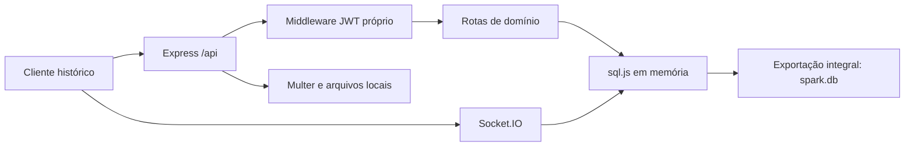

# 09 — Backend legado: referência histórica no contexto do MatchUp

[Índice da documentação](README.md)

> **Este servidor não atende o MatchUp acadêmico atual e não é fallback do Supabase.** O conteúdo de `server` é uma implementação histórica independente, voltada ao antigo domínio de relacionamentos. Mantê-lo no diretório não significa que faça parte do site público, da PWA ou do APK acadêmico. A referência histórica deste capítulo é a release **3.3.1 / versionCode 11** (os patches de interface 3.3.2 e 3.3.3 mantêm este legado inativo), publicada no domínio estável e na [implantação identificada](https://bd9ef3c7.matchup-87k.pages.dev); seus artefatos e evidências estão no [histórico](13-historico-de-releases.md). Os testes da release acadêmica não validam este servidor histórico. Este capítulo explica seus contratos para leitura e eventual manutenção autorizada, não oferece um caminho alternativo de instalação da produção.

## 1. Dois sistemas, sem intercambialidade

| Aspecto | MatchUp acadêmico atual | Servidor histórico em `server` |
|---|---|---|
| Domínio | Disciplinas, solicitações de ajuda, grupos e encontros | Perfis de relacionamento, swipes e matches |
| Cliente principal | `index.html`, `mentorship*.js` e CSS correspondentes | Contratos de cliente legado |
| Identidade | Supabase Auth | JWT próprio e senha com bcrypt |
| Persistência | PostgreSQL/Supabase, RPC, grants e RLS | sql.js em memória com exportação para arquivo |
| Comunicação | Chamadas Supabase e polling de 12 segundos enquanto visível; sem assinatura Realtime no frontend atual | HTTP Express e eventos Socket.IO |
| Arquivos | Storage, com fotos públicas e materiais privados | Uploads locais servidos estaticamente |
| Empacotamento público | Allowlist acadêmica em `tools\web-assets.cjs` | Não integrado ao build público atual |
| Relação entre ambos | Nenhuma dependência deste servidor para funcionar | Não traduz RPCs nem implementa tabelas `mentor_*` |

Um JWT emitido por esse Express não é uma sessão Supabase. Um identificador de `matches` não é um identificador de solicitação acadêmica. Copiar `spark.db` para algum diretório não restaura o banco atual. Também não se deve concluir que os antigos modos de estudos/caronas sejam todos implementados por este servidor: arquivos históricos distintos podem pertencer a experimentos e contratos diferentes.

A arquitetura vigente está no [capítulo 01](01-visao-geral-e-arquitetura.md); dados acadêmicos e autorização estão nos [capítulos 04](04-banco-de-dados.md) e [05](05-supabase-e-configuracao.md).

## 2. Organização e fluxo de execução

O desenho resume responsabilidades, não certifica que cada rota/evento tenha autorização equivalente.

| Caminho | Responsabilidade |
|---|---|
| `server\package.json` | Dependências e scripts próprios |
| `server\src\index.js` | Express, CORS, arquivos estáticos, rotas, migração e inicialização |
| `server\src\db\database.js` | Instância sql.js, leitura e exportação do banco |
| `server\src\db\migrate.js` | Criação de tabelas e índices |
| `server\src\db\seed.js` | Limpeza e inserção de dados demonstrativos; destrutivo |
| `server\src\middleware\auth.js` | Leitura e verificação de Bearer JWT |
| `server\src\middleware\upload.js` | Configuração de upload Multer |
| `server\src\routes` | Endpoints HTTP |
| `server\src\socket\chat.js` | Autenticação e eventos Socket.IO |
| `server\spark.db` | Arquivo persistido, quando existente; não é fonte de código |
| Diretório configurado de uploads | Objetos enviados; não são incorporados ao banco |

### 2.1 Dependências e scripts: inventário, não receita de produção

O manifesto identifica `spark-server` **1.0.0**, com entrada `src/index.js`. As faixas declaradas incluem Express `^4.21.0`, sql.js `^1.10.3`, bcryptjs `^2.4.3`, cors `^2.8.5`, dotenv `^16.4.5`, jsonwebtoken `^9.0.2`, multer `^1.4.5-lts.1`, Socket.IO `^4.7.5` e uuid `^10.0.0`. Faixa de manifesto não comprova versão instalada ou ausência de vulnerabilidades.

| Script do manifesto de `server` | Comando declarado | Efeito que exige atenção |
|---|---|---|
| `start` | `node src/index.js` | Inicializa o servidor e chama migração |
| `dev` | `node --watch src/index.js` | Mesmo servidor com reinício por alterações |
| `migrate` | `node src/db/migrate.js` | Cria estruturas no banco local; não é apenas inspeção |
| `seed` | `node src/db/seed.js` | Apaga registros e insere demonstrações |

Não há script `test` próprio nesse manifesto. Os scripts de teste da raiz pertencem a outra organização e não devem ser apresentados como certificado de segurança do legado.

### 2.2 Inicialização e exposição estática

`index.js` carrega configuração com dotenv, habilita CORS amplo, aceita JSON até **10 MB**, registra `/uploads` e serve também a **raiz inteira do projeto** com `express.static`. O listener usa **`0.0.0.0`**, com porta padrão **3000**, e não somente loopback.

Consequências para manutenção:

- Não iniciar esse servidor no diretório de desenvolvimento como forma de “abrir o MatchUp atual”.
- Não supor que executar no próprio computador impede acesso pela rede.
- Não expor uma árvore que pode conter fontes, ferramentas, bancos ou outros arquivos locais.
- CORS não substitui autenticação, autorização nem delimitação de arquivos públicos.
- Uma eventual reutilização exige revisão prévia de bind, diretório público explícito, configuração e controles de acesso.

Para o desenvolvimento estático atual, siga [desenvolvimento e Android](06-desenvolvimento-e-android.md), que descreve as ferramentas apropriadas, incluindo `tools\serve.cjs`. Não misture esse procedimento com os scripts históricos acima.

## 3. Configuração sem transportar segredos

A tabela registra nomes lidos nos fontes, não valores de um ambiente real. Não é necessário abrir `.env` para compreender o contrato.

| Nome | Uso observado | Padrão/observação |
|---|---|---|
| `PORT` | Porta do HTTP/Socket.IO | 3000 |
| `JWT_SECRET` | Assinatura/verificação dos tokens históricos | Sem valor padrão seguro no código; não expor nem reutilizar segredo Supabase |
| `JWT_EXPIRES_IN` | Prazo dos JWT emitidos | `7d` |
| `UPLOAD_DIR` | Local dos arquivos enviados | `uploads`, resolvido no contexto do servidor |
| `MAX_FILE_SIZE` | Limite de upload | Inteiro interpretado pelo middleware, com fallback de 5 MiB |

Uma cópia de código para análise não precisa de credenciais reais, banco de participantes ou arquivos enviados. Não publique tokens, hashes de senha, dumps, `.env` ou credenciais demonstrativas embutidas no seed. Não reaproveite senhas de exemplos.

## 4. Persistência: SQLite por exportação do sql.js

### 4.1 Como os dados chegam ao disco

`database.js` mantém uma instância de banco em memória. Ao abrir, lê `server\spark.db`, se existir; caso contrário, cria um banco. A gravação exporta a representação inteira e usa escrita síncrona no arquivo.

Há gravações explícitas nas mutações, rotina periódica de aproximadamente **30 segundos** e tratamento de saída/sinais. O código solicita `journal_mode=WAL` e chaves estrangeiras, mas isso **não transforma a exportação integral em um banco seguro para vários processos concorrentes**.

Não execute duas instâncias sobre o mesmo arquivo. Reinício abrupto, falha de escrita ou cópia durante uma exportação precisam ser considerados na estratégia de preservação. Uploads ficam fora do banco: copiar apenas `spark.db` não preserva o conjunto de objetos referenciados.

### 4.2 Schema por responsabilidade

| Área histórica | Tabelas |
|---|---|
| Identidade/perfil | `users`, `user_interests`, `user_photos` |
| Preferências/localização | `user_filters`, `user_location` |
| Descoberta/conexão | `swipes`, `matches` |
| Conversa | `messages` |
| Segurança | `reports`, `blocks` |
| Avisos | `notifications` |
| Oferta premium demonstrativa | `premium_plans`, `user_premium_history` |
| Conteúdo | `pickup_lines`, `stickers`, `favorite_lines` |

Usuários usam identificadores UUID armazenados como texto; vários registros de domínio usam inteiros. Booleanos aparecem como 0/1 e datas como texto. RLS do PostgreSQL/Supabase não existe nesse banco; a proteção depende do código que atende cada operação.

`migrate.js` usa criação de estruturas com `IF NOT EXISTS`. Isso não equivale a uma sequência completa de migrações versionadas capaz de transformar todo schema antigo por `ALTER TABLE`. Antes de mudar o legado, compare o schema esperado com uma cópia autorizada e sanitizada; não execute uma “migração” esperando que ela seja um diagnóstico sem escrita.

### 4.3 Seed não é reset acadêmico

O seed contém exclusões de usuários, interesses, fotos, filtros, localização, histórico/planos premium, notificações, bloqueios, denúncias, mensagens, matches e swipes, antes de inserir demonstrações.

**Não executar sobre dados que devam ser preservados.** Ele não é rotina de manutenção, não é reversível por uma simples nova execução e não implementa `mentor_reset_connections`. O mesmo cuidado se aplica a SQL histórico como `supabase\pilot-reset.sql`: não deve ser reaplicado para preparar uma apresentação acadêmica atual.

## 5. Contrato HTTP histórico

Todos os caminhos abaixo pertencem ao servidor Express. São referência para leitura de consumidores antigos, **não endpoints da API atual de produção**. O comportamento efetivo é o registrado no router; comentários de cabeçalho podem estar desatualizados.

### 5.1 Autenticação própria

| Método/caminho | Entrada principal | Resultado observado |
|---|---|---|
| `POST /api/auth/signup` | `email`, `password`, `nome` | Cria UUID, senha bcrypt com custo 10; retorna 201 com `token` e `user` |
| `POST /api/auth/login` | `email`, `password` | Retorna 200 com `token` e `user` em sucesso |

A validação histórica de nova senha exige pelo menos **6 caracteres**, diferente da atual. Os tokens contêm `userId`, são assinados pelo segredo próprio e enviados no cabeçalho HTTP `Authorization`, usando o esquema Bearer. O middleware responde 401 para ausência ou token inválido.

Não há, nesse contrato, equivalência com confirmação de e-mail, refresh de sessão, recuperação de senha e encerramento remoto fornecidos por uma plataforma de Auth. Remover um token do cliente não implementa revogação remota no servidor. Não migre contas copiando token ou hash diretamente para o frontend acadêmico.

### 5.2 Endpoints públicos

- `GET /api/health`: estado de saúde e contagem de usuários.
- `GET /api/content/interests`: conteúdo de interesses.
- `GET /api/content/lines`: frases do conteúdo histórico.
- `GET /api/content/stickers`: catálogo de stickers.

A existência de health check não comprova que persistência, autenticação, uploads ou autorização estejam corretos.

### 5.3 Perfil, filtros e localização — autenticados

| Método/caminho | Finalidade/entrada |
|---|---|
| `GET /api/users/me` | Perfil próprio, interesses, fotos e filtros |
| `PUT /api/users/me` | Nome, idade, gênero, interesse romântico, cidade, bio, emoji e interesses |
| `PUT /api/users/me/onboarding` | Preenchimento histórico; exige nome, idade, gênero e interesse |
| `PUT /api/users/me/settings` | `discovery_enabled`, `invisible_mode` |
| `PUT /api/users/me/filters` | Faixa etária, distância, gênero e filtro de verificação |
| `PUT /api/users/me/location` | `lat`, `lng` |
| `GET /api/users/:id` | Perfil de outro usuário, com interesses/fotos |

O uso de `COALESCE` em vários updates preserva campos diante de `null`; ausência, limpeza de texto e valor falso não são necessariamente a mesma operação. Campos históricos como `verificado` e `is_premium` não significam verificação institucional ou cobrança real.

### 5.4 Descoberta e matches — autenticados

| Método/caminho | Contrato |
|---|---|
| `GET /api/discover` | Retorna `{ profiles, likes }` segundo filtros históricos |
| `POST /api/discover/swipe` | `{ targetId, direction }`, com `like`, `nope` ou `super` |
| `GET /api/match` | Lista matches ativos e resumo de conversa |
| `GET /api/match/:matchId` | Detalhes de match ativo do participante, com mensagens |
| `DELETE /api/match/:matchId` | Marca match do participante como inativo |

A descoberta seleciona até 30 registros antes de parte dos filtros em memória; por isso pode retornar menos resultados sem examinar todo o banco. Distância é calculada quando existem coordenadas, não representa GPS acompanhado em tempo real. A lista de likes recebidos considera direção `like` e limite de 20.

No swipe, reciprocidade `like`/`super` cria um match se o par ainda não existir. A resposta `{ matched, direction }` indica se foi criado naquela operação; **não retorna `matchId`** e não reativa automaticamente match inativo já existente. Desfazer match altera `active`, não apaga conta nem purga mensagens. Essas regras não devem ser transportadas para o pedido por disciplina do MatchUp.

### 5.5 Conversas — autenticadas

| Método/caminho | Contrato |
|---|---|
| `GET /api/chat` | Lista conversas de matches ativos |
| `GET /api/chat/:matchId/messages` | Lista mensagens e marca recebidas como lidas |
| `POST /api/chat/:matchId/messages` | `{ content, type }`; tipo padrão `text`, com tratamento histórico de `sticker` |

A consulta e o envio verificam participação em match ativo. A rota retorna 404 quando não encontra uma conversa elegível. Mensagens expõem campos como `id`, `senderId`, `content`, `type`, `time`, `read` e `isMine`, conforme a resposta.

Dois detalhes importam para manutenção:

1. A consulta monta a resposta antes de marcar registros como lidos; o campo `read` pode representar o estado anterior àquela leitura.
2. O envio HTTP persiste a mensagem e retorna 201, mas **não emite automaticamente um evento Socket.IO**. Um comentário sugerindo envio ao parceiro não substitui código de emissão.

Não combinar arbitrariamente envio HTTP e envio Socket para o mesmo texto: são caminhos de gravação separados, sem a garantia de deduplicação por identificador de cliente usada no chat acadêmico atual.

### 5.6 Bloqueio, denúncia e notificações — autenticados

| Método/caminho | Contrato |
|---|---|
| `POST /api/report` | `{ targetId, reason, description? }`; registra denúncia, bloqueia e inativa matches do par |
| `POST /api/report/block` | `{ targetId }`; bloqueia sem denunciar e inativa matches |
| `GET /api/report/blocks` | Lista bloqueios próprios |
| `DELETE /api/report/block/:userId` | Remove o bloqueio; não reativa matches |
| `GET /api/notification` | Lista notificações próprias |
| `PUT /api/notification/:id/read` | Marca uma notificação como lida |
| `PUT /api/notification/read/all` | Marca todas como lidas |
| `GET /api/notification/count/unread` | Consulta quantidade não lida |

Os caminhos `read/all` e `count/unread` vêm do router, não da ordem sugerida em comentários históricos. A denúncia que bloqueia automaticamente é comportamento **deste legado**; no MatchUp acadêmico, bloquear e denunciar são ações separadas.

### 5.7 Premium demonstrativo — autenticado

| Método/caminho | Contrato |
|---|---|
| `GET /api/premium` | Lista planos |
| `POST /api/premium/subscribe` | `{ planId }`; registra assinatura demonstrativa |
| `GET /api/premium/likes` | Consulta relacionada a likes recebidos |

A assinatura calcula duração por meses multiplicados por 30 dias e não integra cobrança real. Não há base para apresentar o projeto atual como serviço de assinatura paga.

## 6. Uploads locais históricos

| Método/caminho | Entrada/efeito |
|---|---|
| `POST /api/upload` | Multipart com campo `photo`; cria registro e atualiza avatar |
| `POST /api/upload/photos` | Multipart com campo `photos`, até 6 arquivos; usa a primeira como avatar se não houver um |
| `DELETE /api/upload/:photoId` | Exclui o registro de foto do usuário |

O middleware aceita MIME declarado de JPEG, PNG, WebP e **GIF**, com tamanho padrão até **5 MiB**. O nome usa UUID com extensão original. Não há o fluxo atual de inspeção/otimização para 640 pixels nem a mesma política de foto opcional salva com o perfil.

Excluir uma foto pela rota remove a linha em `user_photos`, **não o arquivo físico** e não necessariamente corrige uma referência de avatar. Erros emitidos pelo Multer antes de entrar no handler não são capturados pelo `try/catch` interno dessa rota.

Arquivos locais não possuem o mecanismo atual de materiais privados com metadados de contexto e URL assinada de curta duração. Não usar esta implementação para servir materiais de grupos do MatchUp.

## 7. Socket.IO: contrato e limites observados

O handshake recebe JWT em `handshake.auth.token`. O servidor acompanha sockets por usuário em um `Map`, mas autenticar a conexão não autoriza automaticamente cada evento e sala.

| Evento | Comportamento observado |
|---|---|
| `chat:join` | Inscreve o socket na sala de match informada |
| `chat:message` | Verifica match ativo/participante, persiste e emite mensagem |
| `chat:typing` / `chat:stop-typing` | Encaminha indicação de digitação |
| `match:notify` | Recebe identificação de destino e tenta emitir para sala pessoal |
| Desconexão | Atualiza controle de presença/sockets |

Há limites concretos a preservar no registro técnico, não a ocultar sob a palavra “realtime”:

- `chat:join` não faz a mesma verificação de participação presente em `chat:message`.
- Os eventos de digitação não repetem a autorização de envio de mensagem.
- A mensagem é emitida na sala com `isMine: false` e novamente ao remetente com `isMine: true`; se ele pertence à sala, o consumidor pode receber duas representações do mesmo registro.
- Há emissões para salas pessoais, mas o arquivo não estabelece inscrição explícita via `socket.join(userId)`; manter usuário no `Map` não cria essa sala.
- O caminho Socket e o caminho HTTP não são uma única operação idempotente.

Essas observações resultam de leitura estática e indicam necessidade de revisão antes de qualquer reutilização. **Não constituem auditoria de segurança completa, teste de exploração ou autorização para exposição do serviço.** Nenhuma correção de código é realizada por este capítulo.

## 8. Manutenção offline segura

A finalidade preferencial da manutenção histórica é compreender contratos, preservar contexto e avaliar eventual migração de ideias — não ativar o servidor por conveniência.

### 8.1 Antes de qualquer execução futura

1. Determine por que o legado precisa ser executado. Se a questão é um comportamento acadêmico, comece pelos módulos `mentorship*`, não por `server`.
2. Trabalhe com código e, somente quando indispensável e autorizado, cópia sanitizada de dados. Não inspecione bancos/uploads de participantes para ilustrar documentação.
3. Faça inventário de scripts com efeito de escrita. Inicializar já chama migração; seed é destrutivo.
4. Planeje um ambiente isolado de rede e arquivos públicos. O bind atual não limita o acesso a localhost.
5. Defina credenciais exclusivas descartáveis, sem transportar segredos reais.
6. Não execute duas instâncias sobre o mesmo arquivo sql.js.

### 8.2 Preservação e restauração, se forem necessárias

Uma rotina autorizada deve parar de forma controlada a instância identificada antes de obter uma cópia consistente, preservar o banco e os uploads relacionados, restringir acesso às cópias e verificar a restauração em ambiente separado. Registrar tamanho e hash ajuda a identificar um arquivo, mas não prova consistência lógica.

Não sobreponha um banco ativo nem trate exportação como backup continuamente validado. Nunca use o backup histórico como substituto de uma política de backup/restore do Supabase. Os procedimentos atuais estão no [capítulo 08](08-operacao-privacidade-e-suporte.md).

### 8.3 Se houver proposta de reutilização

Antes de aprová-la, seria necessário definir escopo, remover exposição da raiz, uniformizar autorização HTTP/Socket, rever uploads, completar validação e limites de payload, proteger segredos, definir política de tokens, migrações, testes e persistência adequada. Isso é **trabalho futuro**, não uma característica existente nem requisito para operar o MatchUp atual.

Não portar atalhos antigos — premium demonstrativo, verificação autodeclarada ou desbloqueio HTTP — como se fossem contratos acadêmicos já aprovados. Uma migração de dados demandaria mapeamento explícito, consentimento/finalidade, validação e plano de reversão próprios.

## 9. Evidência e checklist de encerramento

Este capítulo foi reescrito por inspeção de fontes. Não foram executados servidor, migração, seed, testes de legado ou operações de banco para produzi-lo. Resultados históricos de testes do MatchUp 3.3 **não certificam o servidor Express**.

Antes de concluir uma atividade futura neste diretório, confira:

- [ ] A mudança era realmente do legado e não alterou contratos do cliente acadêmico por engano.
- [ ] Não foram reutilizados segredo, token, banco ou uploads de participantes.
- [ ] Nenhum serviço histórico ficou exposto ou executando sem necessidade.
- [ ] Não houve seed, migração ou sobrescrita involuntária.
- [ ] Persistência, uploads e caminhos públicos foram tratados separadamente.
- [ ] Eventos HTTP e Socket têm evidência específica, caso tenham sido alterados.
- [ ] Limites conhecidos e resultados realmente obtidos estão registrados sem certificações implícitas.
- [ ] Os ativos históricos continuam fora do build público acadêmico.

Para critérios gerais de manutenção, consulte o [capítulo 10](10-manutencao-e-evolucao.md). Para fundamentos de escolhas arquiteturais e consistência, use [Bass, Clements e Kazman](12-referencias-e-glossario.md#ar01) e [Kleppmann](12-referencias-e-glossario.md#ar03): as referências ajudam a analisar custos e riscos, não validam automaticamente esta implementação.
